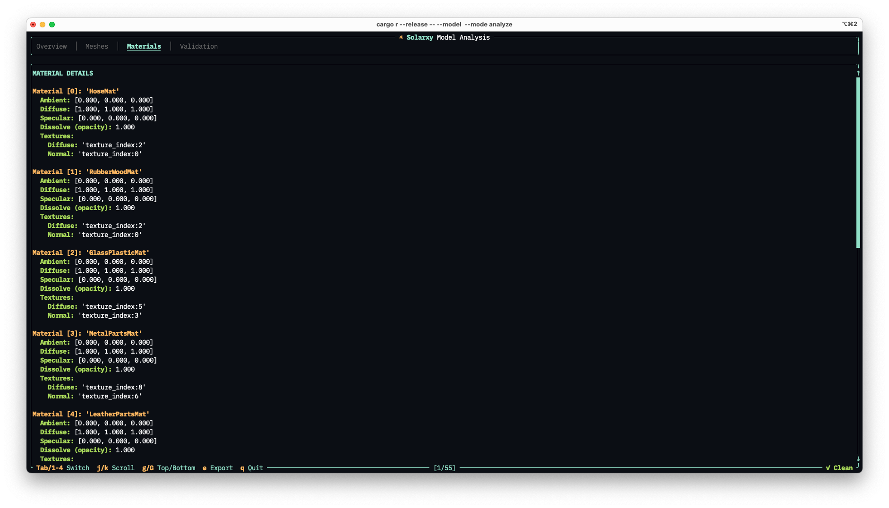

# solarxy


A lightweight, cross-platform 3D model viewer and validator built with Rust and wgpu. Inspect 3D models in a real-time graphical viewer or analyze them from the terminal with built-in validation checks.

## Features

- **Multi-format support** -- OBJ, STL, PLY, and glTF/GLB
- **PBR rendering** -- Cook-Torrance BRDF, normal mapping, shadow mapping, 3-light system, 4x MSAA
- **Interactive analysis** -- TUI with per-mesh and per-material breakdowns, validation checks
- **Report export** -- save analysis reports to file or pipe to stdout
- **Drag-and-drop** -- drop model files directly into the viewer window

## Supported Formats

| Format | Extensions | Notes |
|---|---|---|
| Wavefront OBJ | `.obj` | Meshes, materials (`.mtl`), textures, UVs |
| STL | `.stl` | Geometry only, no materials |
| PLY | `.ply` | Flexible vertex attributes, optional normals and UVs |
| glTF 2.0 | `.gltf`, `.glb` | PBR materials, normal maps, embedded textures |

## Getting Started

### Prerequisites

- Rust toolchain (install from [rustup.rs](https://rustup.rs))
- MSRV: see `Cargo.toml`

### Build

```bash
cargo build --release
```

### Usage

View a model (default mode):

```bash
cargo r --release -- --model path/to/model.obj
```

Or launch the viewer and drag a file onto the window:

```bash
cargo r --release
```

Analyze a model in the terminal:

```bash
cargo r --release -- --model path/to/model.glb --mode analyze
```

Analyze and save the report to a file:

```bash
cargo r --release -- --model path/to/model.glb --mode analyze --output report.txt
```

## CLI Reference

| Flag | Description | Default |
|---|---|---|
| `-m, --model <PATH>` | Path to model file (optional in view mode -- supports drag-and-drop) | -- |
| `-M, --mode <MODE>` | `view` or `analyze` | `view` |
| `-o, --output <PATH>` | Save report to file (analyze mode only) | -- |

## View Mode

The viewer renders models with physically-based shading (Cook-Torrance BRDF), normal mapping, real-time shadow mapping, and 4x MSAA anti-aliasing. A 3-light system (key, fill, rim) follows the camera to provide consistent illumination. The scene includes a shadow-catching floor and an infinite grid. A heads-up display shows polygon, triangle, and vertex counts alongside the current render mode, projection, and frame rate.

<p align="center">
  
</p>

### Camera Controls

| Input | Action |
|---|---|
| Left mouse drag | Orbit |
| Middle mouse drag | Pan |
| Scroll wheel | Zoom |

### Keyboard Shortcuts

| Key | Action |
|---|---|
| `W` | Cycle view mode (Shaded / Shaded+Wire / Wireframe) |
| `S` | Shaded mode |
| `X` | Toggle ghosted view |
| `N` | Cycle normals (Off / Face / Vertex / Face+Vertex) |
| `U` | Cycle UV overlay (Off / Gradient / Checker) |
| `H` | Frame model (reset view) |
| `T` `F` `L` `R` | Top / Front / Left / Right view |
| `P` | Perspective projection |
| `O` | Orthographic projection |
| `B` | Cycle background (Gradient / Blue-gray / Dark / Studio / White / Black) |
| `C` | Save screenshot (PNG) |
| `?` | Toggle keybinding hints |
| `Esc` | Exit |

## Analyze Mode

The analyzer opens a terminal UI with four tabs: **Overview**, **Meshes**, **Materials**, and **Validation**. Overview shows aggregate counts and bounding box dimensions. Meshes and Materials provide per-element breakdowns. Validation lists errors and warnings found in the model.

<p align="center">
  
</p>

### Navigation

| Key | Action |
|---|---|
| `Tab` / `Shift+Tab` | Next / previous tab |
| `1` `2` `3` `4` | Jump to tab |
| `j` / `k`, arrows | Scroll up / down |
| `g` / `G` | Jump to top / bottom |
| `PgUp` / `PgDn` | Page scroll |
| `e` | Export report (prompts for filename) |
| `q` / `Esc` | Quit |

## Validation Checks

The analyzer runs the following checks and reports errors or warnings:

- Normal count does not match vertex count
- UV count does not match vertex count
- Missing UVs (severity depends on format)
- Non-triangulated meshes (index count not divisible by 3)
- Empty index buffers
- Invalid material references
- Missing texture files

## Tech Stack

**Core:** Rust 2024 Edition, wgpu, winit, WGSL shaders

**Libraries:** clap, ratatui, crossterm, tobj, stl_io, ply-rs-bw, gltf, wgpu_text, cgmath, image

## Contributing

Contributions are welcome! Feel free to open an issue or submit a pull request.

## License

Licensed under the MIT License. See the [LICENSE](LICENSE) file for details.

## Contact

[Marko Koljancic](https://koljam.com/)
