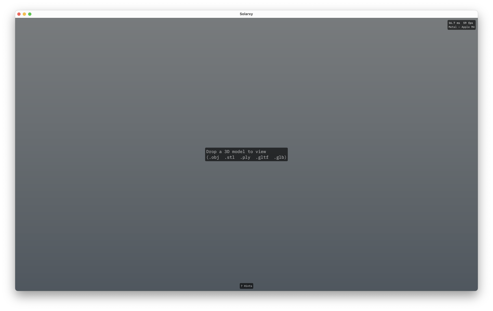
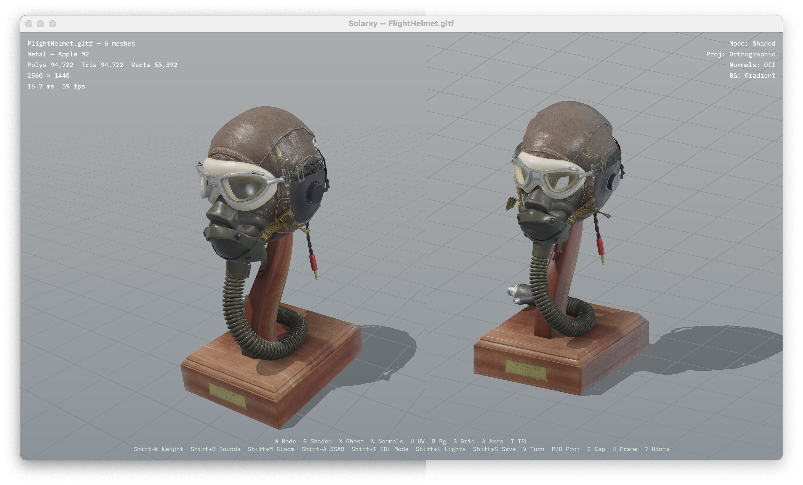
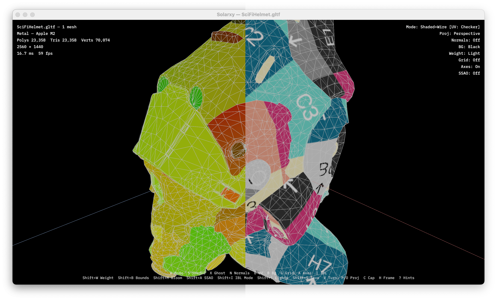
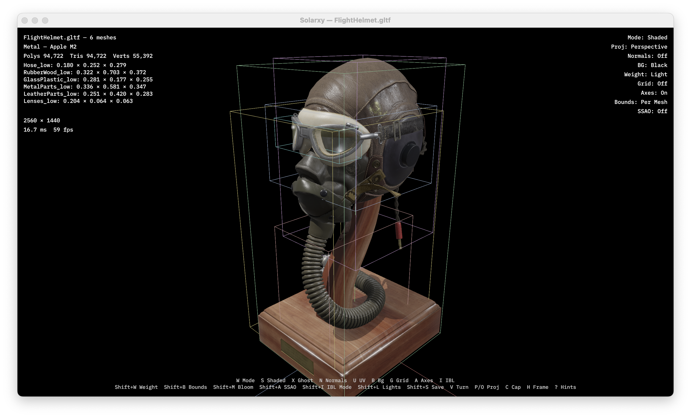
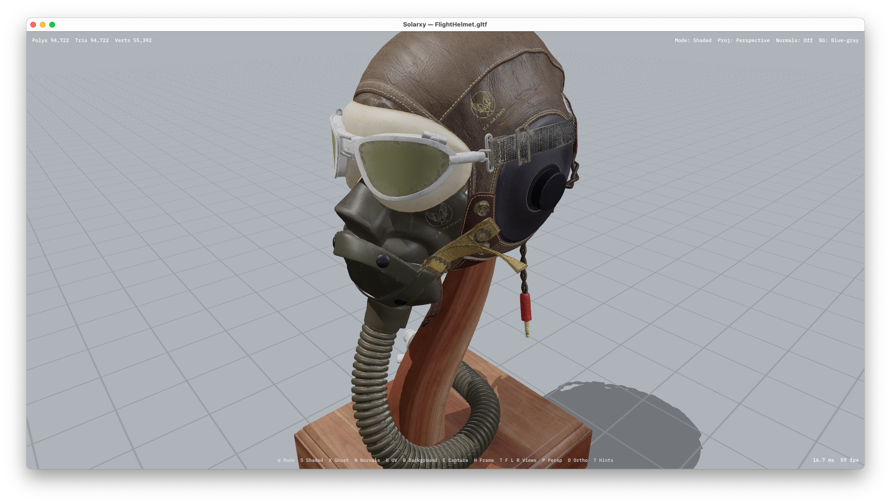
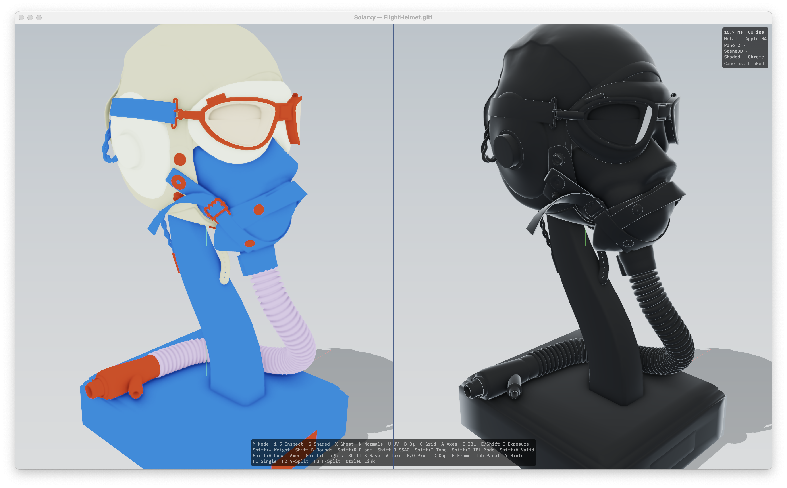
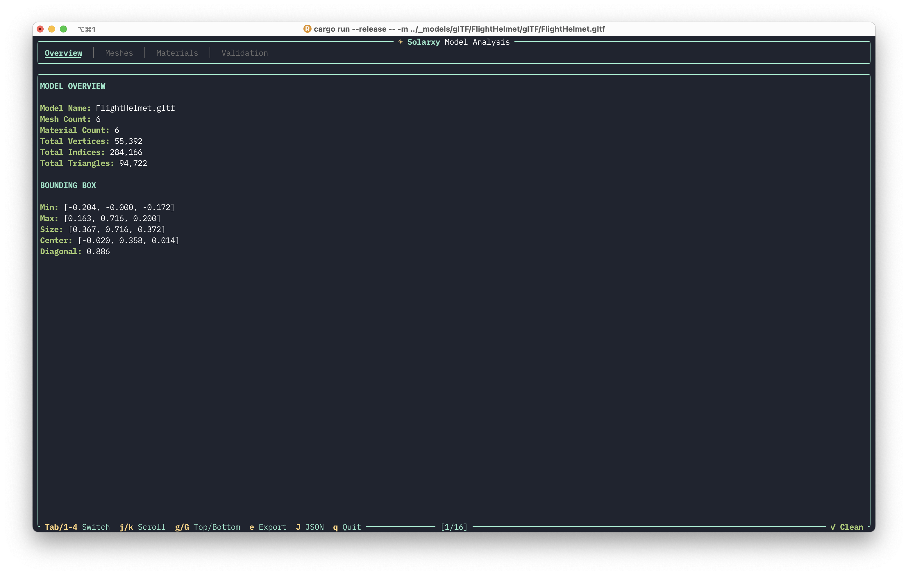
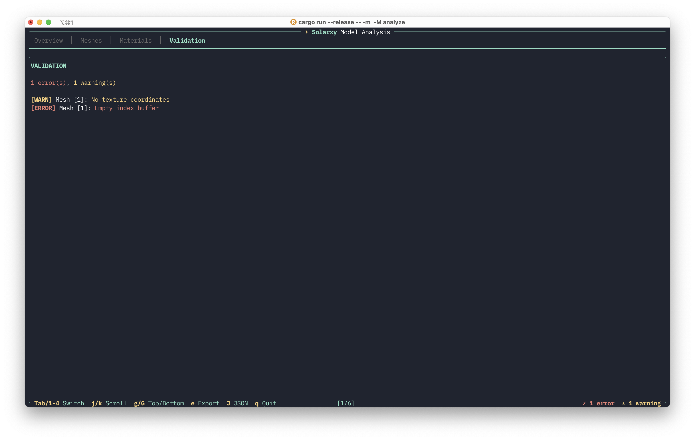
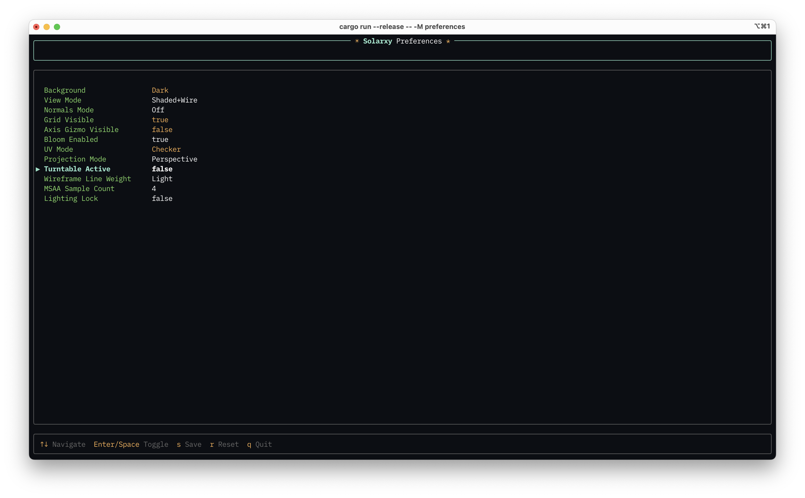
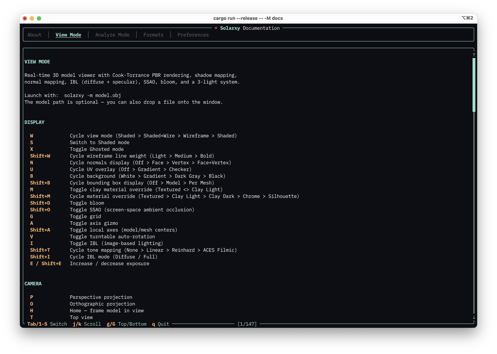

# Solarxy Documentation

> **Out of date.** This document describes Solarxy 0.3.x and has not been updated for the 0.5.0 CLI/GUI split or the UI revamp. A full rewrite is planned for 0.6.0. For current state, see the top-level [README](../README.md), the [CHANGELOG](changelog/CHANGELOG.md), and the in-app `solarxy-cli --mode docs`.

A comprehensive guide to Solarxy -- a lightweight, cross-platform 3D model viewer and validator built with Rust and wgpu.

[GitHub Repository](https://github.com/marko-koljancic/solarxy)

<p align="center">
  
</p>

---

## Table of Contents

- [Quick Start](#quick-start)
- [Installation](#installation)
  - [Pre-Built Binaries](#pre-built-binaries)
  - [Building from Source](#building-from-source)
  - [Verifying the Installation](#verifying-the-installation)
  - [System Requirements](#system-requirements)
  - [Updating](#updating)
- [Supported File Formats](#supported-file-formats)
  - [Format Comparison](#format-comparison)
  - [OBJ (Wavefront)](#obj-wavefront)
  - [STL (Stereolithography)](#stl-stereolithography)
  - [PLY (Polygon File Format)](#ply-polygon-file-format)
  - [glTF / GLB](#gltf--glb)
- [CLI Reference](#cli-reference)
  - [Synopsis](#synopsis)
  - [Options](#options)
  - [Usage Examples](#usage-examples)
  - [Input Validation](#input-validation)
- [View Mode](#view-mode)
  - [Launching the Viewer](#launching-the-viewer)
  - [Camera Controls](#camera-controls)
  - [View Modes](#view-modes)
  - [Rendering Features](#rendering-features)
  - [Visualization Tools](#visualization-tools)
  - [Background and Appearance](#background-and-appearance)
  - [Sidebar Panel](#sidebar-panel)
  - [Split Viewport](#split-viewport)
  - [Inspection Modes](#inspection-modes)
  - [UV Map Mode](#uv-map-mode)
  - [Validation Overlay](#validation-overlay)
  - [Drag and Drop](#drag-and-drop)
  - [Screenshots](#screenshots)
  - [Heads-Up Display](#heads-up-display)
  - [Saving Preferences from the Viewer](#saving-preferences-from-the-viewer)
  - [Keyboard Shortcut Reference](#keyboard-shortcut-reference)
- [Analyze Mode](#analyze-mode)
  - [Launching Analysis](#launching-analysis)
  - [TUI Navigation](#tui-navigation)
  - [Report Tabs](#report-tabs)
  - [Exporting Reports](#exporting-reports)
  - [Validation Checks Reference](#validation-checks-reference)
- [Preferences](#preferences)
  - [Config File Location](#config-file-location)
  - [Three Ways to Edit Preferences](#three-ways-to-edit-preferences)
  - [Complete Settings Reference](#complete-settings-reference)
  - [Example Config File](#example-config-file)
  - [Preferences TUI Navigation](#preferences-tui-navigation)
  - [Config Robustness](#config-robustness)
- [Docs Mode](#docs-mode)
- [Tutorials](#tutorials)
  - [Viewing Your First Model](#viewing-your-first-model)
  - [Inspecting Model Quality](#inspecting-model-quality)
  - [Setting Up Your Preferred Workspace](#setting-up-your-preferred-workspace)
  - [Using Custom HDRI Lighting](#using-custom-hdri-lighting)
  - [Batch Analysis for CI/CD](#batch-analysis-for-cicd)
- [Troubleshooting](#troubleshooting)
  - [Common Issues](#common-issues)
  - [Performance Tips](#performance-tips)
  - [Config Reset](#config-reset)
- [Appendix](#appendix)
  - [Rendering Pipeline](#rendering-pipeline)
  - [Keyboard Shortcut Cheat Sheet](#keyboard-shortcut-cheat-sheet)
  - [Glossary](#glossary)

---

## Quick Start

Get from zero to viewing a model in under a minute.

**View a model:**

```bash
solarxy -m model.obj
```

**Launch the viewer empty and drag a file onto the window:**

```bash
solarxy
```

**Analyze a model in the terminal:**

```bash
solarxy -M analyze -m model.glb
```

**Open the preferences editor:**

```bash
solarxy -M preferences
```

**Shortcuts to memorize first:** **W** (cycle view mode), **H** (frame model), **B** (cycle background), **N** (cycle normals display), **?** (show all shortcuts).

*The viewer displaying a model with default PBR shading, gradient background, and HUD overlay.*

---

## Installation

### Pre-Built Binaries

Download the latest release for your platform from the [GitHub Releases](https://github.com/marko-koljancic/solarxy/releases) page. Binaries are available for:

- **Windows** (x86_64)
- **macOS** (ARM and x86_64)
- **Linux** (x86_64)

Extract the archive and run the `solarxy` binary directly. No installation step is required.

### Building from Source

If you prefer to build from source or need a platform not covered by the pre-built binaries:

1. Install the Rust toolchain from [rustup.rs](https://rustup.rs) (minimum supported Rust version: **1.92**).
2. Clone the repository:
   ```bash
   git clone https://github.com/marko-koljancic/solarxy.git
   cd solarxy
   ```
3. Build in release mode:
   ```bash
   cargo build --release
   ```
4. The binary is at `target/release/solarxy`. You can copy it anywhere on your `PATH`.

### Verifying the Installation

```bash
solarxy --version
```

For detailed version and project info:

```bash
solarxy --about
```

This prints the version, description, repository URL, license, and contact information.

### System Requirements

- A GPU with **Vulkan**, **Metal**, or **DirectX 12** support. Solarxy uses wgpu, which automatically selects the best available graphics backend for your system.
- macOS: Metal is used automatically on all supported Macs.
- Windows: DirectX 12 or Vulkan.
- Linux: Vulkan. Ensure your GPU drivers are up to date.

### Updating

If you installed Solarxy via the shell or PowerShell installer, you can update to the latest version directly from the command line:

```bash
solarxy --update
```

This checks for a newer release on GitHub and installs it automatically.

If you built from source, pull the latest changes and rebuild:

```bash
git pull
cargo build --release
```

---

## Supported File Formats

### Format Comparison

| Format | Extensions | Multiple Meshes | Materials | Textures | UVs | Normals |
| --- | --- | --- | --- | --- | --- | --- |
| Wavefront OBJ | `.obj` | Yes | Yes (MTL) | Yes | Yes | Yes |
| STL | `.stl` | No (single mesh) | No | No | No | Face only |
| PLY | `.ply` | No (single mesh) | No | Auto-detected | Optional | Optional |
| glTF 2.0 | `.gltf`, `.glb` | Yes (scene graph) | Full PBR | Embedded or external | Yes | Yes |

### OBJ (Wavefront)

The OBJ format is widely supported across 3D tools. Solarxy reads meshes, materials (from the companion `.mtl` file), textures, UVs, and normals.

**Important:** The `.mtl` file must be in the same directory as the `.obj` file, and texture paths inside the `.mtl` are resolved relative to that directory. If your textures are not loading, check that the paths in the MTL file are correct and that the image files are present.

OBJ materials support diffuse, ambient, specular, and normal map textures. Solarxy also reads the `Pr` (roughness) and `Pm` (metallic) custom parameters if present, enabling PBR-quality rendering for OBJ files that include them. Transparency is read from the dissolve (`d`) parameter.

### STL (Stereolithography)

STL files contain geometry only -- no materials, textures, or UV coordinates. Both binary and ASCII STL are supported. The entire file is loaded as a single mesh.

STL is commonly used for 3D printing. In the viewer, STL models are rendered with a default clay material and lit by the 3-light system. This format is best for quick geometry inspection rather than material review.

### PLY (Polygon File Format)

PLY files support flexible vertex attributes. Solarxy reads positions (required), and optionally normals and UV coordinates. UV coordinates are detected from multiple naming conventions: `s`/`t`, `u`/`v`, or `texture_u`/`texture_v`.

Solarxy performs **companion texture detection** for PLY files -- it searches for image files alongside the PLY with common suffixes (`_0`, `_diffuse`, or the bare filename) in jpg, png, bmp, and tga formats. If a companion texture is found, it is applied automatically as the diffuse texture.

### glTF / GLB

glTF 2.0 is the recommended format for the best visual results. It provides full PBR (physically-based rendering) material support with the metallic-roughness workflow.

Supported glTF features:
- Base color texture and factor
- Normal maps
- Metallic-roughness texture and individual factors
- Occlusion maps
- Emissive texture and factor
- Alpha modes (Opaque, Mask, Blend)
- Scene hierarchy (recursive node traversal)
- Embedded textures (GLB bundles everything in one file)
- External texture references (glTF with separate image files)

**Tip:** For the best visual results, use glTF/GLB format. It provides full PBR material support including metallic-roughness, normal maps, and embedded textures -- all in a single file with GLB.

---

## CLI Reference

### Synopsis

```
solarxy [OPTIONS]
```

### Options

| Flag | Description | Default | Applies To |
| --- | --- | --- | --- |
| `-m, --model <PATH>` | Path to a model file | -- | All modes (optional in view, required in analyze) |
| `-M, --mode <MODE>` | Operation mode: `view`, `analyze`, `preferences`, `docs` | `view` | -- |
| `-f, --format <FORMAT>` | Output format: `text` or `json` | `text` | Analyze mode only |
| `-o, --output <PATH>` | Write report to file | -- | Analyze mode only |
| `--about` | Print version and project info | -- | -- |
| `--help` | Print help message | -- | -- |
| `--version` | Print version number | -- | -- |

### Usage Examples

```bash
# View a model (default mode)
solarxy -m dragon.obj

# Launch the viewer empty -- drag and drop a file onto the window
solarxy

# Analyze a model in the interactive TUI
solarxy -M analyze -m dragon.glb

# Export a text report to a file
solarxy -M analyze -m dragon.glb -o report.txt

# Export a JSON report (auto-named as <model>.json)
solarxy -M analyze -m dragon.glb -f json

# Export a JSON report to a specific file
solarxy -M analyze -m dragon.glb -f json -o analysis.json

# Pipe JSON output to jq for processing
solarxy -M analyze -m dragon.glb -f json | jq .meshes

# Open the preferences editor
solarxy -M preferences

# Open the built-in documentation
solarxy -M docs

# Print version and project info
solarxy --about
```

### Input Validation

The CLI validates your input before proceeding. Here are the messages you may see:

| Condition | Message |
| --- | --- |
| File does not exist | `Model file does not exist: <path>` |
| Path is a directory | `Path is not a file: <path>` |
| Unsupported extension | `Invalid file extension '.<ext>', expected '.obj', '.stl', '.ply', '.gltf', or '.glb'` |
| No file extension | `File has no extension, expected '.obj', '.stl', '.ply', '.gltf', or '.glb'` |
| JSON format outside analyze mode | `Error: --format json requires --mode analyze` |
| No model in analyze mode | `Model path is required for analyze mode (use -m <path>)` |

---

## View Mode

The viewer renders models with physically-based shading (Cook-Torrance BRDF), normal mapping, real-time shadow mapping, image-based lighting (diffuse irradiance + specular reflections), screen-space ambient occlusion (SSAO), HDR bloom, selectable tone mapping (ACES Filmic, Reinhard, Linear, None), alpha blending, and 4x MSAA anti-aliasing. A 3-light system (key, fill, rim) follows the camera for consistent illumination. The scene includes a shadow-catching floor, an infinite grid, an axis gizmo, and optional bounding-box overlays.

### Launching the Viewer

**With a model:**

```bash
solarxy -m model.obj
```

The model loads and the camera automatically frames it in view.

**Without a model:**

```bash
solarxy
```

The viewer opens with an empty scene showing a centered message with the supported file extensions. Drop a model file onto the window to load it.



*The viewer launched without a model, ready for drag-and-drop.*

### Camera Controls

| Input | Action |
| --- | --- |
| Left mouse drag | Orbit around the model |
| Middle mouse drag | Pan the camera |
| Scroll wheel | Zoom in and out |
| Arrow keys | Move the camera |

**Framing and preset views:**

| Key | Action |
| --- | --- |
| **H** | Home -- frame the entire model in view |
| **T** | Top view (looks down the Y axis) |
| **F** | Front view (looks along the Z axis) |
| **L** | Left view (looks along the -X axis) |
| **R** | Right view (looks along the X axis) |

Preset views automatically switch to orthographic projection and frame the model with an animated camera transition.

**Projection:**

| Key | Action |
| --- | --- |
| **P** | Perspective projection (realistic depth) |
| **O** | Orthographic projection (no foreshortening, useful for technical inspection) |

**Tip:** Press **H** if you ever lose sight of your model. It resets the camera to frame the entire bounding box.



*The same model in perspective projection (left) and orthographic projection (right).*

### View Modes

Solarxy offers four view modes for different inspection needs.

| Mode | Description | How to Activate |
| --- | --- | --- |
| **Shaded** | Full PBR rendering with materials and lighting | **S** (direct) or **W** (cycle) |
| **Shaded+Wire** | PBR rendering with wireframe edges overlaid | **W** (cycle) |
| **Wireframe** | Wireframe edges only, no surface shading | **W** (cycle) |
| **Ghosted** | Semi-transparent surfaces with visible edges | **X** (toggle) |

**W** cycles through Shaded, Shaded+Wire, and Wireframe in order. **S** switches directly to Shaded from any mode. **X** toggles Ghosted mode on and off -- when toggled off, it returns to your previous non-ghosted mode.


*All four view modes: Shaded, Shaded+Wire, Wireframe, and Ghosted.*

### Rendering Features

#### PBR Shading

The viewer uses a Cook-Torrance BRDF (bidirectional reflectance distribution function) with the metallic-roughness workflow. This is the same shading model used in modern game engines and matches the glTF 2.0 material specification. OBJ models with MTL materials are rendered with diffuse, specular, and normal map support. Models without materials receive a default clay appearance.

#### 3-Light System

Three lights provide consistent, studio-style illumination:

- **Key light** -- warm white, positioned upper-left. The primary light source and the one that casts shadows.
- **Fill light** -- cool blue-tinted, positioned to the right. Softens shadows from the key light.
- **Rim light** -- pure white, positioned behind the model. Creates edge highlights for separation from the background.

By default, all three lights follow the camera as you orbit. Toggle **Shift+L** to lock the lights in place -- they remain stationary while you orbit, letting you see how light falls from a fixed direction.

#### Material Override

Material overrides replace all texture and material properties with a uniform diagnostic material, letting you inspect surface geometry, topology, and lighting response without visual noise from authored textures.

| Key | Action |
| --- | --- |
| **M** | Toggle between Textured and Clay Light |
| **Shift+M** | Cycle: Textured → Clay Light → Clay Dark → Chrome → Silhouette |

| Mode | Albedo | Roughness | Metallic | Notes |
| --- | --- | --- | --- | --- |
| **Textured** | Authored | Authored | Authored | Normal rendering (default) |
| **Clay Light** | 0.8 (light gray) | 0.7 | 0.0 | Neutral matte clay -- same as default STL appearance |
| **Clay Dark** | 0.025 (near-black) | 1.0 | 0.0 | Dark matte -- reveals subtle surface curvature |
| **Chrome** | 0.05 (black) | 0.03 | 1.0 | Reflective black metal, IBL-only (no direct lights) |
| **Silhouette** | 0.0 (black) | -- | -- | Flat black, completely unlit -- pure shape outline |

All override modes disable texture sampling (diffuse, normal, metallic-roughness, occlusion, emissive) and use geometric normals instead of normal maps. Chrome mode disables the 3-light system and relies solely on IBL environment reflections for smooth, artifact-free specular response. Silhouette mode bypasses the entire PBR pipeline.

Material override is per-pane in split viewport mode and is also available from the sidebar Material dropdown. The active override name appears in the HUD pane label.

#### Shadow Mapping

The key light casts real-time shadows using a 2048x2048 shadow map. Shadows fall onto the model's own surfaces and onto a shadow-catching floor beneath the model.

#### Normal Mapping

When a model includes normal map textures (common in glTF files), the viewer applies them automatically. Normal maps add surface detail without additional geometry, making surfaces appear more complex than their polygon count would suggest.

#### Image-Based Lighting (IBL)

IBL provides ambient environment lighting that wraps around the model from all directions, simulating how real objects are lit by their surroundings.

| Key | Action |
| --- | --- |
| **I** | Toggle IBL on and off |
| **Shift+I** | Cycle IBL mode: Diffuse / Full |

- **Diffuse** -- Irradiance only. Provides soft, uniform ambient light.
- **Full** -- Diffuse irradiance plus specular reflections. Metallic and glossy surfaces show environment reflections. This is the default.

The IBL environment is generated from the current background sky colors by default. You can replace it with a custom HDRI environment map by dragging an `.hdr` or `.exr` file onto the viewer window.


#### SSAO (Screen-Space Ambient Occlusion)

SSAO adds subtle contact shadows in crevices, folds, and where surfaces meet. It enhances the perception of depth and detail. Enabled by default.

| Key | Action |
| --- | --- |
| **Shift+O** | Toggle SSAO on and off |

#### Bloom

HDR bloom adds a soft glow around bright highlights, simulating how bright areas bleed light in real cameras. Enabled by default.

| Key | Action |
| --- | --- |
| **Shift+D** | Toggle bloom on and off |

#### Tone Mapping

Tone mapping controls how HDR color values are mapped to the displayable [0, 1] range. The default operator is ACES Filmic, which provides good contrast and color retention at high luminance. Cycle through operators with Shift+T.

| Key | Action |
| --- | --- |
| **Shift+T** | Cycle tone mapping: None (clip) → Linear → Reinhard → ACES Filmic |

| Operator | Description |
| --- | --- |
| **ACES Filmic** | Industry-standard filmic curve (Narkowicz approximation). Good contrast, saturated highlights. Default. |
| **Reinhard** | Classic operator. Gentle rolloff, tends to desaturate bright highlights. |
| **Linear** | Clamp to [0, 1]. No curve applied. |
| **None (clip)** | Raw clamp to [0, 1]. Diagnostic mode — highlights clip hard. |

#### Exposure

Exposure scales the scene color before tone mapping is applied. Useful for adjusting the overall brightness when working with HDR environment maps that are much brighter or dimmer than the default lighting.

| Key | Action |
| --- | --- |
| **E** | Increase exposure (+0.5) |
| **Shift+E** | Decrease exposure (-0.5) |

Range: 0.1 to 10.0. Default: 1.0. Saved with preferences.

#### MSAA (Multi-Sample Anti-Aliasing)

4x MSAA is enabled by default, smoothing jagged edges on polygon boundaries. The sample count (1, 2, or 4) can be changed in preferences but not at runtime. Lower values improve performance on constrained hardware.

### Visualization Tools

#### Normals Display

Visualize surface normals as colored lines extending from the model's surface.

| Key | Action |
| --- | --- |
| **N** | Cycle: Off, Face, Vertex, Face+Vertex |

- **Face normals** -- one line per triangle, pointing perpendicular to the face.
- **Vertex normals** -- one line per vertex, showing the interpolated normal direction.
- **Face+Vertex** -- both overlaid simultaneously.

This is useful for diagnosing shading artifacts caused by incorrect or flipped normals.


*Face and vertex normals rendered on a model surface.*

#### UV Overlay

Visualize how UV coordinates are mapped onto the model's surface.

| Key | Action |
| --- | --- |
| **U** | Cycle: Off, Gradient, Checker |

- **Gradient** -- maps UV coordinates to colors (red = U axis, green = V axis). Useful for seeing the overall UV layout.
- **Checker** -- projects a checkerboard pattern. Useful for spotting UV stretching, distortion, and seam placement.



*Checker UV overlay revealing the UV mapping distribution on a model.*

#### Bounding Boxes

| Key | Action |
| --- | --- |
| **Shift+B** | Cycle: Off, Whole Model, Per Mesh |

- **Whole Model** -- a single axis-aligned bounding box around the entire model.
- **Per Mesh** -- individual bounding boxes for each mesh, color-coded for distinction. Only available for multi-mesh models.

When bounding boxes are visible, the HUD displays the model's extents (width, height, depth).



*Per-mesh bounding boxes on a multi-mesh model, each mesh outlined in a distinct color.*

#### Grid

| Key | Action |
| --- | --- |
| **G** | Toggle grid on and off |

An infinite ground-plane grid at Y=0. Grid color automatically adapts to contrast with the current background. Enabled by default.

#### Axis Gizmo

| Key | Action |
| --- | --- |
| **A** | Toggle axis gizmo on and off |

A 3D axis indicator showing X (red), Y (green), and Z (blue) directions at the model's origin. Disabled by default.

#### Wireframe Weight

| Key | Action |
| --- | --- |
| **Shift+W** | Cycle: Light (1px), Medium (2px), Bold (3px) |

Controls the line thickness for wireframe edges in Shaded+Wire, Wireframe, and Ghosted modes. Default is Medium.

### Background and Appearance

| Key | Action |
| --- | --- |
| **B** | Cycle background: White, Gradient, Dark Gray, Black |

The background affects the overall feel of the scene. Changing the background also regenerates the default IBL environment from the new sky colors, subtly shifting the ambient lighting.

- **White** -- clean and bright, good for contrast.
- **Gradient** -- default. A balanced gradient from light to dark blue.
- **Dark Gray** -- reduces eye strain for extended sessions.
- **Black** -- maximizes contrast, useful for light-colored models.

#### Turntable

| Key | Action |
| --- | --- |
| **V** | Toggle turntable auto-rotation |

Turntable mode continuously rotates the model around the Y axis. Useful for presentations or getting a quick all-around view. Turntable pauses while you orbit manually with the mouse and resumes when you release.

### Sidebar Panel

Press **Tab** to toggle an interactive sidebar on the left side of the viewer. The sidebar slides in with an animation and is hidden by default.

The sidebar contains collapsible sections with interactive controls:

**View section:**
- View mode dropdown (synced with **W** key)
- Inspection mode dropdown (synced with **1**-**5** keys)
- Material override dropdown (synced with **M** / **Shift+M**)
- Texel Density target slider (shown when Texel Density inspection is active, logarithmic 0.01--10.0)
- Normals mode dropdown (synced with **N**)
- UV mode dropdown (synced with **U**)
- Wireframe line weight dropdown (synced with **Shift+W**)
- Background mode dropdown (synced with **B**)
- Bounds mode dropdown (synced with **Shift+B**)
- Camera linking checkbox (split mode only, synced with **Ctrl+L**)

**UV Map controls** (shown when active pane is in UV Map mode):
- UV background dropdown (Dark / Checker / Texture)
- Line weight dropdown
- Overlap toggle checkbox
- Overlap coverage percentage (when overlap is enabled)
- "Back to 3D" button

**Display section:**
- Grid checkbox (synced with **G**)
- Axis gizmo checkbox (synced with **A**)
- Local axes checkbox (synced with **Shift+A**)
- Lights lock checkbox (synced with **Shift+L**)
- Turntable checkbox (synced with **V**)
- Turntable RPM slider (shown when turntable is active, logarithmic 1.0--60.0)

**Validation section** (collapsed by default, shown when a model is loaded):
- Show overlay checkbox (synced with **Shift+V**)
- List of validation issues with color-coded severity indicators

**Post-Processing section:**
- Bloom checkbox (synced with **Shift+D**)
- SSAO checkbox (synced with **Shift+O**)
- Tone mapping dropdown (synced with **Shift+T**)
- Exposure slider (synced with **E** / **Shift+E**, logarithmic 0.1--10.0)

**Lighting section:**
- IBL mode dropdown (synced with **I** / **Shift+I**)

**Model Stats:**
- Toggle checkbox at the bottom (shown when a model is loaded)

All sidebar controls are bidirectionally synced with keyboard shortcuts -- changing a value in the sidebar updates the viewer immediately, and pressing a keyboard shortcut updates the sidebar to match. Each control shows a tooltip with its corresponding keyboard shortcut.



*The sidebar panel open alongside the viewer, with the Model Stats overlay showing geometry and validation details.*

### Split Viewport

Solarxy supports split-pane layouts for simultaneous multi-angle or multi-mode inspection.

| Key | Layout |
| --- | --- |
| **F1** | Single viewport (default) |
| **F2** | Vertical split -- left pane shows UV Map, right pane shows 3D |
| **F3** | Horizontal split -- top pane shows UV Map, bottom pane shows 3D |

Each pane has its own independent settings:

- **Camera** -- orbit, pan, and zoom independently per pane
- **View mode** -- Shaded, Wireframe, Ghosted, etc.
- **Inspection mode** -- Shaded, Material ID, Texel Density, Depth
- **Display toggles** -- grid, axes, normals, UV overlay, background, bounds
- **Pane mode** -- 3D Scene or UV Map

The **active pane** is determined by cursor position and highlighted with a blue border. Mouse input (orbit, pan, zoom) applies only to the active pane. Keyboard shortcuts for display and inspection modes also apply to the active pane only.

**Camera linking:** Press **Ctrl+L** to link or unlink cameras between panes. When linked, orbiting in one pane orbits both. A toast notification confirms the state change.

Panes are separated by a 2-pixel divider. The divider is highlighted in blue on the active pane side.


*Horizontal split layout with two independent 3D viewports and Model Stats overlay.*


*Vertical split layout with UV Map on the left and textured 3D view on the right.*

### Inspection Modes

Inspection modes provide specialized visualizations for debugging 3D assets. They are activated via number keys and apply to the active pane.

| Key | Mode | Description |
| --- | --- | --- |
| **1** | Shaded | Full PBR rendering (default) |
| **2** | Material ID | Flat color per material slot -- each material gets a unique, deterministic color via hash function. No lighting is applied. Useful for verifying material assignments. |
| **3** | UV Map | Toggles the pane between 3D view and 2D UV-space rendering. See [UV Map Mode](#uv-map-mode). |
| **4** | Texel Density | Heat map showing UV density distribution. Blue = under-density (UV islands too large for the surface), green = target density, red = over-density (UV islands too small). The target density is adjustable via a logarithmic slider in the sidebar (0.01--10.0). Models without UVs show solid gray. |
| **5** | Depth | Linearized depth buffer visualization. White = near plane, black = far plane. Works correctly with both perspective and orthographic projections. Useful for diagnosing Z-fighting and clipping plane issues. |

Inspection modes compose independently with view modes (**W**/**X**). For example, you can view Material ID in wireframe mode, or Texel Density with ghosted transparency.



*Split view showing Material ID inspection (left) and Silhouette material override (right).*

In split mode, each pane can use a different inspection mode simultaneously -- for example, Material ID on the left and Shaded on the right.

### UV Map Mode

Press **3** to toggle the active pane between 3D scene rendering and 2D UV-space rendering. In UV Map mode, the vertex shader projects mesh vertices using their UV coordinates instead of world-space positions, showing the UV layout as a flat 2D view.

**Controls in UV Map mode:**

| Key | Action |
| --- | --- |
| **U** | Cycle UV background: Dark / Checker / Texture |
| **O** | Toggle UV overlap display |
| **Shift+W** | Cycle wireframe line weight |
| **3** | Return to 3D view |

**Mouse:** Left or middle drag to pan, scroll to zoom. The UV camera is orthographic -- no orbit.

**UV overlap detection:** Press **O** to highlight overlapping UV regions. Solarxy uses a two-pass algorithm: the first pass renders all triangles in UV space and counts per-pixel coverage; the second pass highlights pixels covered by more than one triangle in semi-transparent red (35% alpha). The overlap coverage percentage is shown in the sidebar.

The recommended split workflow is **F2** (vertical split) with UV Map on the left and Shaded on the right, allowing you to inspect UV layout alongside the 3D model.

### Validation Overlay

The validation overlay renders validation warnings as color-coded semi-transparent highlights directly on the 3D model.

**Toggle:** Press **Shift+V** or use the checkbox in the sidebar's Validation section.

Each validation issue category has a distinct color:

| Category | Color | Alpha |
| --- | --- | --- |
| General Error | Red | 35% |
| Invalid Material Reference | Orange | 35% |
| Normal Count Mismatch | Cyan | 35% |
| Missing UVs | Magenta | 35% |
| Degenerate Triangles | Yellow | 35% |

When a mesh has multiple issues, the highest-severity issue is displayed. Degenerate triangles are rendered using a separate index buffer containing only the zero-area faces, so individual bad triangles are highlighted rather than the entire mesh.

The sidebar's Validation section lists all issues with colored indicator dots, counts of errors and warnings, and the overlay toggle.

Validation runs automatically when a model is loaded. The HUD and sidebar display issue counts.

### Drag and Drop

Drop files directly onto the viewer window.

**Model files** (`.obj`, `.stl`, `.ply`, `.gltf`, `.glb`):
- Replaces the current model.
- The camera automatically frames the new model.
- A toast notification confirms the load or reports any errors.

**HDRI environment maps** (`.hdr`, `.exr`):
- Replaces the default IBL environment with a custom one.
- Automatically enables Full IBL mode.
- Toast notification confirms "HDRI loaded" or shows an error message.

**Unsupported files:**
- Dropping any other file type shows a red toast notification: "Unsupported format: .xxx".

### Screenshots

| Key | Action |
| --- | --- |
| **C** | Capture screenshot |

Saves a PNG screenshot to the current working directory. The filename is timestamped: `solarxy_YYYYMMDD_HHMMSS.png`. A toast notification confirms the save location. The screenshot captures the full rendering pipeline including all active effects.

### Heads-Up Display

The HUD overlays real-time information on the viewer.

**Top-left corner:**
- Model filename and mesh count
- Polygon, triangle, and vertex counts
- Bounding box dimensions (when bounds display is active)
- Frame time and FPS

**Top-right corner** (shows non-default states):
- Current view mode
- Projection mode
- Normals mode (if enabled)
- Background name
- Wireframe weight (if not Medium)
- Grid (if disabled)
- Lights (if locked)
- Axes (if enabled)
- Local Axes (if enabled)
- Bounds mode (if enabled)
- IBL mode (if not Full)
- SSAO (if disabled)
- Tone mapping (if not ACES Filmic)
- Exposure (if not 1.0)

**Bottom center:**
- Keyboard hints bar (toggle with **?**)

**Toast notifications:**
- Appear briefly (about 3 seconds) to confirm actions like saving preferences, capturing screenshots, loading models, or reporting errors.
- Color-coded: green for success, red for errors.
- Text color adapts to background luminance for readability.

### Saving Preferences from the Viewer

Press **Shift+S** to save the current viewer state as your default preferences. This writes the current background, view mode, normals mode, grid, axis gizmo, local axes, bloom, SSAO, tone mapping, exposure, UV mode, projection, turntable, turntable RPM, wireframe weight, IBL mode, lights lock, inspection mode, and texel density target to the config file. These settings are restored the next time you launch Solarxy.

### Keyboard Shortcut Reference

**Display:**

| Key | Action |
| --- | --- |
| **W** | Cycle view mode (Shaded / Shaded+Wire / Wireframe) |
| **S** | Switch to Shaded mode |
| **X** | Toggle Ghosted mode |
| **Shift+W** | Cycle wireframe line weight (Light / Medium / Bold) |
| **N** | Cycle normals display (Off / Face / Vertex / Face+Vertex) |
| **U** | Cycle UV overlay (Off / Gradient / Checker) |
| **B** | Cycle background (White / Gradient / Dark Gray / Black) |
| **Shift+B** | Cycle bounding box display (Off / Model / Per Mesh) |
| **M** | Toggle clay material override (Textured / Clay Light) |
| **Shift+M** | Cycle material override (Textured / Clay Light / Clay Dark / Chrome / Silhouette) |
| **Shift+D** | Toggle bloom |
| **Shift+O** | Toggle SSAO |
| **Shift+A** | Toggle local axes (model/mesh centers) |
| **Shift+T** | Cycle tone mapping (None / Linear / Reinhard / ACES Filmic) |
| **E** / **Shift+E** | Increase / decrease exposure |
| **G** | Toggle grid |
| **A** | Toggle axis gizmo |
| **V** | Toggle turntable auto-rotation |
| **Shift+V** | Toggle validation overlay |
| **I** | Toggle IBL |
| **Shift+I** | Cycle IBL mode (Diffuse / Full) |

**Inspection Modes:**

| Key | Action |
| --- | --- |
| **1** | Shaded inspection (default PBR) |
| **2** | Material ID inspection |
| **3** | Toggle UV Map / 3D view |
| **4** | Texel Density inspection |
| **5** | Depth inspection |

**Split Viewport:**

| Key | Action |
| --- | --- |
| **F1** | Single viewport |
| **F2** | Vertical split (left: UV Map, right: 3D) |
| **F3** | Horizontal split (top: UV Map, bottom: 3D) |
| **Ctrl+L** | Toggle camera linking between panes |

**UV Map Mode:**

| Key | Action |
| --- | --- |
| **U** | Cycle UV background (Dark / Checker / Texture) |
| **O** | Toggle UV overlap display |

**Camera:**

| Key | Action |
| --- | --- |
| **H** | Home -- frame model in view |
| **T** | Top view |
| **F** | Front view |
| **L** | Left view |
| **R** | Right view |
| **P** | Perspective projection |
| **O** | Orthographic projection |
| Arrow keys | Camera movement |

**Mouse:**

| Input | Action |
| --- | --- |
| Left drag | Orbit camera |
| Middle drag | Pan camera |
| Scroll wheel | Zoom in / out |

**Other:**

| Key | Action |
| --- | --- |
| **Tab** | Toggle sidebar panel |
| **C** | Capture screenshot (PNG) |
| **Shift+S** | Save current settings as preferences |
| **Shift+L** | Toggle lights lock |
| **?** | Toggle keyboard hints overlay |
| **Esc** | Exit viewer |

---

## Analyze Mode

The analyzer opens a terminal UI with structured reports covering geometry, meshes, materials, and validation issues. Use it to inspect model data and catch problems before shipping assets.

### Launching Analysis

**Interactive TUI** (opens a navigable report):

```bash
solarxy -M analyze -m model.glb
```

**Direct text export** (writes a report file without opening the TUI):

```bash
solarxy -M analyze -m model.glb -o report.txt
```

**JSON export** (auto-named as `<model>.json` when run in a terminal):

```bash
solarxy -M analyze -m model.glb -f json
```

**JSON to a specific file:**

```bash
solarxy -M analyze -m model.glb -f json -o analysis.json
```

**Piping JSON to other tools** (when stdout is not a terminal, JSON goes to stdout):

```bash
solarxy -M analyze -m model.glb -f json | jq .validation
```

A model path (`-m`) is required in analyze mode.



*The Overview tab showing aggregate model statistics and bounding box dimensions.*

### TUI Navigation

| Key | Action |
| --- | --- |
| **Tab** / **Shift+Tab** | Next / previous tab |
| **1** **2** **3** **4** | Jump to tab (Overview, Meshes, Materials, Validation) |
| **j** / **k** | Scroll down / up |
| **Up** / **Down** arrows | Scroll up / down |
| **g** / **G** | Jump to top / bottom |
| **PgUp** / **PgDn** | Scroll up / down 20 lines |
| **e** | Export text report (prompts for filename) |
| **J** | Export JSON report (prompts for filename) |
| **q** / **Esc** | Quit |

### Report Tabs

#### Tab 1: Overview

A summary of the entire model:

- **Model Name** -- the filename of the loaded model
- **Mesh Count** -- number of meshes in the model
- **Material Count** -- number of materials defined
- **Total Vertices** -- sum across all meshes
- **Total Indices** -- sum across all meshes
- **Total Triangles** -- sum across all meshes
- **Bounding Box** (if geometry is present):
  - Min and Max corners (X, Y, Z)
  - Size (width, height, depth)
  - Center point
  - Diagonal distance

#### Tab 2: Meshes

A per-mesh breakdown. Each mesh shows:

- **Index** -- mesh number (zero-based)
- **Vertices** -- vertex count
- **Indices** -- index count
- **Triangles** -- triangle count
- **Normals** -- count with a status indicator:
  - Checkmark -- normal count matches vertex count (correct)
  - Warning -- count mismatch or partial normals
- **Texture Coords** -- count with a status indicator:
  - Checkmark -- UV count matches vertex count
  - Cross -- no UVs present
  - Warning -- count mismatch
- **Material** -- assigned material name and ID, or "None"

#### Tab 3: Materials

Per-material properties and textures:

- **Name** and **Index**
- **Ambient**, **Diffuse**, **Specular** -- RGB color values
- **Shininess**, **Dissolve** (opacity), **Optical Density** -- when available
- **Textures** -- each slot (Diffuse, Ambient, Specular, Normal, Shininess, Dissolve) with:
  - File path
  - Status: checkmark if the file exists, **[MISSING]** in red if not found

If no materials are defined, the tab shows "No materials found".

#### Tab 4: Validation

A list of all errors and warnings found in the model:

- **Summary line** -- "{N} error(s), {M} warning(s)"
- Each issue shows:
  - **Severity** -- `[ERROR]` (red) or `[WARN]` (yellow)
  - **Scope** -- which mesh or material is affected (e.g., "Mesh [0]", "Material [2]")
  - **Message** -- description of the issue

If no issues are found, the tab shows "No issues found" in green.



*The Validation tab listing errors and warnings found during model analysis.*

### Exporting Reports

Reports can be exported in two formats.

**Text format** -- human-readable, structured with headers and indentation. Includes all four sections (Validation, Overview, Meshes, Materials). Export from the TUI by pressing **e**, or from the CLI with `-o report.txt`.

**JSON format** -- machine-readable, suitable for automation and CI/CD pipelines. The JSON structure includes:

```json
{
  "model_name": "model.glb",
  "mesh_count": 3,
  "material_count": 2,
  "total_vertices": 15420,
  "total_indices": 46260,
  "total_triangles": 15420,
  "bounds": {
    "min": { "x": -1.0, "y": 0.0, "z": -1.0 },
    "max": { "x": 1.0, "y": 2.0, "z": 1.0 },
    "size": { "x": 2.0, "y": 2.0, "z": 2.0 },
    "center": { "x": 0.0, "y": 1.0, "z": 0.0 },
    "diagonal": 3.464
  },
  "meshes": [ ... ],
  "materials": [ ... ],
  "validation": {
    "error_count": 1,
    "warning_count": 2,
    "issues": [
      {
        "severity": "error",
        "scope": "mesh",
        "scope_index": 0,
        "message": "Normal count (100) does not match vertex count (200)"
      }
    ]
  }
}
```

Export JSON from the TUI by pressing **J**, or from the CLI with `-f json`. When piped (stdout is not a terminal), JSON output goes directly to stdout for processing with tools like `jq`.

### Validation Checks Reference

| Check | Severity | Scope | Triggered For | Message |
| --- | --- | --- | --- | --- |
| Normal count mismatch | Error | Mesh | All formats (if normals exist) | Normal count (N) does not match vertex count (M) |
| UV count mismatch | Warning | Mesh | All formats (if UVs exist) | Texture coordinate count (N) does not match vertex count (M) |
| Missing UVs | Warning | Mesh | OBJ, glTF only | No texture coordinates |
| Non-triangulated mesh | Error | Mesh | All formats | Index count (N) is not divisible by 3 (non-triangulated) |
| Empty index buffer | Error | Mesh | All formats | Empty index buffer |
| Invalid material reference | Error | Mesh | OBJ, glTF | Material ID N is out of range (only M materials available) |
| Missing texture file | Error | Material | OBJ | Texture file not found: 'path' |
| Degenerate triangles | Warning | Mesh | All formats | N degenerate triangle(s) detected (near-zero area) |

Degenerate triangles are detected using cross-product area with an epsilon threshold of `diagonal² × 1e-10`, where diagonal is the model's bounding box diagonal. This catches near-zero-area faces that can cause shading artifacts, shadow mapping issues, and wasted GPU work.

**Note:** STL and PLY files do not trigger the "Missing UVs" warning since these formats do not typically include UV coordinates.

---

## Preferences

Solarxy persists display, rendering, and lighting settings in a TOML configuration file. Preferences are loaded automatically on startup and applied to the viewer.

### Config File Location

| Platform | Path |
| --- | --- |
| macOS | `~/Library/Application Support/solarxy/config.toml` |
| Linux | `~/.config/solarxy/config.toml` |
| Windows | `C:\Users\<User>\AppData\Roaming\solarxy\config.toml` |

The config directory and file are created automatically the first time you save preferences.

### Three Ways to Edit Preferences

**1. Preferences TUI** -- the dedicated interactive editor:

```bash
solarxy -M preferences
```

Navigate settings, cycle values, and save. See [Preferences TUI Navigation](#preferences-tui-navigation) for key bindings.



*The preferences editor showing all configurable settings with their current values.*

**2. In-viewer save** -- change settings on the fly using keyboard shortcuts in the viewer, then press **Shift+S** to persist them.

**3. Direct TOML editing** -- open the config file in any text editor. Solarxy reads it on startup.

### Complete Settings Reference

**Display settings** (`[display]` section):

| Setting | TOML Key | Values | Default |
| --- | --- | --- | --- |
| Background | `background` | `"White"`, `"Gradient"`, `"DarkGray"`, `"Black"` | `"Gradient"` |
| View Mode | `view_mode` | `"Shaded"`, `"ShadedWireframe"`, `"WireframeOnly"`, `"Ghosted"` | `"Shaded"` |
| Normals Mode | `normals_mode` | `"Off"`, `"Face"`, `"Vertex"`, `"FaceAndVertex"` | `"Off"` |
| Grid Visible | `grid_visible` | `true`, `false` | `true` |
| Axis Gizmo Visible | `axis_gizmo_visible` | `true`, `false` | `true` |
| Local Axes Visible | `local_axes_visible` | `true`, `false` | `false` |
| Bloom Enabled | `bloom_enabled` | `true`, `false` | `true` |
| SSAO Enabled | `ssao_enabled` | `true`, `false` | `true` |
| UV Mode | `uv_mode` | `"Off"`, `"Gradient"`, `"Checker"` | `"Off"` |
| Projection Mode | `projection_mode` | `"Perspective"`, `"Orthographic"` | `"Perspective"` |
| Turntable Active | `turntable_active` | `true`, `false` | `false` |
| IBL Mode | `ibl_mode` | `"Off"`, `"Diffuse"`, `"Full"` | `"Full"` |
| Tone Mode | `tone_mode` | `"None"`, `"Linear"`, `"Reinhard"`, `"AcesFilmic"` | `"AcesFilmic"` |
| Exposure | `exposure` | `0.1` -- `10.0` | `1.0` |
| Local Axes Visible | `local_axes_visible` | `true`, `false` | `false` |
| Turntable RPM | `turntable_rpm` | `1.0` -- `60.0` | `5.0` |
| Inspection Mode | `inspection_mode` | `"Shaded"`, `"MaterialId"`, `"TexelDensity"`, `"Depth"` | `"Shaded"` |
| Texel Density Target | `texel_density_target` | `0.01` -- `10.0` | `1.0` |

**Rendering settings** (`[rendering]` section):

| Setting | TOML Key | Values | Default |
| --- | --- | --- | --- |
| Wireframe Line Weight | `wireframe_line_weight` | `"Light"`, `"Medium"`, `"Bold"` | `"Light"` |
| MSAA Sample Count | `msaa_sample_count` | `1`, `2`, `4` | `4` |

**Lighting settings** (`[lighting]` section):

| Setting | TOML Key | Values | Default |
| --- | --- | --- | --- |
| Lights Lock | `lock` | `true`, `false` | `false` |

### Example Config File

A complete config file with all settings at their defaults:

```toml
config_version = 1

[display]
background = "Gradient"
view_mode = "Shaded"
normals_mode = "Off"
grid_visible = true
axis_gizmo_visible = true
local_axes_visible = false
bloom_enabled = true
ssao_enabled = true
uv_mode = "Off"
projection_mode = "Perspective"
turntable_active = false
turntable_rpm = 5.0
ibl_mode = "Full"
tone_mode = "AcesFilmic"
exposure = 1.0
inspection_mode = "Shaded"
texel_density_target = 1.0

[rendering]
wireframe_line_weight = "Light"
msaa_sample_count = 4

[lighting]
lock = false

[history]
recent_files = []
```

### Preferences TUI Navigation

| Key | Action |
| --- | --- |
| **j** / **Down** | Move selection down |
| **k** / **Up** | Move selection up |
| **Enter** / **Space** / **l** / **Right** | Cycle setting value forward |
| **h** / **Left** | Cycle setting value backward |
| **s** | Save preferences to disk |
| **r** | Reset all settings to defaults (unsaved until you press **s**) |
| **q** / **Esc** | Quit |

Changed but unsaved settings are highlighted. An asterisk (`*`) appears next to the title when there are unsaved changes.

### Config Robustness

Solarxy handles configuration gracefully:

- **Unknown fields** are silently ignored. This means older versions of Solarxy can read config files written by newer versions without errors.
- **Missing sections** use defaults. A partial config file works fine -- any omitted settings fall back to their defaults.
- **Invalid MSAA values** fall back to 4 with a warning printed to stderr. Only 1, 2, and 4 are valid.
- **Corrupt TOML** prints a warning to stderr and uses all defaults. The viewer still launches normally.
- **Atomic saves** -- preferences are written to a temporary file first, then renamed into place. This prevents corruption if the write is interrupted.
- **Recent files** -- Solarxy tracks up to 20 recently opened model files in the `[history]` section. This list is updated automatically when you load a model.

---

## Docs Mode

Solarxy includes a built-in documentation viewer accessible entirely offline.

```bash
solarxy -M docs
```

The docs TUI has five tabs:

| Tab | Content |
| --- | --- |
| **1 -- About** | Version, description, repository, license, modes overview, getting started examples, CLI options |
| **2 -- View Mode** | Display shortcuts, camera controls, inspection modes, split viewport, UV Map, sidebar panel, mouse controls, drag-and-drop |
| **3 -- Analyze Mode** | Usage examples, TUI navigation, report tabs overview, validation checks |
| **4 -- Preferences** | Config file locations, editing methods, complete settings table with defaults, TUI navigation |
| **5 -- Formats** | Supported file formats and format-specific notes |

Navigation is the same as in analyze mode: **Tab** / **Shift+Tab** to switch tabs, **1**-**5** to jump to a tab, **j**/**k** or arrows to scroll, **g**/**G** to jump to top/bottom, **PgUp**/**PgDn** for page scrolling, **q** or **Esc** to quit.



*The built-in documentation viewer showing the View Mode tab.*

---

## Tutorials

### Viewing Your First Model

This walkthrough takes you from launching Solarxy to exploring a model and capturing a screenshot.

**Step 1 -- Load a model.** Run the viewer with a model file:

```bash
solarxy -m my-model.glb
```

The model loads and the camera automatically frames it. You should see the model rendered with PBR shading on a gradient background.

**Step 2 -- Orbit around the model.** Click and hold the left mouse button, then drag to orbit. The camera rotates around the model's center. Use the scroll wheel to zoom in and out.

**Step 3 -- Try different view modes.** Press **W** to cycle through Shaded, Shaded+Wire, and Wireframe. Press **X** to see the model in Ghosted mode. Press **S** to return to Shaded.

**Step 4 -- Inspect normals.** Press **N** to cycle through normals visualization. Face normals show per-triangle direction; vertex normals show the interpolated direction at each vertex. Press **N** again until it returns to Off.

**Step 5 -- Change the background.** Press **B** to cycle backgrounds. Try Black for maximum contrast or White for a clean look.

**Step 6 -- Toggle rendering features.** Press **I** to toggle IBL on and off -- notice how it affects ambient lighting. Press **Shift+O** to toggle SSAO, and **Shift+D** to toggle bloom. Press **M** to toggle Clay Light material override, and **Shift+M** to cycle through all material overrides. Press **Shift+A** to toggle local coordinate axes at model and mesh centers.

**Step 7 -- Use preset views.** Press **T** for a top-down view, **F** for front, **L** for left, **R** for right. Press **H** to return to the default framing.

**Step 8 -- Capture a screenshot.** Press **C**. A PNG file is saved in your current working directory with a timestamped filename. A toast notification confirms the save.

**Step 9 -- Exit.** Press **Esc** to close the viewer.

### Inspecting Model Quality

Use analyze mode to check a model for issues before using it in production.

**Step 1 -- Run the analyzer:**

```bash
solarxy -M analyze -m asset.glb
```

**Step 2 -- Check the Validation tab.** Press **4** to jump to the Validation tab. This shows all errors and warnings. A clean model displays "No issues found" in green.

**Step 3 -- Review mesh data.** Press **2** for the Meshes tab. Check that:
- Each mesh has normals (checkmark in the Normals column).
- Meshes that need texturing have UVs (checkmark in the Texture Coords column).
- Material assignments are correct (not "None" or "Invalid ID").

**Step 4 -- Review materials.** Press **3** for the Materials tab. Verify that:
- Texture paths are valid (checkmark, not [MISSING]).
- Color values look reasonable.

**Step 5 -- Export a report.** Press **e** to export a text report (you will be prompted for a filename), or press **J** to export as JSON.

**Step 6 -- Exit.** Press **q**.

### Setting Up Your Preferred Workspace

Configure Solarxy to start with your preferred settings every time.

**Option A -- Configure in the viewer:**

1. Launch the viewer: `solarxy -m model.obj`
2. Set your preferred background with **B**.
3. Set your preferred view mode with **W**.
4. Toggle grid (**G**), axis gizmo (**A**), local axes (**Shift+A**), bloom (**Shift+D**), SSAO (**Shift+O**), and IBL (**I** / **Shift+I**) to your liking.
5. Press **Shift+S** to save. A toast confirms "Preferences saved".

**Option B -- Use the preferences editor:**

1. Launch: `solarxy -M preferences`
2. Use **j**/**k** to navigate settings and **Enter** or arrow keys to cycle values.
3. Press **s** to save.

**Option C -- Edit the TOML file directly** in your text editor. See [Example Config File](#example-config-file) for the full structure.

### Using Custom HDRI Lighting

Replace the default environment lighting with a custom HDRI for more realistic or stylized rendering.

**Step 1 -- Obtain an HDRI file.** You need an `.hdr` or `.exr` file. Free HDRIs are available from sites like Poly Haven.

**Step 2 -- Launch the viewer with a model:**

```bash
solarxy -m model.glb
```

**Step 3 -- Drop the HDRI file onto the viewer window.** Drag your `.hdr` or `.exr` file from your file manager and drop it on the Solarxy window. A green toast notification confirms "HDRI loaded".

**Step 4 -- Compare IBL modes.** Press **Shift+I** to cycle between Diffuse and Full IBL. In Full mode, metallic and glossy surfaces show reflections from the HDRI environment. Press **I** to toggle IBL off entirely and compare the difference.

**Step 5 -- Save if desired.** Press **Shift+S** to save the current IBL mode as your default preference. Note that the HDRI file itself is not saved in preferences -- it is used for the current session only.

### Batch Analysis for CI/CD

Automate model validation in your build pipeline using JSON output.

**Validate a single model and check for errors:**

```bash
solarxy -M analyze -m asset.glb -f json | jq '.validation.error_count'
```

**Validate all GLB files in a directory:**

```bash
for model in assets/*.glb; do
  echo "Checking $model..."
  errors=$(solarxy -M analyze -m "$model" -f json | jq '.validation.error_count')
  if [ "$errors" -gt 0 ]; then
    echo "  FAILED: $errors error(s)"
    solarxy -M analyze -m "$model" -f json -o "${model%.glb}_report.json"
  else
    echo "  OK"
  fi
done
```

**Export reports for all models:**

```bash
for model in assets/*.glb; do
  solarxy -M analyze -m "$model" -f json -o "reports/$(basename "${model%.glb}").json"
done
```

The JSON output is deterministic and machine-readable, making it straightforward to integrate into CI checks, asset pipelines, or custom tooling.

---

## Troubleshooting

### Common Issues

**"Model file does not exist: \<path\>"**
Check that the file path is correct. Use an absolute path if relative paths are not resolving as expected.

**"Path is not a file: \<path\>"**
You passed a directory instead of a file. Specify the path to the model file itself.

**"Invalid file extension '.\<ext\>'"**
Solarxy supports `.obj`, `.stl`, `.ply`, `.gltf`, and `.glb`. Rename or convert your file to a supported format.

**"File has no extension"**
Solarxy requires a file extension to determine the format. Add the appropriate extension to the filename.

**"Error: --format json requires --mode analyze"**
The `-f json` flag only works with analyze mode. Use `-M analyze` together with `-f json`.

**"Model path is required for analyze mode"**
Analyze mode requires a model file. Use `-m <path>` to specify one.

**Black or incorrect rendering**
Check that your GPU drivers are up to date. Solarxy requires Vulkan (Linux/Windows), Metal (macOS), or DirectX 12 (Windows) support.

**Model loads but materials or textures are missing**
- For OBJ: ensure the `.mtl` file is in the same directory as the `.obj` file, and that texture paths inside the MTL are correct and the image files exist.
- For glTF: ensure external texture files are present relative to the `.gltf` file, or use `.glb` which embeds everything.

**"Warning: invalid msaa_sample_count \<N\> in config"**
Your config file has an unsupported MSAA value. Only 1, 2, and 4 are valid. Solarxy falls back to 4 and continues normally.

**"Warning: failed to parse config.toml"**
The config file has invalid TOML syntax. Delete or fix it; Solarxy uses defaults when the file cannot be parsed.

**"HDRI error: \<message\>"**
The dropped `.hdr` or `.exr` file could not be parsed. Verify the file is a valid HDR image.

**"Unsupported format: .\<ext\>"**
You dropped a file type that Solarxy does not support. Only model files (`.obj`, `.stl`, `.ply`, `.gltf`, `.glb`) and HDRI files (`.hdr`, `.exr`) can be dropped onto the viewer.

### Performance Tips

If you experience slow frame rates or lag:

- **Reduce MSAA** -- change `msaa_sample_count` from 4 to 2 or 1 in preferences. This is the most impactful change.
- **Disable SSAO** -- press **Shift+O** in the viewer. SSAO requires an additional rendering pass.
- **Disable Bloom** -- press **Shift+D**. Bloom requires three additional full-screen passes.
- **Disable IBL** -- press **I** to turn off image-based lighting.
- Large models (millions of polygons) take longer to load. The viewer displays a loading message during this time. Once loaded, rendering performance depends on your GPU.

### Config Reset

To reset all preferences to defaults, delete the config file:

- **macOS:** `rm ~/Library/Application\ Support/solarxy/config.toml`
- **Linux:** `rm ~/.config/solarxy/config.toml`
- **Windows:** Delete `C:\Users\<User>\AppData\Roaming\solarxy\config.toml`

Solarxy recreates the file with defaults the next time you save preferences.

---

## Appendix

### Rendering Pipeline

Solarxy renders each frame through multiple passes. In split viewport mode, passes 1--8 execute independently per pane with separate cameras, viewport rects, and scissor rects.

1. **Shadow pass** -- renders depth from the key light's perspective into a 2048x2048 shadow map.
2. **GBuffer pass** (when SSAO is enabled) -- captures position and normal data for ambient occlusion calculation.
3. **Main PBR pass** -- Cook-Torrance shading with normal mapping, 3 dynamic lights, shadow sampling, IBL contribution, and inspection mode switch (Material ID, Texel Density, Depth).
4. **Floor pass** -- renders a shadow-catching transparent floor beneath the model.
5. **Wireframe and Ghosted overlays** -- rendered on top of the main pass when active.
6. **Grid and normals visualization** -- rendered when enabled.
7. **Validation overlay** (when enabled) -- renders color-coded semi-transparent highlights on meshes with issues, plus degenerate triangle highlights.
8. **SSAO and Bloom post-processing** -- SSAO computes ambient occlusion from the GBuffer; Bloom extracts bright pixels and applies Gaussian blur.
9. **Composite pass** -- per-pane compositing with viewport/scissor rect setup, tone mapping, and final output to the surface texture.
10. **UV Map pass** (for UV Map panes) -- dedicated pipeline with UV-space vertex shader, UV overlap count pass, and overlap overlay.
11. **GUI overlay** -- egui sidebar, divider, model stats, HUD text, and toast notifications. Rendered at full window resolution after all pane rendering.

### Keyboard Shortcut Cheat Sheet

A single reference table of every keyboard shortcut in view mode.

| Key | Action |
| --- | --- |
| **W** | Cycle view mode (Shaded / Shaded+Wire / Wireframe) |
| **S** | Shaded mode |
| **X** | Toggle Ghosted |
| **N** | Cycle normals (Off / Face / Vertex / Face+Vertex) |
| **U** | Cycle UV overlay (Off / Gradient / Checker); cycle UV background in UV Map |
| **B** | Cycle background (White / Gradient / Dark Gray / Black) |
| **G** | Toggle grid |
| **A** | Toggle axis gizmo |
| **V** | Toggle turntable |
| **I** | Toggle IBL |
| **P** | Perspective projection |
| **O** | Orthographic projection; toggle UV overlap (UV Map) |
| **H** | Frame model (home) |
| **T** / **F** / **L** / **R** | Top / Front / Left / Right view |
| **C** | Capture screenshot |
| **1** | Shaded inspection mode |
| **2** | Material ID inspection mode |
| **3** | Toggle UV Map / 3D view |
| **4** | Texel Density inspection mode |
| **5** | Depth inspection mode |
| **F1** | Single viewport |
| **F2** | Vertical split (left: UV Map, right: 3D) |
| **F3** | Horizontal split (top: UV Map, bottom: 3D) |
| **Tab** | Toggle sidebar panel |
| **Shift+W** | Cycle wireframe weight (Light / Medium / Bold) |
| **Shift+B** | Cycle bounds (Off / Model / Per Mesh) |
| **M** | Toggle clay material override (Textured / Clay Light) |
| **Shift+M** | Cycle material override (Textured / Clay Light / Clay Dark / Chrome / Silhouette) |
| **Shift+D** | Toggle bloom |
| **Shift+O** | Toggle SSAO |
| **Shift+A** | Toggle local axes (model/mesh centers) |
| **Shift+T** | Cycle tone mapping (None / Linear / Reinhard / ACES Filmic) |
| **Shift+I** | Cycle IBL mode (Diffuse / Full) |
| **Shift+L** | Toggle lights lock |
| **Shift+S** | Save preferences |
| **Shift+V** | Toggle validation overlay |
| **Ctrl+L** | Toggle camera linking (split mode only) |
| **E** / **Shift+E** | Increase / decrease exposure |
| **?** | Toggle keybinding hints |
| **Esc** | Exit |

### Glossary

**AABB** -- Axis-Aligned Bounding Box. The smallest box aligned with the coordinate axes that fully contains a model or mesh. Used for framing, spatial queries, and bounding box display.

**Cook-Torrance BRDF** -- A physically-based shading model that calculates how light reflects off surfaces based on roughness and metallic properties. It produces realistic highlights and falloff.

**HDR Bloom** -- A post-processing effect that makes bright areas of the image glow, simulating how real cameras and eyes perceive very bright light sources.

**IBL (Image-Based Lighting)** -- A technique that uses an environment map (often an HDRI photograph) to light a scene from all directions, providing realistic ambient illumination and reflections.

**MSAA (Multi-Sample Anti-Aliasing)** -- A technique that smooths jagged edges (aliasing) on polygon boundaries by sampling each pixel multiple times. Higher sample counts (4x) produce smoother edges at the cost of performance.

**Normal Mapping** -- A technique that uses a texture to perturb surface normals, adding the appearance of fine detail (bumps, grooves, scratches) without additional geometry.

**PBR (Physically-Based Rendering)** -- A rendering approach that models how light interacts with materials in a physically plausible way. PBR materials are defined by properties like base color, metallic, and roughness.

**Shadow Mapping** -- A technique that renders the scene from the light's perspective to determine which areas are in shadow. The resulting depth map is sampled during the main rendering pass.

**SSAO (Screen-Space Ambient Occlusion)** -- A post-processing technique that darkens areas where surfaces are close together (creases, corners, contact points), enhancing the perception of depth.

**Texel Density** -- A measure of how much texture resolution is applied to a surface, expressed as the ratio of texture pixels (texels) to screen pixels. Uniform texel density means consistent texture sharpness across a model. Solarxy visualizes this as a heat map using screen-space UV derivatives.

**Turntable** -- An automatic rotation mode that spins the model continuously around the vertical axis, useful for presentations and quick all-around inspection.

**UV Overlap** -- A condition where multiple triangles share the same UV-space coordinates, causing texture pixels to be shared between different parts of a mesh. This is usually unintentional and leads to texture baking errors. Solarxy detects overlap by counting per-pixel UV-space coverage and highlighting areas where coverage exceeds one.

**Validation Overlay** -- A rendering pass that highlights geometry with validation issues directly on the 3D model using color-coded semi-transparent overlays. Each issue category (errors, missing UVs, degenerate triangles, etc.) has a distinct color.
