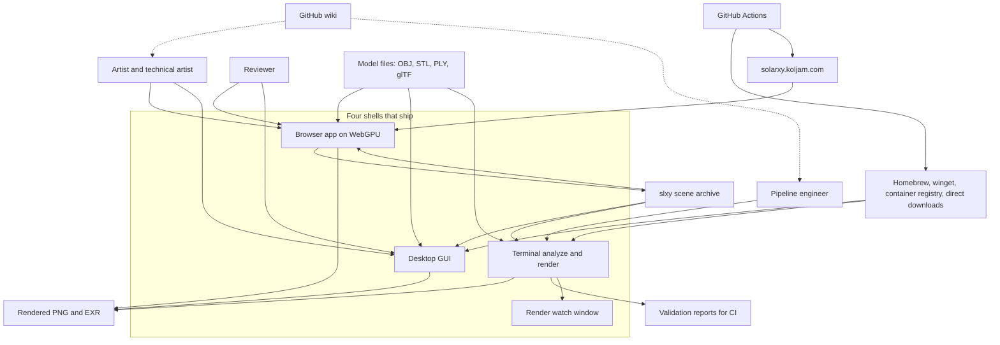

# Context and drivers

What Solarxy is, who it is for, what it ships as, and the forces that shaped the code you are
about to read. Everything here is true today and cites a path.

## What the product is

Solarxy is a 3D model viewer, validator, renderer, and browser-based node modeler, written in
Rust on wgpu. `README.md:11` states it in one sentence and the workspace backs it: 15 Cargo
members, roughly 159 thousand lines of Rust under `crates/*/src`, 34 thousand lines of
TypeScript under `web/src`, and 45 WGSL shaders.

The product does four things that a user would name separately.

- **Inspect.** Real-time physically based rendering with split viewports, inspection modes,
  material overrides, and image-based lighting.
- **Validate.** Geometry checks with a colour-coded 3D overlay, a project config, and CI
  adapters that emit a versioned report.
- **Author.** A non-destructive node graph with 77 registered node types, asserted at
  `crates/solarxy-graph/src/nodes/mod.rs:238`, across four typed contexts.
- **Render.** A GPU compute path tracer that runs from the browser, the desktop app, and the
  terminal, on the same scene.

## The arc the product is on

Solarxy began as a viewer and validator and is becoming an authoring tool. That arc is not a
marketing framing, it is visible in the crate graph. The oldest crates are the ones a viewer
needs: `solarxy-core` for data types, `solarxy-formats` for loaders, `solarxy-renderer` for
wgpu, `solarxy-app` for the winit and egui shell. The authoring crates arrived later and are
now the largest single body of code in the workspace: `solarxy-graph` at 50 thousand lines is
the document, topology, cook engine, registry, expression language, undo and review, and
`solarxy-kernel` at 9.4 thousand lines is the geometry it cooks.

Two consequences follow, and both matter when reading the rest of this set.

The authoring capability is not evenly available. The browser shell drives effectively all 35
`Command` variants. The desktop shell holds an `Option<Box<Engine>>` and dispatches two of
them in production code, a selection change at
`crates/solarxy-app/src/state/intents.rs:95` and a parameter write at the same file's line
864. The desktop can open a `.slxy` scene and list its graph read-only; it cannot edit one.
That gap is the subject of
[adr/0012-shared-application-layer-is-a-new-crate.md](adr/0012-shared-application-layer-is-a-new-crate.md).

And the rendering half is mid-transition too. The rasterizer is the older implementation and
the path tracer the newer one, they shade the same authored material through two independent
code paths, and which of them is correct was not written down until
[adr/0013-path-tracer-is-the-shading-ground-truth.md](adr/0013-path-tracer-is-the-shading-ground-truth.md).

## Who uses it

The users are technical. A 3D artist checking a model before it goes into an engine, a
technical artist building geometry parametrically, a pipeline engineer wiring validation into
CI, a reviewer leaving spatially anchored notes on a surface. All of them drive the product
through its own surfaces.

There is no plugin API, and nothing in the workspace is shaped to accept one. Extension
happens two ways, and both are inside the repository. A new node type is registered in Rust
and the frontend picks it up from the registry snapshot with no frontend change, which is the
extensibility contract guarded by `web/src/registry/extensibility.test.ts`. A new CI ecosystem
is a `PipelineAdapter` implementation in `solarxy-validate`.

`solarxy-validate` is the one crate written for an outside consumer. Its module documentation
at `crates/solarxy-validate/src/lib.rs:19-34` declares its public types a stable wire format
with a `schema_version` field, and describes vendors embedding it directly rather than
shelling out to the CLI. Read that as intent, not as an enforced guarantee: the doc names
`cargo-semver-checks` as the guard, and a search of `.github/` finds no such job.

Three crates are marked `publish = false`: `solarxy-host`, `solarxy-render` and `solarxy-web`.
The other eleven members are nominally publishable, which is an accident of not having said
otherwise rather than a decision to publish them.

## System context

What to notice. The `.slxy` archive is the one artefact all three primary shells read, which
makes it the load-bearing contract of the system rather than a convenience format, and only
the browser shell writes one: `save_slxy` exists at `crates/solarxy-web/src/app/scenefile.rs:79` and
has no counterpart in `solarxy-app`, so the desktop opens scenes it cannot save. The terminal
shell is the only one that produces a machine-readable validation report,
so a pipeline engineer never touches a window. The watch window hangs off the terminal shell
rather than standing beside it, because it is reached through `solarxy-cli render --watch`
and not by its own binary. And the wiki and the public site are external surfaces: neither is
in this repository, and the site's pages are built from `web/` while the edge routing and
deploy live in a separate repository entirely.

## The four shells

The README says three. The code says four.

| Shell | Where | What it is |
|---|---|---|
| Browser app | `crates/solarxy-web` plus `web/` | The `wasm-bindgen` boundary and WebGPU host, with a React and TypeScript display mirror |
| Desktop GUI | `crates/solarxy-app`, launched by the 89-line root binary | winit, egui and wgpu |
| Terminal | `crates/solarxy-cli` | The analyze surface and the render dashboard, on a shared terminal substrate |
| Watch window | `crates/solarxy-cli/src/render_watch/` | A second windowed GPU shell inside the terminal crate |

The fourth is easy to miss and worth stating plainly, because it changes what "cross-platform"
means for this codebase. `crates/solarxy-cli/src/render_watch/mod.rs:596` implements
`winit::application::ApplicationHandler`, the directory carries its own WGSL shader at
`render_watch/render_watch.wgsl`, and it brings up its own wgpu adapter and device rather than
reusing the render's. It is behind the `watch` feature, which is off by default, and it does
ship: `crates/solarxy-cli/Cargo.toml:78-83` declares `[package.metadata.dist]` with
`features = ["watch"]`, so cargo-dist builds the CLI archives with the window enabled and the
installers, the portable archive, the Homebrew formula and the container image all carry it.
The one shipped copy without it is the CLI embedded in the macOS application bundle, which
`.github/workflows/native-bundle.yml:70` builds with a plain
`cargo build --release --workspace`.

The watch window also does not route through `solarxy-host`, the crate that exists so both
graphical shells share one orchestration, and it requests `wgpu::Limits::default()` at
`crates/solarxy-cli/src/render_watch/mod.rs:212` where every other shell asks
`solarxy_renderer::limits::required_limits`. So there are three independent implementations of
device setup and presentation, and the pixel gate in CI covers one of them.

## Artefacts and distribution

One tag fires the whole fan-out. `.github/workflows/release.yml` is generated by cargo-dist
0.31.0 and invokes six reusable workflows in-graph through the `post-announce-jobs` hook in
`dist-workspace.toml`.

| Artefact | Built by | Reaches users through |
|---|---|---|
| GUI DMG and AppImage | `native-bundle.yml` | GitHub Releases, Homebrew cask |
| GUI MSI | cargo-dist | winget, GitHub Releases |
| CLI shell and PowerShell installers, portable archive | cargo-dist | Direct install, Homebrew formula |
| CLI container image | `ghcr-publish.yml` | A container registry, tagged `latest`, minor and full version |
| Web bundle tarball | `web-release.yml` | Deployed to the public site from a separate repository |

`dist-workspace.toml:8-14` names five build targets: two Apple, two Linux, one Windows.
Flathub is packaged but not live, and that absence is declared rather than accidental:
`.github/workflows/verify-fanout.yml:45` carries `DECLARED_ABSENT: "flathub"` so the
verifier reports it as intentional.

That verifier exists because release job colour is not evidence. Three channels fail soft on a
missing token: they emit a warning, skip, and report green. `verify-fanout.yml` re-derives
success from the artefacts themselves, asserting named release assets exist, resolving
container tags by digest, grepping the Homebrew tap for the version, and searching for the
winget submission.

## The forces that shaped this

Five forces are visible in the code, not merely asserted about it.

**Single-maintainer throughput.** Every structural choice that looks unusual is cheaper for
one person than the alternative. The golden-image gate refuses a committed baseline and
instead captures the same two models twice on the same runner, once at the pull request's base
commit and once at the head, because that removes the maintenance of a baseline tree. The
fan-out verifier exists because one person cannot watch six channels. The frontend is a
display mirror rather than an independent application because a second document model would be
a second thing to keep correct. It also explains the gaps: the browser host was one
6,489-line file with zero tests, against eleven in the whole crate. It is now eleven modules
under `crates/solarxy-web/src/app/`, which addresses the size and not yet the tests.

**Browser and desktop from one core.** This is the force with the largest structural
footprint. The engine and the renderer never depend on each other, so both compile into a
single WebAssembly instance and cooked geometry never crosses into JavaScript. `solarxy-host`
exists so the per-pane orchestration is written once, and is forbidden a `solarxy-graph`
dependency to keep that separation real, stated at `crates/solarxy-host/Cargo.toml:53-58`.
Portability is bought almost entirely with Cargo feature negation rather than conditional
compilation: the entire workspace carries only 18 `target_arch`, `target_os`, `unix` or
`windows` attribute sites in `src`, and the whole 6,489-line WebAssembly host sits behind one
gate at `crates/solarxy-web/src/lib.rs:30`.

**Open-source contribution.** The repository is GPL-3.0-or-later, stated at `Cargo.toml:25`,
and `.github/CONTRIBUTING.md` requires a Developer Certificate of Origin sign-off on every
commit. Nothing in CI checks for the sign-off line. The force shows up more usefully as an
obligation on documentation: this set exists because a contributor could not previously read
the architecture anywhere, and `README.md` now points at it.

**The WebAssembly 32-bit address space.** It is a hard ceiling on allocation, and the code
argues with it explicitly rather than hoping. `crates/solarxy-web/src/app/mod.rs:690` caps a
floating-point still at 16 million pixels, and its doc comment does the arithmetic: roughly
forty bytes a pixel at peak, near 290 megabytes, inside an address space also holding the
document, the tracer's buffers and the page. The comment states the reason a stated limit
beats an allocation failure, which on WebAssembly takes the whole tab rather than the
operation. The same shape recurs at `app.rs:2533` and `app.rs:2567` for screenshots and at
`app.rs:692` for auxiliary render passes.

**Portability by requiring nothing optional.** Every device request in the workspace passes
`wgpu::Features::empty()`. There is no optional GPU feature anywhere, so no code path exists
that some conformant adapter cannot run. Limits are raised off the adapter by
`crates/solarxy-renderer/src/limits.rs`, and that helper raises exactly two size fields and
never lowers one, deliberately refusing wgpu's one-line `or_better_values_from` because it
would raise count limits too. Its own documentation explains the cost of getting that wrong:
the path tracer's scene bind group spends core WebGPU's eight-storage-buffer budget, so a
raised count limit would let a later change exceed what the target platform guarantees and
fail only on the machines that guarantee least.

There is a sixth force worth naming because it contradicts the fifth. `.cargo/config.toml`
forces `-C target-feature=+avx2,+fma` on all three x86_64 targets, unconditionally, for every
profile. Three of the five shipped targets therefore require a 2013-or-later CPU with no
runtime dispatch and no diagnostic; the failure mode is an illegal instruction at startup.
No workflow, no wiki page and no test states that floor.

## Open questions

- The two cook budgets differ, 6 milliseconds in the browser and 8 on the desktop. Whether
  that is a measured difference in per-frame headroom or drift is not recorded anywhere.
- Whether the x86_64 AVX2 and FMA baseline was a deliberate decision with an accepted hardware
  floor, or inherited. Nothing states it outside the config file.
- Whether the watch window is intended to remain a third GPU host or to route through
  `solarxy-host` later. `crates/solarxy-cli/src/render_watch/mod.rs:1-16` argues why it owns
  its own device, which is a narrower question than whether it should share the orchestration.
- Whether the eleven publishable crates are meant to be published. Only three carry
  `publish = false`, and the stability language in `solarxy-validate` is not backed by a CI
  job.
