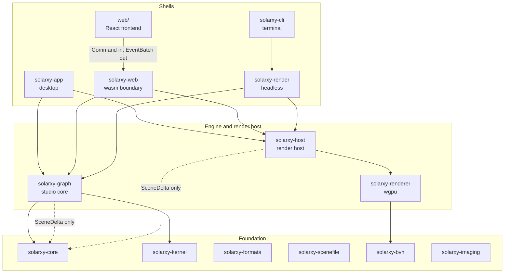
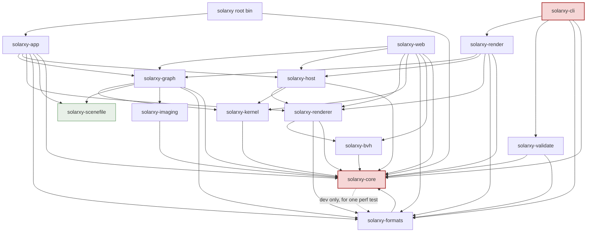
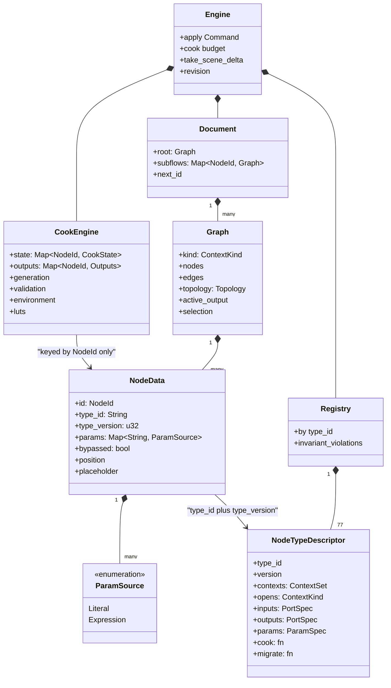
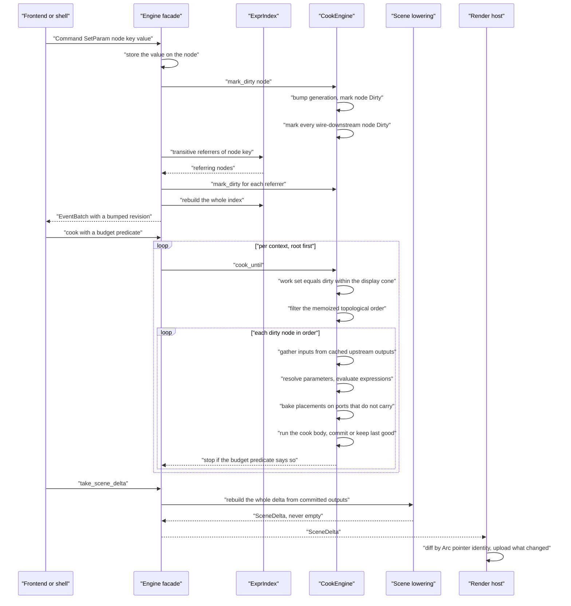
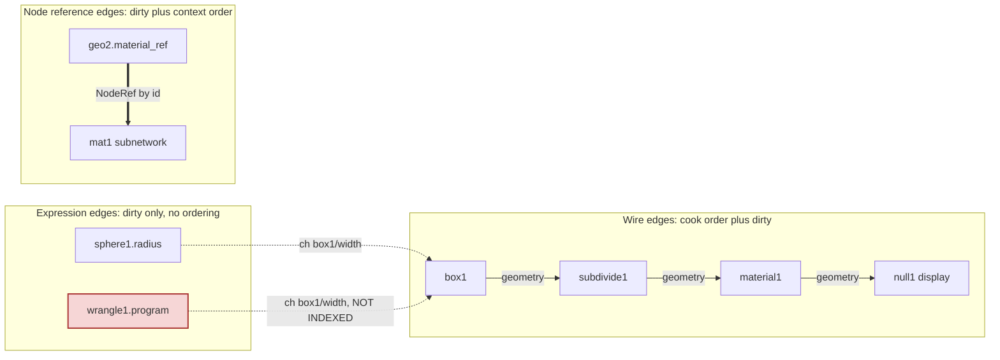
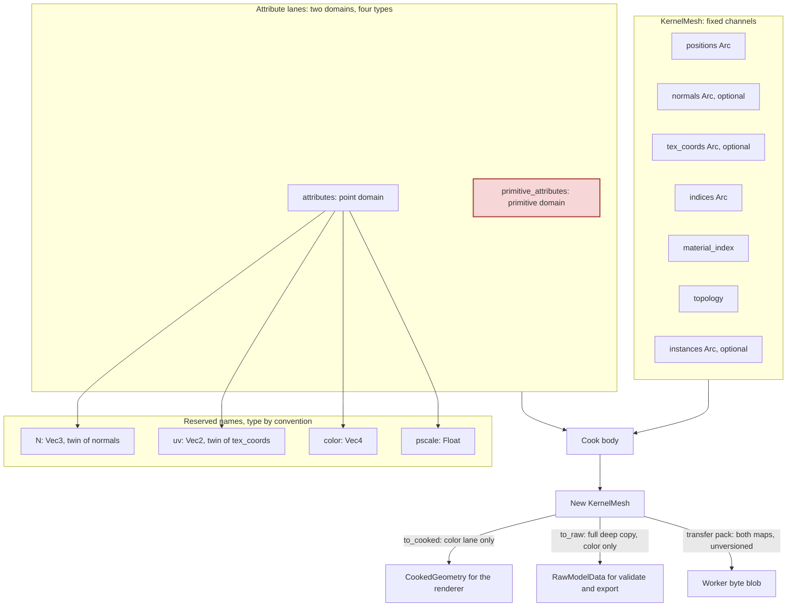
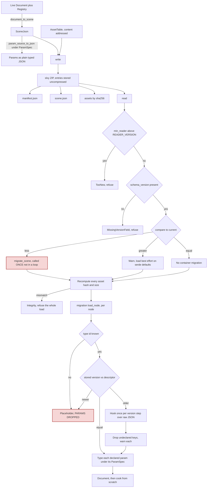
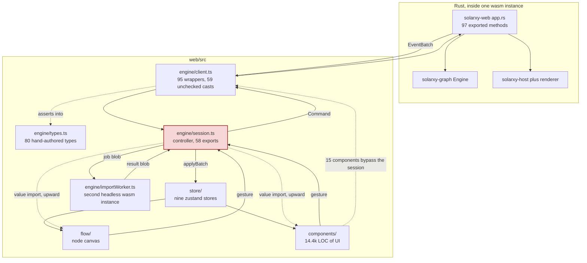
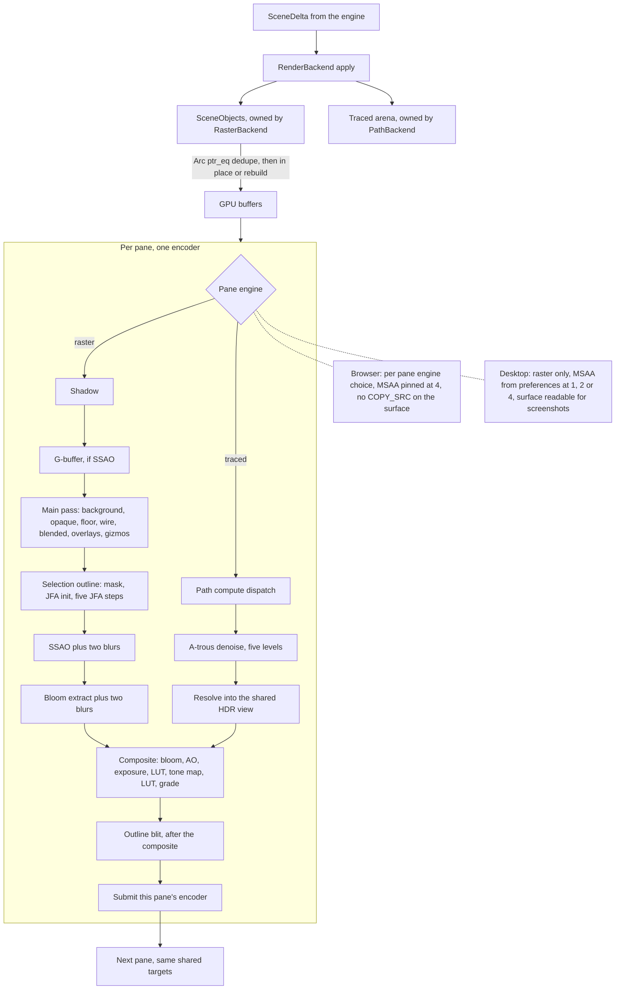
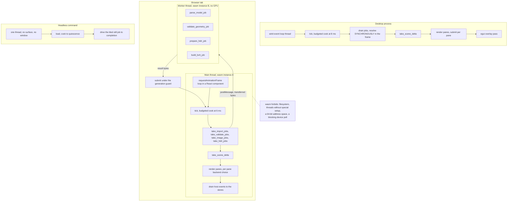

# 03. The current architecture

This document describes Solarxy as it is today. Everything in it is true of the code in this
repository at the time of writing, and every structural claim cites the path it came from.
Where the code contradicts its own documentation, this document says so and sides with the
code. Nothing here is a plan. The prescriptive half of the set is
[04-target-architecture.md](04-target-architecture.md).

Line numbers drift faster than paths. Treat a cited line as a hint and the path as the claim.

## 1. The shape of the system

The workspace is 15 Cargo members: fourteen library and shell crates under `crates/`, plus the
root `solarxy` binary, which is 89 lines that parse three arguments and call into the desktop
shell. Alongside them, and outside Cargo entirely, sits `web/`, a Vite plus React frontend.

Sizes below are total Rust under each crate, including its tests and examples.

| Member | LOC | What it actually is | Layer |
|---|---|---|---|
| `solarxy` (root bin) | 89 | Argument parsing, tracing setup, one call into `solarxy_app::run_viewer` | Entry point |
| `solarxy-core` | 12,106 | Fourteen public modules: geometry and math primitives, the engine-to-renderer scene contract, validation types, a UI colour palette, desktop preferences, install-channel detection, project config, review sidecars | Foundation, by dependency count |
| `solarxy-scenefile` | 1,243 | The `.slxy` container: manifest, scene JSON schema types, ZIP archive, integrity, version gate | Foundation, and the only member with no intra-workspace dependency |
| `solarxy-formats` | 5,343 | Loaders for OBJ, PLY, STL, glTF/GLB, Radiance and OpenEXR, and Adobe `.cube`, plus the writers for all of them | Format layer |
| `solarxy-imaging` | 1,113 | Pure-CPU image operators for the texture context | Format layer |
| `solarxy-kernel` | 9,426 | Parametric geometry: `GeometrySet`, `KernelMesh`, primitives, transforms, attribute operations, the worker transfer codec | Engine support |
| `solarxy-bvh` | 2,788 | GPU-free bounding volume hierarchy, its builder, its CPU traversal twin, its own versioned transfer codec | Renderer support |
| `solarxy-graph` | 50,087 | The studio core: document, topology, cook driver, node registry of 77 types, expression language, undo, review, migration, and the `Engine` facade | Engine |
| `solarxy-renderer` | 42,159 | Every wgpu pipeline and pass, the path tracer compute path, the `RenderBackend` contract declaration, split-pane layout maths | Renderer |
| `solarxy-host` | 10,153 | Per-pane pass orchestration and composite, cameras, lighting, the raster backend implementation, the tiled still job, the gizmo drag solver | Shared render host |
| `solarxy-app` | 17,980 | The winit plus egui desktop shell | Shell |
| `solarxy-web` | 7,604 | The wasm-bindgen boundary and the browser WebGPU host | Shell |
| `solarxy-render` | 4,293 | Headless rendering: loads a scene or a model, brings up a device with no surface, drives the still job | Shell, despite the name |
| `solarxy-validate` | 1,402 | Validation orchestration plus CI pipeline adapters | Library |
| `solarxy-cli` | 18,082 | Argument parsing, a generic terminal-UI substrate, two terminal surfaces, and an optional windowed GPU preview | Shell |

`web/` is roughly 34,000 lines of TypeScript and TSX across 200 files, by directory:

| Directory | LOC | What it holds |
|---|---|---|
| `components/` | 14,409 | All React UI: panels, modals, menus, parameter widgets, viewport chrome, review UI |
| `roadmap/` | 3,717 | The public roadmap page, not part of the application |
| `engine/` | 3,643 | The wasm boundary wrapper, the session controller, the hand-authored boundary types, the import worker |
| `flow/` | 3,230 | The node canvas |
| `store/` | 2,602 | Nine zustand stores |
| `dock/` | 1,026 | Free-pane docking integration |
| `hooks/` | 797 | Including the global keyboard dispatcher |
| `export/` | 596 | Published-scene bundle, turntable encoding, player config |
| `render/` | 465 | Still-render presentation helpers |
| `registry/` | 324 | Data-type handle colours and coercion legality |
| `persistence/` | 319 | Autosave ring and folder-drop traversal |
| `input/` | 306 | The single keymap table |
| `landing/`, `player/`, `public/`, `references/` | 682 | Public pages and the published-scene player |

Alongside these, 45 WGSL shader files totalling around 8,500 lines live under
`crates/solarxy-renderer/src/shaders/`, with one exception noted in section 2.



What to notice: the engine and the renderer never touch. `solarxy-graph` reaches
`solarxy-renderer` through nothing at all; the two meet only where both depend on
`solarxy_core::scene`, and what crosses is a `SceneDelta`. `solarxy-host` sits firmly on the
renderer's side of that line. Four things in the shell box drive a graphical or headless
render, not two, and one of them is the crate named for the command line.

## 2. Layering as it actually exists

### The parts that hold, and they are the load-bearing parts

**The engine and the renderer have no dependency edge in any kind.**
`crates/solarxy-graph/Cargo.toml` declares `solarxy-core`, `solarxy-formats`,
`solarxy-imaging`, `solarxy-kernel` and `solarxy-scenefile`, with no
`[dev-dependencies]` and no `[target.*]` table at all.
`crates/solarxy-renderer/Cargo.toml` declares `solarxy-bvh`, `solarxy-core` and
`solarxy-formats`, and its dev-dependencies are `pollster`, `anyhow` and `ab_glyph`. Neither
names the other in a normal, dev, build, or target-conditional position. This is confirmed
from `cargo metadata`, not from prose.

They communicate through `solarxy_core::scene::SceneDelta`. The engine builds one
(`crates/solarxy-graph/src/engine/scene.rs`) and hands it out through
`Engine::take_scene_delta`; a render host consumes it. This is the one architectural invariant
in the workspace that the build system enforces rather than a comment.

**`solarxy-host` has no `solarxy-graph` edge either**, and the reason is written into the
manifest at `crates/solarxy-host/Cargo.toml:53`, verbatim:

> Deliberately ABSENT: `solarxy-graph`. The engine and the renderer meet only at
> `solarxy_core::scene::SceneDelta`, and this crate sits on the renderer's side of that line.

That refusal is what keeps the boundary real, because `solarxy-host` is the only crate both
graphical shells share. It is also what forces several functions to be written three times,
which section 3 covers.

**`solarxy-scenefile` is the true root of the dependency graph.** It declares serde,
serde_json, sha2, thiserror, zip and an optional schemars, and no workspace crate at all
(`crates/solarxy-scenefile/Cargo.toml`). It is the only member that can be changed and tested
in isolation.

**Portability is bought with Cargo feature negation, not conditional compilation.** The entire
workspace carries seventeen platform `#[cfg]` attribute sites and seven runtime `cfg!`
branches, spread over nine files: `solarxy-web/src/lib.rs`, `trace_settings.rs` and
`camera_commit.rs`; `solarxy-core/src/install_source.rs`; `solarxy-app/src/app.rs`,
`gui/mod.rs`, `state/init.rs` and `state/input/mod.rs`; and
`solarxy-cli/src/bin/solarxy-cli.rs`. `solarxy-renderer`, 42,159 lines of wgpu, IBL, SSAO,
bloom, shadows and a compute path tracer, compiles for `wasm32` with zero platform cfgs.
`solarxy-host` likewise. The whole native and wasm seam of the browser host is one line,
`crates/solarxy-web/src/lib.rs:30`:

```rust
#[cfg(target_arch = "wasm32")]
mod app;
```

and `app.rs` itself, all 6,489 lines of it, contains no internal target cfg. Portability comes
from every consumer remembering `default-features = false` on `solarxy-core` and
`solarxy-formats`, and from the `[target.'cfg(target_arch = "wasm32")'.dependencies]` table in
`crates/solarxy-web/Cargo.toml`.

**No ungated platform I/O reaches the foundation crates.** `solarxy-kernel`, `solarxy-bvh` and
`solarxy-imaging` contain no `std::fs`, `std::net`, `std::process`, `std::env`, `dirs`,
`std::thread` or `Instant` at all. `solarxy-scenefile` uses only in-memory `std::io::Cursor`.
`solarxy-graph` uses `std::io::Cursor` and `std::io::Write` into a `Vec<u8>` for its in-memory
export archive and nothing else. In `solarxy-core`, every filesystem call is behind the `fs` or
`serialization` feature, and five of its fourteen modules are feature-gated at
`crates/solarxy-core/src/lib.rs:62-82`.

### The parts that do not hold

**`solarxy-core` is a foundation crate by dependency count and a grab-bag by content.**
Thirteen of the other fourteen members depend on it; only `solarxy-scenefile` does not. Its
module block at `crates/solarxy-core/src/lib.rs:62-82` declares fourteen public modules
covering at least five unrelated concerns: geometry and math (`aabb`, `geometry`, `raycast`),
the engine-to-renderer contract (`scene`), a two-tier interface colour palette that drives the
egui GUI, the terminal UI and the generated web CSS (`theme`), desktop application preferences
(`preferences`, 1,514 lines), and distribution-channel detection (`install_source`).

The feature gates split the crate by dependency weight rather than by concern.
`install_source` is behind `fs`; `preferences` and `view_config` behind `serde`; `json`,
`project_config`, `report` and `review` behind `serialization`. But `theme`, `scene`,
`geometry`, `raycast`, `gizmo` and `validation` are ungated and always linked. So
`solarxy-bvh`, which takes core with `default-features = false` and no features, and whose only
non-test use of it is `aabb::AABB`, still recompiles when the colour palette changes, because
Cargo recompiles the whole crate. The crate that everything depends on is also one of the
crates most likely to change for a reason unrelated to most of its dependents.

**`RawMaterialData` carries seventeen ungated `Option<PathBuf>` fields in the crate whose
header says it has no filesystem.** `crates/solarxy-core/src/geometry.rs:12` is
`use std::path::PathBuf;` outside any feature gate, and the struct at `geometry.rs:423`
declares exactly seventeen `Option<PathBuf>` texture-path fields. The type flows from
`solarxy-core` into `solarxy_kernel::GeometrySet::materials`, into `solarxy-graph`, into
`solarxy-web`, and therefore into the shipped WebAssembly artifact, where a host filesystem
path has no meaning.

This is not an abstract concern. `crates/solarxy-renderer/src/pathtrace/scene.rs` branches on
five of those fields in `TextureRole::path_only`, and its own doc comment concedes that on web
there is no filesystem to hold and that the symptom is one material rendering untextured in the
tracer and textured in the viewport, which reads as a shading bug. The paths themselves
serialize normally; it is the in-memory decoded-image companions that carry `serde(skip)`.

**`solarxy-cli` is a terminal-UI framework plus a second windowed GPU shell, in a crate named
for the command line.** Its `watch` feature pulls winit, wgpu, pollster, egui, egui-wgpu and
egui-winit at the same versions the desktop shell pins.
`crates/solarxy-cli/src/render_watch/mod.rs` implements `winit::application::ApplicationHandler`
and brings up its own wgpu instance, adapter and device, deliberately not the render's.
`crates/solarxy-cli/src/render_watch/render_watch.wgsl` is the only WGSL file in the workspace
outside `solarxy-renderer`. The crate has no direct dependency on `solarxy-renderer` or
`solarxy-host`; it reaches them only transitively through `solarxy-render`, so this fourth GPU
host does not route through the shared orchestration that `solarxy-host` exists to provide. And
`[package.metadata.dist]` turns the feature on for the shipped binary, so the installed
command-line tool contains a windowing toolkit.

**`solarxy-core` has a dev-dependency on `solarxy-formats`, one layer up.** It exists for
exactly one call site: `crates/solarxy-core/src/raycast.rs:861` calls
`solarxy_formats::obj::load_obj` inside a performance test in the crate's own inline
`#[cfg(test)]` module. The manifest comment acknowledges the package-level cycle. Two costs
follow. `cargo test -p solarxy-core` builds the whole parser tree, including glTF with its
extension features, EXR, PLY, STL and image decoding, to test a leaf crate. And the test lives
in `src/` rather than `tests/`, so it compiles into every test build of the crate including the
reduced-feature clippy variants, and it returns early with a printed notice when the fixture
model is absent, meaning a green run proves nothing about raycast performance.

**There is no workspace `[lints]` table.** `#![warn(clippy::pedantic)]` plus a hand-maintained
allow block is copied into all sixteen crate roots, in twelve distinct configurations. Only
five are identical: `solarxy-core`, `solarxy-formats`, `solarxy-graph`, `solarxy-kernel` and
`solarxy-studio`, which arrived in 0.10.0, share the same twenty-one allows. `solarxy-renderer` allows twenty-two, `solarxy-host` twenty,
`solarxy-app` twenty, `solarxy-bvh` and `solarxy-cli` fifteen, `solarxy-validate` ten,
`solarxy-web` nine, `solarxy-imaging` six, the root binary five, `solarxy-scenefile` two and
`solarxy-render` exactly one. Five lints appear in exactly one crate each. There is no `deny`
or `forbid` anywhere in the workspace, including no `forbid(unsafe_code)`, while three real
`unsafe` blocks exist in `crates/solarxy-formats/src/export.rs`, each reinterpreting a typed
slice as bytes, none carrying a safety comment.

**`solarxy-render` declares a `clap` feature that nothing in the crate references.**
`crates/solarxy-render/Cargo.toml:15` declares `clap = ["dep:clap"]` with an optional clap
dependency at line 33. A recursive search for the string `clap` across
`crates/solarxy-render/src/` returns nothing. `solarxy-cli` enables it anyway. This is the
workspace's only dead feature.

**`solarxy-renderer` declares 41 public modules and zero private ones.** There is no facade and
no internal-versus-external distinction, giving it 749 public items, the largest surface in the
workspace and larger than the 50k-line engine's 643. `solarxy-kernel` has the same shape at 19
public modules to 1 private, as does `solarxy-graph` at 17 to 1. Only `solarxy-web`,
`solarxy-scenefile`, `solarxy-app` and `solarxy-validate` use module privacy to shape a
surface. The practical consequence is that `solarxy-host`, `solarxy-app`, `solarxy-web` and
`solarxy-render` reach directly into renderer internals such as `pathtrace::backend`,
`pathtrace::denoise` and `pathtrace::environment`, so a refactor of an internal module is a
breaking change to four crates.



What to notice: there is no cycle, and the one edge drawn as a dotted line is a dev-dependency
that runs upward, from the crate everything depends on to the parser layer above it. The two
red nodes are the crates whose name and content disagree: `solarxy-core`, which thirteen
members link in order to reach a handful of types, and `solarxy-cli`, which optionally links a
windowing toolkit. `solarxy-scenefile`, in green, is the only node with no outgoing workspace
edge. And notice what is absent: there is no edge between `solarxy-graph` and
`solarxy-renderer`, and none between `solarxy-host` and `solarxy-graph`, in either direction.

## 3. Where responsibilities have leaked, and where a concept is modelled twice

This section is a list, not an argument. Each item is a place where one concept has two
implementations that nothing holds together.

**Review is modelled twice, in two crates, with no adapter.**
`crates/solarxy-core/src/review.rs` is 632 lines defining `ReviewFile` (line 38),
`ReviewAnnotation`, `AnchorPosition` and SHA-based file and mesh hashing; it is consumed only
by the desktop shell. `crates/solarxy-graph/src/review.rs` is 388 lines defining `Annotation`,
`ReviewAnchor` and `geometry_hash` (line 174) with threading, staleness and cascade delete; it
is driven only from the browser, through five `Command` variants the desktop never sends. Same
domain concept: anchored, categorised, threaded, resolvable notes on geometry. Two anchoring
schemes, two hashing schemes, two persistence stories, no bridge. An annotation authored on one
shell is invisible on the other.

**The desktop carried two mutually exclusive scene representations, and does not any more.**
`crates/solarxy-app/src/state/mod.rs` held both `scene: Option<ModelScene>`, a file-loaded model
with its own GPU buffers, and `engine: Option<Box<solarxy_graph::Engine>>`, with a field comment
stating they were never both `Some`. Twenty-nine sites across twelve files read the first, the
invariant was upheld by exactly two mirrored lines with no test, and every downstream consumer
branched on the pair: validation, the outliner's data source, the scene-present flag at
composite, the UV pane's source, and the review focus scale.

**0.10.0 deleted the second root.** A model file is staged, synthesized into a document holding
one import node, and cooked to quiescence on a worker thread, through
`crates/solarxy-graph/src/model_document.rs`, which the headless command
(`crates/solarxy-render/src/input.rs`) already stood on and which the desktop already called for
its still render. `crates/solarxy-app/src/state/open.rs` is now the only place `engine` is
assigned, and nothing in the shell branches on which kind of file was opened.
`crates/solarxy-app/src/state/engine_scene.rs` remains, no longer as an adapter back to
single-model shapes but as what the inspection panels read about the one document.

**The same two-valued render-engine concept is modelled three times.**
`crates/solarxy-graph/src/nodes/export_nodes.rs:31` declares `RenderEngine { Raster, PathTraced }`.
`crates/solarxy-host/src/still.rs:199` declares `StillEngine { Raster, PathTraced }`.
`crates/solarxy-cli/src/parser.rs:243` declares `RenderEngineArg { Raster, PathTraced }`.
Four hand-written mappings connect them, one per shell plus the CLI binary. The duplication
exists because `solarxy-host` is forbidden a graph dependency, so the shared still job cannot
name the engine's own enum. Every mapping site is an exhaustive two-arm match with no wildcard,
so adding a third engine halts compilation everywhere rather than diverging silently. The cost
is edits, not correctness.

**`render_pane` is implemented twice while a doc comment claims it is shared.**
`crates/solarxy-app/src/state/render.rs:2` states that the module "assembles each pane's
parameters and hands them to `solarxy_host::render_pane`". No such symbol exists. A workspace
search finds `render_pane` at `crates/solarxy-app/src/state/render.rs:160` and
`crates/solarxy-web/src/app/render.rs:1197`, plus comment references in the renderer and the host.
The two shells each build the full nineteen-field `FrameCtx` literal themselves and share only
the composite tail, `solarxy_host::composite_and_submit`. They have already diverged: the
desktop passes no grid plane and writes no manipulator or light markers per pane; the web does
both. Roughly 340 lines of duplicated frame driver with no test covering the pair.

**`denoise_settings_for` is byte-identical in three crates.** It appears at
`crates/solarxy-app/src/state/still/settings.rs:130`, `crates/solarxy-web/src/trace_settings.rs:104` and
`crates/solarxy-render/src/lib.rs:942`, with the same four-field body character for character.
Its sibling `trace_settings_for`, in the same three files, opens with an exhaustive
`let RenderSettings { ... } = *settings;` naming every field with no rest pattern, so a field
added to the settings halts compilation in all three shells and forces the author to route it.
`denoise_settings_for` reads fields by dot access and destructures nothing, so it carries none
of that guarantee itself. The guard is one function above it, not in it.

**The still-render pump loop is written three times.**
`crates/solarxy-app/src/state/still/mod.rs:394`, `crates/solarxy-web/src/app/still.rs:501` and
`crates/solarxy-render/src/lib.rs:1087` each read the job's current tile, resize the shared
targets to it, build the twelve-field context, dispatch through the backend trait, match five
ways on the resulting step, drain tiles and previews, and compute progress. The desktop
module's own header says the shape mirrors the web shell deliberately, piece for piece. The
three have already diverged: the headless copy treats the preview step as unreachable, the
browser queues tiles for JavaScript to drain, and the desktop blits inline and additionally
tears down a synthesized scene. No test covers more than one of them.

**Normals exist as a fixed field and as a reserved attribute lane.** `KernelMesh` carries
`normals: Option<Arc<Vec<[f32;3]>>>` as a struct field, and
`crates/solarxy-kernel/src/set.rs` reserves the lane name `N`, whose own documentation calls it
"the attribute-lane twin of `KernelMesh::normals`". Nothing states which wins when both are
present. The inspection layer resolves it by convention:
`crates/solarxy-graph/src/engine/attr_table.rs` prefers the map lane and skips a fixed buffer
that a lane shadows. The same doubling happens for UVs, and in the other direction for colour,
which is a reserved lane on the kernel side and a dedicated `colors` field on the renderer
side.

**A mesh is modelled six times.** `solarxy_core::geometry::RawMeshData` (the loader shape),
`solarxy_core::scene::CookedMesh` (the renderer contract), `solarxy_kernel::set::KernelMesh`
(the wire shape), `solarxy_renderer::model::Mesh` (the GPU shape),
`solarxy_formats::export::ExportMesh` (the writer shape), and
`solarxy_cli::calc::analyze::AnalyzerMesh` (the analyzer shape). The middle two are the same
struct field for field except that the kernel adds two attribute maps and the cooked type
carries a colour buffer instead. `crates/solarxy-kernel/src/set.rs` claims the two cannot drift
without `GeometrySet::to_cooked` failing to compile; that guarantee runs one way only. Adding a
field to `CookedMesh` breaks the build; adding one to `KernelMesh` compiles silently and is
simply never lowered, which is exactly how the attribute maps came to exist on one side only.

**Two hand-written binary transfer codecs cross the same worker boundary with different
framing contracts.** `crates/solarxy-kernel/src/transfer.rs:120` and `:192` expose `pack` and
`unpack` for geometry. `crates/solarxy-bvh/src/transfer.rs:76` and `:107` expose the same pair
for a hierarchy. The BVH codec carries `MAGIC` at line 29 and `VERSION` at line 34 and checks
both on unpack. The geometry codec carries neither, by explicit design decision, on the
grounds that both sides are the same wasm build. Both blobs leave the same worker as untyped
byte arrays, so only caller discipline keeps them apart on the JavaScript side, and the weaker
of the two is the one carrying user geometry.

**Preferences, toasts and keymaps are each one concept with two implementations.**
`solarxy_core::preferences` persists TOML to a config directory; `web/src/store/prefs.ts` is a
versioned browser-storage blob with its own defaults and its own migration, and three slices
are pushed one way into Rust so those values are held twice. The desktop toast queue is a
bounded double-ended queue painted by egui; the web's is a store array with per-severity
timeouts, a different cap and a different dismissal model. The web has one typed keymap table
driving both its dispatcher and its generated shortcuts modal; the desktop has a hand-written
display table in `crates/solarxy-app/src/gui/modals/shortcuts.rs` and a dispatcher
split across `crates/solarxy-app/src/app.rs` and `crates/solarxy-app/src/state/input/mod.rs`,
with nothing comparing the three.

**`showIf` is declared in Rust and evaluated only in TypeScript.** `ShowIf` lives on the
parameter spec at `crates/solarxy-graph/src/registry/param_spec.rs:189`, and the registry
validates that each clause names an existing parameter. No Rust code evaluates one. The sole
evaluator is `paramVisible` at `web/src/components/paramVisibility.ts:97`, including its own
literal-versus-default resolution and its own array equality. Any second consumer of the
registry has to reimplement it, with nothing to reimplement it against.

## 4. The engine

`solarxy-graph` is 50,087 lines, of which 9,295 are a single in-source test module included at
the bottom of `engine/mod.rs`. It owns a two-level document, a per-node cook driver, a static
registry of 77 node types, a hand-rolled expression language, undo, review threads, and the
`Engine` facade.

### Evaluation strategy

Cooking is push-forward dirty marking plus a topologically ordered sweep, gated by a display
cone. It is not pull-based; nothing anywhere asks an upstream node for a value.

Invalidation is `CookEngine::mark_dirty` at `crates/solarxy-graph/src/cook/driver.rs:198`:

```rust
pub fn mark_dirty(&mut self, graph: &Graph, node: NodeId) {
    *self.generation.entry(node).or_insert(0) += 1;
    self.state.insert(node, CookState::Dirty);
    for down in graph.downstream(node) {
        self.state.insert(down, CookState::Dirty);
    }
}
```

Evaluation is `CookEngine::cook_until` at `driver.rs:260`. It computes a work set, filters the
memoized topological order by it, and cooks every dirty node in that order until the caller's
budget predicate says stop. The work set, at `driver.rs:324`, is the dirty set intersected with
the display node's predecessor cone when a subflow has an active output, and the whole dirty
set otherwise. The root graph has no active output, so the root is never cone-gated: every
dirty root node cooks.

Ordering is Kahn's algorithm with a `BTreeSet` ready queue in
`crates/solarxy-graph/src/topology.rs`, so the tie-break is smallest node id first and the
order is deterministic. It is memoized, and a subset order is produced by filtering the
memoized full order rather than re-sorting. Adjacency is a multiset keyed on node pairs, so two
typed edges between the same pair collapse to one adjacency edge that survives until the last
typed edge goes.

Wire cycles are refused at connect time, in exactly one place: `Graph::connect` calls
`Topology::would_create_cycle` and returns `GraphError::CycleDetected`. Every structural path,
including undo's re-connect and the load path, routes through `connect`, so a cycle cannot
enter the wire topology from any direction.

One cost of this design is visible in the code. `cook_until` deep-clones the whole `Graph`
once per context per pass, purely to obtain a mutable receiver for the memoized sort, and then
discards the clone's rebuilt cache. The `Graph` owns every node's full parameter map, every
edge, and the topology's own three maps.

### The scheduler and its budget

There are two levels. The outer one is `Engine::cook`: it orders contexts root first, then
subflows in reference-dependency order, defers any context whose referenced networks did not
drain this pass, and calls `cook_until` once per context. The inner one is `cook_until` itself.

The budget unit is not defined by the engine at all. `Engine::cook` takes an opaque
`&mut dyn FnMut() -> bool`. Both shells independently chose wall-clock, at different values and
with no shared constant: `COOK_BUDGET_MS: f64 = 6.0` at `crates/solarxy-web/src/app/mod.rs:73`, and
`COOK_BUDGET: Duration = from_millis(8)` at `crates/solarxy-app/src/state/update.rs:21`. Those
are the only two callers of `Engine::cook` in the workspace.

Resumption is correct by construction, and cursorless. Cook state lives per node rather than in
a consumable queue, so re-dirtying an already-passed node simply re-marks it for the next slice.
On exhaustion the loop breaks, every unreached node keeps its dirty state, and the report counts
what remains.

The budget is honoured per context rather than per pass. The forward-progress rule at
`driver.rs:288` reads the report that `cook_until` freshly constructed for this call, so a
document with N subflows can cook up to one node per context past an already-expired deadline.
The doc comment describes forward progress as always cooking at least one node per call, which
is literally true and hides the aggregate.

### The actual unit of invalidation

The unit is the whole node, and then its whole transitive downstream. Nothing finer exists.
`CookState` is per node, `self.state` is a map keyed by node id, and there is no port-level,
parameter-level or attribute-level dirty structure anywhere in the crate. `mark_dirty` takes
only a node id and never sees which key changed.

Three consequences follow directly.

A slider drag streams `Engine::preview_param`, which parks the value in an overlay map and
marks the node dirty, so each drag frame re-dirties the node and its entire downstream chain.
On release, one `SetParam` commits and additionally rebuilds the whole expression index from
scratch over every node in the document.

`name` and `description` are ordinary parameters on every node, injected by `params_with` into
every descriptor. `set_param` marks dirty unconditionally with no key exemption. No cook body
reads `description`, so committing a change in a node's description box recooks that node and
everything below it. The invalidation API cannot express the exemption, because the key never
reaches it.

`mark_dirty` overwrites a downstream node's `Pending` state with `Dirty` without bumping its
generation, contradicting the documented invariant that a pending node is never re-cooked. The
next sweep re-cooks it and spawns a second job at the same generation. The duplicate result is
dropped by a pair of guards on submission, so the visible cost is duplicated worker work rather
than a wrong value, but the guard the design relies on is not the one the comment describes.

### The cook cache is a dirty-flag scheme, not a keyed memoization cache

This distinction matters more than any other fact in this section, because the words "cook
cache" invite the wrong mental model.

There is no cache key. `CookEngine.outputs` at `driver.rs:78` is a
`BTreeMap<NodeId, Arc<Outputs>>`, and the whole key is the bare node id. Nothing is hashed,
nothing is content-compared. It sits beside eight sibling per-node maps: cook state,
validation, environment, colour-grading tables, warnings, status, statistics, cook counts and
generation. The `generation` counter is not a key either; it is only the stale-drop guard for
asynchronous job results.

What that implies, precisely:

- **Correctness rests entirely on every mutation path calling `mark_dirty`.** The non-obvious
  inputs are covered by hand and are covered correctly. Asset bytes are content-addressed by
  SHA-256, so different bytes are a different parameter value. Scene time re-dirties exactly
  the set of nodes whose expressions or wrangle programs read the clock. Drag previews dirty
  explicitly. But this is a property of discipline, not of the data structure.
- **A recook that produces a bit-identical result does not un-dirty anything downstream.**
  `commit_outputs` compares nothing against the previous output. Its only conditional is
  keep-last-good, described below.
- **There is no eviction and no memory ceiling.** Entries leave only when a node is deleted or
  the document is replaced. A ten-node chain over a large import therefore holds ten complete
  intermediate geometry sets resident for the session, displayed or not. The only ceilings in
  the system bound a single operation's output, not the retained total. This matters most in
  the browser, a 32-bit address space where an allocation failure takes the tab.
- **Retention is silent.** `commit_outputs` computes a keep-last-good flag at `driver.rs:672`
  from a renderable-empty result plus an existing cached entry, and when it is set it skips the
  insert and then reports success. `commit_error` has the same shape for every error but a
  missing required input. So a delete node that legitimately removes all geometry, or an
  erroring node, keeps feeding downstream its previous geometry with no user-visible signal.
- **Two hand-maintained clearing lists have drifted in opposite directions.** `reset` clears
  eleven maps but not the colour-grading tables. `forget_node` removes the grading tables but
  not warnings and not cook counts.
- **The bypass arm clears one of three side channels.** Bypassing a node commits its outputs
  and clears its cached validation, but never clears its cached environment or grading tables,
  and the scene lowering reads both of those directly rather than through the outputs.

### Node registration

Registration is static, in-tree and hand-written. There is no macro, no derive and no manifest.
Each node file exports `pub fn descriptor() -> NodeTypeDescriptor` returning a plain struct
literal; `builtin_descriptors()` is a vector of 77 such calls; `Registry::with_descriptors`
keys them by type id and runs an invariant check so a registry that constructs is a valid one.
The cook body is a bare function pointer and the migration hook an optional one, both declared
at `crates/solarxy-graph/src/registry/mod.rs:285-291`.

A descriptor declares: a type id and a version; a display name, category, glyph, documentation
string and search aliases; a `ContextSet` bitset of the contexts it may be placed in and an
optional context it opens; input and output `PortSpec` lists; a parameter list built by a
builder chain carrying type, default, hard and soft ranges, unit and documentation; a bypass
behaviour; a role; the cook function; and an optional migration function.

The count is 77, asserted at `crates/solarxy-graph/src/nodes/mod.rs:238` and cross-checked at
line 203 against the descriptor vector's own length. The file additionally asserts the
per-category counts as a hardcoded table, so moving one node between categories fails the build
by design.

The registry's extensibility contract is real for containers and for plain geometry operators,
and not real beyond them. `crates/solarxy-graph/src/nodes/mod.rs` claims adding a node is two
touch points. It is not, for anything that is a light, a camera, an environment or a
manipulable object: `crates/solarxy-graph/src/engine/scene.rs` dispatches scene lowering on the
string literals `"camera"` and `"environment"` and then a six-arm string match for lights, and
`invoke_action` matches type-id and key string pairs. Counting the non-test engine code, roughly
a dozen sites still hardcode a type id.

**Containers left that set in v0.10.0.** Ten sites decided that a node opened a geometry network
by comparing its type id to a literal, and each now asks `Registry::opens`
(`crates/solarxy-graph/src/registry/mod.rs`): scene lowering, both pick loops, the transform
role table, the display-geometry filter, the world-matrix guard, the two flag and transform
resolvers, the subflow gizmo frame, and the document synthesised around an imported model. Two
of the ten were not comparisons but latent defects, fetching the container's descriptor by name
while already holding the node whose descriptor they wanted. `a_second_container_opening_the_same_kind_behaves_as_the_first`
in `crates/solarxy-graph/src/engine/tests.rs` is what holds it, by driving a fabricated second
container through every one of them.

### Typed contexts

`ContextKind` is a four-variant enum, `Obj`, `Sop`, `Mat`, `Cop`, at
`crates/solarxy-graph/src/document/mod.rs`, stored as a field on `Graph` rather
than encoded in the address. The address is a separate two-variant `GraphContext` at line 101:
`Root` or `Subflow(NodeId)`. The root graph is always `Obj`; a child network's kind is whatever
its owning container declares that it opens.

Placement legality is a bitset test against the target graph's kind, not against its address.
The same predicate filters the node palette, which is what makes the palette a pure interpreter
of the registry. One structural invariant makes the model hold: any type placeable in the `Obj`
context must declare zero ports, so the root canvas has no handles and cross-context data
cannot travel by wire.

Cross-context data travels by node reference instead, stored as a stable node id even though
the parameter type is named `NodePath` and documented as referencing by path. Resolution
happens in the cook driver before a cook body runs, by opening the target subflow and reading
its active output node's committed default output. Cook order across contexts is a second Kahn
pass over container reference edges.

Reference cycles are refused at set time, from exactly one call site inside `set_param`. The
load path, the scene-file load path and paste never call the check, so a hand-edited or
foreign scene file can install a reference cycle the engine's stated invariant says cannot
exist. The failure is degraded rather than fatal, because reference resolution is
non-recursive, and the context ordering carries an append-the-remainder fallback for exactly
this case.

### The expression subsystem

There is a real, hand-rolled expression language in `crates/solarxy-graph/src/expr/`: 3,768
lines across nine files with no parser dependency. A lexer, a precedence-climbing parser, an
abstract syntax tree, a tree-walking evaluator, a builtin table of 32 pure functions and 6
context queries, a five-variant value lattice, and a statement layer for the per-element
wrangle program.

A parameter is either a literal or an expression. An evaluated result rejoins the literal path
before conforming, hard clamping and degree-to-radian conversion, so an expression cannot
smuggle an out-of-range value past the resolver.

An expression can read: another parameter on the same node; a parameter on a different node,
by one of five path forms bounded by the two-level context tree; geometry queries over the
node's own default geometry input; and the scene clock. Inside a wrangle program only, it can
additionally read attribute lanes and typed locals, both resolved to integer slots at parse
time. Every capability on the evaluation context is optional, and an absent one names itself
rather than evaluating to zero, a rule the code records as having been established after
geometry queries answering zero silently cooked an invisible box.

**Expression references do participate in dependency tracking.** This is worth stating plainly,
because the natural assumption is that they do not.
`crates/solarxy-graph/src/refs.rs` maintains `ExprIndex`, a forward and reverse map over
`(NodeId, String)` pairs built by walking every context, every node and every parameter,
parsing each expression, and collecting the string-literal paths passed to `ch()`. The index is
usable precisely because there is no string type in the value lattice: a path is a string
literal by construction, so the set of things an expression can read is statically known.
`Engine::mark_dirty_inner` then walks `transitive_referrer_nodes` for every stored parameter key
on the dirtied node and recurses into each referrer.

Two design choices around it are deliberate and documented with measurements. The index is
rebuilt from scratch after any command that could touch a reference, rather than patched,
because a scan-based reverse lookup was measured at 1.68 ms per parameter write at 210 nodes and
25.5 ms at 840, and because rebuilding makes a stale entry structurally impossible. And
expression references impose no cook-ordering constraint at all: `ch()` reads a parameter, which
is document state, so a referenced expression is simply re-evaluated on demand by recursion.
Cook order stays pure wire topology. The recursion is bounded by `MAX_REF_DEPTH = 32` at
`crates/solarxy-graph/src/refs.rs:32`.

Four gaps in that coverage are real and provable from the code.

- **Wrangle programs are invisible to the index.** `ExprIndex::build` collects paths only from
  expression-sourced parameters, guarded at `refs.rs:412`. A wrangle's program is a text
  parameter, and it can call `ch()`: the cook hands it the full evaluation context, and the
  node's own shipped documentation advertises the call. The index inspects such a program only
  to extract time dependence. So a cross-network read from a wrangle produces no edge, no dirty
  propagation, and no rewrite on rename.
- **`ResetParams` removes the keys before marking dirty.** The referrer lookup enumerates the
  node's currently stored keys, and by then the reset keys are gone, so their referrers are
  never dirtied. `SetParam` gets the order right, which is what makes this an asymmetry rather
  than a design.
- **Resetting a node's name re-mints a different name without rewriting the paths that named
  it.** `SetParam` on `name` calls `rewrite_references_to` before the write, in the same undo
  step. `ResetParams` on `name` performs the same kind of rename, minting a type-prefixed
  default, and never calls it.
- **The scene lowering evaluates against a hard-coded stopped clock.**
  `crates/solarxy-graph/src/engine/scene.rs` builds its evaluation contexts with
  `SceneTime::default()` at six sites: lines 57, 192, 329, 613, 757 and 800. The cook path uses
  the live clock. So a light, camera or geo transform driven by scene time is re-dirtied every
  frame, re-lowered every frame, and produces the frame-zero value each time. Only geometry
  flowing through a cook body animates. The in-code justification beside one of those sites says
  the clock stays stopped until the runtime lands, and the runtime has landed.

Errors are typed in Rust for one hop and then flattened to strings at every boundary the UI
reads. The parser computes a byte span; the cook status carries a bare string; the wrangle node
formats the position into English prose, and the frontend recovers it with a regular
expression. For a parameter expression the span is discarded entirely.



What to notice: the cook engine's relationship to a node is a bare node id in nine parallel
maps. There is no cache key type, no input digest, and no per-port state. Notice also that a
node instance carries a `type_version` independent of its descriptor's `version`, which is the
whole of the per-node migration mechanism, and that a graph carries a `ContextKind` while a
graph's address is a separate two-variant concept.

The kind names are the field's rather than this project's, since v0.10.0: a geometry network is
a SOP network and an image network is a COP network, and the containers that open them are
`sopnet` and `copnet` beside the `matnet` that did not move.



What to notice: three separate mechanisms fire on one parameter edit. The wire fan-out is a
blind transitive mark with no regard for whether the changed key feeds anything downstream. The
expression fan-out is an index lookup that is correct for expression-sourced parameters and
blind to wrangle programs. And the whole expression index is rebuilt, not patched. Notice also
that the cook resumes across passes without a cursor, that budget exhaustion simply leaves nodes
dirty, and that the delta rebuild at the end is unconditional and total: the renderer's pointer
comparison is the entire incrementality mechanism.



What to notice: three kinds of dependency edge exist and they contribute differently. Wire edges
decide both dirty propagation and cook order. Expression edges decide dirty propagation only,
because a reference reads document state and is re-evaluated on demand, so there is nothing to
order. Node reference edges decide dirty propagation and the order in which whole contexts are
cooked, and their reverse lookup is a full document scan rather than an index, unlike the
expression index that exists a few hundred lines away. The red node is the gap: a wrangle
program's `ch()` call resolves correctly at cook time and creates no edge, so nothing re-cooks
it when what it reads changes.

## 5. Geometry and attributes

The in-memory geometry model is a fixed-channel mesh with a named-attribute system bolted
alongside it, and the hybrid is the architectural fact.

`KernelMesh`, declared in `crates/solarxy-kernel/src/set.rs`, is strict structure-of-arrays at
the mesh level with two-level `Arc` sharing: a name, `positions: Arc<Vec<[f32;3]>>`, optional
`normals` and `tex_coords`, `indices: Arc<Vec<u32>>`, an optional material index, a topology
tag, two attribute maps, and an optional `Arc<Vec<InstanceXform>>` placement list where `None`
means one implicit identity placement. `GeometrySet` holds a vector of those meshes, a vector of
`Arc<RawMaterialData>`, and cached union bounds. The whole set travels the wire as
`Arc<GeometrySet>`, so fan-out and cache retention cost one refcount.

The attribute system has exactly two domains and exactly four lane types.
`crates/solarxy-kernel/src/set.rs:34` declares `AttributeDomain { Point, Primitive }`, and
`AttributeData` at line 63 is `Float`, `Vec2`, `Vec3` or `Vec4`. There is no integer, boolean,
string or matrix attribute; no group or selection concept; no per-corner domain; and no per-set
domain, so a value genuinely global to a geometry has nowhere to live except a parameter. Two
attribute domains is a ratified ceiling, recorded as
[ADR 0014](adr/0014-two-attribute-domains.md).

Position, normals, UVs, indices, material index, topology and placements are not attributes.
They are struct fields. Position has no lane form at all. Normals and UVs exist twice, as fixed
buffers and as the reserved lanes `N` and `uv` documented at `set.rs:41-58` as the
attribute-lane twins of the fixed fields, with no rule stating which wins.

There is no attribute schema and no declaration. A lane is created by whoever writes it, and its
type is decided at write time: from a node enum parameter for attribute creation and
randomisation, and from a wrangle program's first assignment for the wrangle. Validation is two
warnings and nothing else, both of which let the write proceed. The reserved-name type contract
is stated in prose beside the constants and then re-implemented independently in a warning
helper in another crate, in the cooked-geometry lowering, in the raw-model lowering, and in the
inspection table. Four places encode that colour is a four-component lane, and nothing holds
them together.

**Nothing validates lane length against the element count of its domain**, and that invariant is
already violated in shipped code. `crates/solarxy-kernel/src/subdivide.rs:103` emits four
triangles per input triangle and line 117 then clones `primitive_attributes` verbatim, leaving a
lane of length N on a mesh with 4N primitives. `crates/solarxy-kernel/src/delete.rs:200` does the
mirror image, rebuilding indices from the surviving triangles while cloning the primitive lanes
unchanged. The point-domain lanes are handled correctly in both, by interpolation and by
gathering respectively, so the omission is specifically the primitive domain, and
`crates/solarxy-kernel/src/copy.rs` shows the same operation done right. The failure is silent:
every reader is written defensively, so the inspection table renders nothing past the lane end
and a downstream operator refuses a lane on a length mismatch, but an index inside the range now
describes a different primitive.

Instancing, by contrast, is the strongest contract in this area. Placements ride per mesh, and
the cook driver bakes them for any geometry input port that does not declare
`PortSpec::carries_placements`, warning once per baked port. Eleven ports across ten node types
declare carrying. The bake's position in `cook_one` is load-bearing: it runs after the
evaluation context is built and immediately before the cook body, so the geometry queries answer
over what the wires delivered rather than over what the body will receive. The half the driver
cannot enforce, whether a node that claims to carry actually does, is covered by two
registry-derived tests that cook every geometry-consuming node twice, once with instanced input
and once with baked input, and compare.

One consequence of that ordering is a real inconsistency. On a node that does not carry, and
that receives instanced geometry, the point count query answers over the prototype while the
bounding-box query answers over the placed bounds, because the set's cached bounds include every
placement. The two queries describe different things in the same expression on the same input.



What to notice: the lanes travel alongside the fixed channels rather than subsuming them, so
normals and UVs are modelled twice with a shadowing rule implemented only in the inspection
layer. Notice what survives each boundary: exactly one lane, `color`, crosses into the renderer
contract, and the same one lane survives the conversion to the loader shape, so an attribute
authored anywhere else in the graph is invisible to the renderer and to export. The primitive
domain is flagged because two shipped operators change the primitive count while copying its
lanes unchanged, and nothing declares or checks the length invariant they break.

## 6. Persistence

There is one real persisted format and four version fields around it that behave four different
ways.

### The container

A `.slxy` file is a ZIP with every entry written uncompressed, chosen so the read and write path
is pure Rust and compiles to `wasm32`. Entries, in write order: `manifest.json`, `scene.json`,
then one `assets/<sha256>` blob per deduplicated asset. A missing manifest or scene is an error;
a stray entry is ignored, unless it is an unlisted asset, which warns.

Integrity is per asset: the reader recomputes the SHA-256 of every blob named by the manifest
and compares it and the byte length against the manifest entry. Either mismatch fails the whole
load. There is no signature and no checksum over `scene.json` itself. Because the engine
propagates the error before touching the document, and because the desktop loads into a
throwaway engine, a corrupt file leaves whatever is already open untouched.

Two relationships the writer guarantees are not checked on read: that an entry's path equals
`assets/` plus its hash, and that its id equals its hash. And an asset record inside
`scene.json` naming a hash with no manifest entry is not an error at all, because the reader
iterates the manifest rather than the records, so a parameter pointing at an absent asset loads
silently and fails later at cook time.

### Versioning

Three constants, all currently 2, in `crates/solarxy-scenefile/src/lib.rs`:
`SCHEMA_VERSION_CURRENT` (what this build stamps), `MIN_READER_CURRENT` (the minimum reader it
stamps), and `READER_VERSION` (what this build implements). The scene JSON carries
`schema_version` and `min_reader` as required fields. The last two are held in step by a `const`
assertion, added in v0.10.0; the prose beside them had claimed the lockstep for two releases and
nothing enforced it.

The read gate runs in this order. A `min_reader` above `READER_VERSION` fails the load. An
absent or non-integer `schema_version` fails the load, a deliberate tightening recorded in the
code because an absent field previously defaulted to zero and became indistinguishable from a
genuine pre-beta file. Then a version above current loads with a warning, leaning on serde
defaults; a version below current is migrated; equal does nothing. Unknown top-level keys warn
and load; the format never denies unknown fields.

The asymmetry between the two version fields is worth naming: an absent `schema_version` is
fatal, while an absent `min_reader` reads as zero and passes the gate. The argument that
produced the first rule applies equally to the second and was not applied to it.

### The migration mechanism

There are two mechanisms at two granularities, and only one of them carries weight.

**Container level** is `migrate_scene` in `crates/solarxy-scenefile/src/lib.rs`: a loop over
successive steps, with the driver stamping each version rather than the steps doing it. There
are two steps. Zero to one restamps and rewrites no fields, because the only shape change at the
public-beta freeze was a serde-defaulted field. One to two rewrites the context vocabulary on
the raw document: the sub-graph kinds `geo` and `tex` become `sop` and `cop`, the container type
ids `geo` and `texnet` become `sopnet` and `copnet`, and any container carrying no name is given
the display name it used to answer to, because expressions address nodes by name and a changed
display name would otherwise redirect a path silently.

This was a single match applied once until v0.10.0, while its own documentation, this document
and [ADR 0006](adr/0006-slxy-scene-file-format.md) all described stepwise behaviour, and the
release that added a second step is the one that would have broken. It is now held by a test
that walks every version behind the current one and asserts each reaches it, so the test grows a
case per format version rather than needing one written.

The rewrite runs on raw JSON before typing, and that ordering is load-bearing rather than
stylistic: an unmigrated container matches no registered descriptor, and the recovery path for
an unknown type keeps a node's id and position while discarding every parameter, so a container
would lose its transform, its flags and its name, and orphan its whole network.
`SceneFileError::UnsupportedVersion` is currently unreachable for the same reason.

**Node level** is `crates/solarxy-graph/src/migration.rs`, and this one is a genuine ordered
loop. `load_node` at line 40 reconciles a stored node against its descriptor:

1. An unknown type id loads as a non-cooking placeholder.
2. A stored version newer than the descriptor loads as a placeholder.
3. A stored version older than the descriptor runs the descriptor's hook once per version step,
   at line 87, over the raw JSON before any typing. A hook error becomes a load warning and the
   load continues.
4. Every raw key the current descriptor does not declare is dropped, one warning each.
5. Each declared parameter is typed from raw JSON under its spec; a value that fails to type
   falls back to the spec default with a warning; an absent parameter is left unset and resolves
   from the descriptor default at cook time.

Seventeen node types register a hook. Seven carry a version above 1 with no hook at all,
relying on a pure-addition convention that nothing enforces: the registry's invariant checker
validates only that a version is not zero, and nothing correlates a version bump with a hook, a
regenerated registry snapshot, or a test. The counterexample already in the tree is the copy
node's hook, which pins an added parameter to a non-default value precisely because inheriting
the new default would have silently changed what every existing document means.

**A placeholder node discards its parameters.** The construction at `migration.rs:151` builds a
node with an empty parameter map and never reads the raw JSON it was handed, while the module
documentation and the field documentation both state that a placeholder's parameters and edges
are preserved verbatim. Edges and port order do survive, which makes the loss harder to spot:
the graph still looks intact. Since the browser is the only production writer, opening a file
written by a newer build and saving it writes that node back with an empty parameter object and
its old version. No test asserts anything about a placeholder's parameters.

### What is persisted, and how

A node record carries a decimal-string id, a type, a type version, a name hoisted out of the
parameter map, a bypass flag, a parameter map, per-variadic-port edge orderings, a position and
optional timestamps. Edges are recorded by node id and port key, never by index. Variadic
ordering is a list of edge ids, not positions.

Parameters persist as schema-typed plain JSON literals rather than as self-describing values: a
float is a bare number, an enum its bare key string, an asset its bare digest. Reading them back
requires the registry's spec to disambiguate, which is exactly why migration hooks run before
typing, and it means a scene file cannot be fully interpreted by anything but a build whose
registry matches. Expressions persist as source text under a `$expr` key. The same values have a
second on-disk shape, an adjacently tagged serde form, used on the command and event boundary
and in the autosave document.

Cooked geometry is not persisted; graphs recompute on load. Neither is selection, nor the
playing state and current frame.

### The versioning contract has a documented hole

`PaneJson::display` and `PaneJson::background` are declared opaque JSON that the reader
round-trips without interpreting. Both shells in fact deserialize the display blob into
`solarxy_core::view_config::PaneDisplaySettings`, a 23-field camelCase struct inside a
snake_case file. The web writer's own comment states the motive: the per-pane look rides inside
the display blob rather than taking a schema field of its own, so it persists with no scene
schema change and no reader version gate. That is the stated versioning contract being routed
around on purpose.

The consequence is concrete. `PaneDisplaySettings` has no container-level serde default and only
three of its fields carry one, so adding a fourth non-defaulted field makes deserialization fail
on every previously saved scene. Both shells swallow that failure with a bare conditional, so
every pane's display settings revert to defaults with no warning, no error and no version bump.
The checked-in JSON schema types the field as a free-form object, so the schema drift test
cannot see the contents change either. The same pattern repeats in the desktop preferences,
which nest an opaque third-party dock layout blob inside a versioned config.

Four version fields, four policies: the scene file has a hard reader gate and a migration
function; the autosave document's version is written and never read; the review sidecar's is
serde-defaulted and never compared; the project config warns on mismatch and reads on anyway;
and the preferences version is documented as reserved with every version treated as readable.
All are currently 1, so the divergence is invisible today.

**No fixture at any old version is committed.** Every migration test synthesizes its input with
today's writer: the version-zero test builds a current struct and sets the version integer to
zero; the node-level tests generate a scene and then mutate the result by setting a type version
and deleting keys by hand. That bounds what can be tested to differences an author remembered to
reproduce, and a field whose encoding changed cannot be reproduced at all. One migration already
shipped inert for a release for a related reason, and the code carries the admission: it
deserialized the typed form where a real document holds the raw form, so it never ran once in
production. The nine committed sample scenes are all at the current schema version, and they are
machine-generated, so regenerating them restamps every node to its current descriptor version.
An aged fixture structurally cannot persist in this tree.



What to notice: the two red boxes are where the mechanism does not do what its own documentation
says. The container migration is called once rather than stepwise, which is harmless with one
step and silently skips one the moment there are two. And a placeholder, the mechanism whose
stated purpose is that a document is never destroyed by an unknown node, drops that node's
parameters, so opening and re-saving a file from a newer build loses them. Notice also that the
parameter round trip runs through the registry in both directions, which is why a scene file
cannot be fully read by anything but a matching build.

## 7. The frontend and the boundary

### Mirror and command

Rust owns the document, and this is provable rather than asserted. `web/src/store/mirror.ts`
has no mutator that writes document state except `applyEvent`, driven by an event batch, and
`replaceFromSnapshot`. Every UI edit goes through a dispatch call that reaches
`SolarxyApp::dispatch` and applies the returned batch. One function is the only entry point for
applying a batch.

Desync detection is a monotonic revision on the batch. A gap wider than one, or a
document-replaced event, triggers a full snapshot. Three defects sit in that path, all readable
in the code. `replaceFromSnapshot` rebuilds the context map and the revision only, leaving the
per-node cook statistics and validation reports of nodes that no longer exist, keyed by their
old numeric ids, so a node minted with a recycled id inherits another node's badge. The viewport
batch applier returns early on an empty batch, so that batch's revision is never recorded. And
the revision is merged with a maximum, so a batch below the mirror's revision applies its events
anyway.

The boundary itself is 97 exported methods on `SolarxyApp` across the implementation blocks in
`crates/solarxy-web/src/app/`, plus four free worker exports and a start function. Outbound
serialization goes through one helper using a JSON-compatible serializer, so every return builds
a full plain JavaScript object graph rather than a shared-memory view. Raw bytes use typed
arrays and copy. Per animation frame the session makes eight or nine crossings, of which seven
are object-graph builds whose common-case payload is empty. The gizmo drag is deliberately
exempt: pointer move returns nothing, so a drag costs one crossing in and nothing out.

### The nine stores, and which of them Rust does not own

`web/src/store/` holds nine zustand stores. A tenth file, `displayDefaults.ts`, is a
dependency-free constants module rather than a store, and its header explains why: it exists so
the published-scene player can read a default without importing the preferences store, because
that store pulls React and one value import dragged a large framework chunk into a published
bundle.

| Store | Owner | Notes |
|---|---|---|
| `mirror` | Rust | The only document mirror. Fed only by event batches. Its `dirty` flag is the one frontend-only field. |
| `viewState` | Rust for the state object | Mirrors the view-state transfer object the host returns. The two pointer-over flags are frontend-only, and the armed tool mode is held on both sides, which its own comment states. |
| `review` | Split | Annotations are engine-owned and re-read; review mode, draft, filters and selection are frontend-only. |
| `renderJob` | Rust-derived | A mirror of the host's render-progress events. |
| `ui` | Frontend only | Dock layout, six modal flags, palette state, canvas display options, pane colours, panel pinning. Persisted to browser storage. |
| `prefs` | Frontend only | Appearance, review author, autosave cadence, screenshot defaults, gizmo ergonomics, editor and display defaults. A duplicate concept of the desktop preferences, with three slices pushed one way into Rust. |
| `desks` | Frontend only | Named arrangement snapshots and presets. The desktop equivalent is a single saved layout blob in preferences, a different model. |
| `toasts` | Frontend only | Duplicate concept of the desktop toast queue, with a different cap and lifetime. |
| `radial` | Frontend only | Hover radial menu state. |

Above those, the whole controller layer is frontend-only: the menu bar and the keyboard
dispatcher are the web's entire command surface; parameter widget choice, tab derivation and
parameter visibility are evaluated in TypeScript; autosave, scene save and open, recovery, copy
and paste, drag-and-drop import, sidecar preflight and export bundles have no Rust counterpart.

Two things are held in both places and reconciled by hand. Selection is owned by the mirror and
independently held by the canvas library, merged on every re-seed by a reconciliation helper and
dispatched back from the change stream. Node position is the same during a drag, which is
genuinely canvas-owned until commit.

### `session.ts` is a controller, not a mirror

`web/src/engine/session.ts` is 1,248 lines with 58 exports and eleven module-level mutable
bindings plus four mutable maps. It holds the client lifecycle and boot promise, the per-frame
driver, the import worker's creation and its five-kind message protocol with three separate
token and promise regimes, autosave scheduling and recovery, explicit save and open, asset
staging and import completion, review command construction, every view-state mutator, and the
copy, paste and duplicate flows. It is the web shell's application layer, and it has no Rust
counterpart.

It also imports upward into the view: a value import from a parameter-input component and
another from the node canvas, the latter used only to word one toast. Those make the boundary
layer part of two real value cycles, so it cannot be extracted or tested without the UI.

Fifteen view components additionally reach past the session and call the raw wasm client
directly.

### The hand-authored boundary types, pinned for six variants

`web/src/engine/types.ts` is 931 lines declaring 80 types, hand-authored with no code generation
step anywhere in the build. It mirrors the command union (35 members against 35 Rust variants),
the event union (21 against 21), the registry snapshot vocabulary the whole UI interprets, the
view-state transfer objects, and the review, attribute, still-render and import-job shapes.

What pins it is four things, all partial. Three tests in the engine's own test module assert the
JSON key spelling of six command variants and round-trip two of them. One source-text scan in
the core crate asserts that the command enum and the host-event enum both carry the attribute
that renames struct-variant fields to camel case. That is the whole of it.

What those cannot catch: exhaustiveness, so the 35-to-35 and 21-to-21 agreement is unverified
coincidence; field presence, so a field added on one side and forgotten on the other is silent;
type correctness, and three fields on the most round-tripped view type are under-typed, with
`backgroundMode` declared `unknown` at `web/src/engine/types.ts:670` where Rust has a tagged
sum; and every one of the seventy-odd types that is neither a command nor an event, which have
no pinning of any kind. No test anywhere reads `types.ts`.

The cost of that gap is recorded in the repository itself. The renaming scan's own doc comment
explains that the still dialog's elapsed and remaining readouts were blank for an entire release
because a host event sent snake-case field names while the TypeScript declared camel case.
Neither side was wrong on its own; only the pair was. And the repository already contains the
house pattern for closing this: two existing tests read frontend source files and diff them
against Rust, one for node glyph art and one for expression parameter types. The pattern is
understood and was simply never applied to the file that mirrors the whole boundary.

### Type strictness

The TypeScript configuration enables strict mode, unused-local and unused-parameter checks,
no-fallthrough, isolated modules and no-emit. It does not enable `noUncheckedIndexedAccess`,
`exactOptionalPropertyTypes`, `noImplicitOverride` or
`noPropertyAccessFromIndexSignature`.

There are 90 occurrences of `any` in `web/src`, 64 of them inside the generated wasm type
declarations, which are build output. There are no `@ts-ignore` or `@ts-expect-error`
suppressions at all, and ten non-null assertions.

The real strictness hole is elsewhere. There are 177 assertion casts in `web/src`, and 59 of
them, a third, are in `web/src/engine/client.ts` alone, because wasm-bindgen types every return
as `any` and the wrapper asserts it into the mirrored type with no runtime validation. The same
pattern repeats at the other two untrusted edges: casts over stored bytes in the persistence
layer and over browser-storage blobs in two stores, and casts over worker message payloads. The
type system is nominally airtight and factually terminates at exactly the three places where
values enter from outside.

The worker protocol is typed on both sides and the two sides never share a type. The request
shapes are non-exported interfaces in the worker module; the result shape is a single flattened
interface in the session module; and the session builds request literals inline at five posting
sites with nothing checking them against the worker's declarations.

The frontend is genuinely registry-driven where it claims to be, and there are seven exceptions.
The palette, the typed handles, the coercion matrix and the parameter widget switch all read the
registry snapshot, guarded by a dedicated test. Outside that path, seven components branch on a
specific node type id: the note node in three places, plus the camera picker, the double-click
dive gate, the text pane, and, most consequentially, the parameter panel's action button, which
diverts the generic action contract into the still dialog for one type id.



What to notice: the intended flow is a clean loop. A gesture becomes a command, the command
returns an event batch, the batch updates the mirror, and the UI reads the mirror. The dotted
edges are where that shape breaks. The session module, which sits at the boundary, imports
values upward from two view directories, so the boundary layer depends on the UI it is supposed
to serve. Fifteen components reach past it to the raw client. And the type file that the client
asserts every return into is held to Rust by tests covering six variants, so the arrow labelled
"asserts into" is the only checking that happens at the widest point of the boundary.

## 8. The render path

There is no frame graph. There is a hand-written call sequence and a four-method backend trait
bolted on top of it. No pass anywhere declares an input, an output or a dependency; ordering is
Rust statement order.

The sequencer is `encode_pane_passes` at `crates/solarxy-host/src/pane.rs:410`, which matches
on the pane's content and calls one of three hardcoded chains: the six-step raster chain at
line 259, the overdraw chain at line 304, or the UV chain at line 605. The composite is
deliberately not in that function; it is a separate call at line 345 that the shell invokes
after the backend returns, so the full per-pane order lives in two functions with a trait call
between them, and each shell writes that stitching itself.

Two backends implement `solarxy_renderer::backend::RenderBackend` (`backend.rs:57`):
`RasterBackend` in the host and `PathBackend` in the renderer. The trait is genuinely
capability-keyed rather than identity-keyed, and per-pane state is keyed on the frame context's
pane index. But only the browser and the still job ever dispatch polymorphically. The desktop
viewport calls the raster backend unconditionally and hardcodes the raster capability at its
composite, so the desktop cannot show a path-traced pane at all, and nothing in the code records
that as a decision.

The raster backend also ignores the trait's one output parameter. Its `encode` binds the target
view as an unused argument and writes the renderer's own targets instead, while the tracer
resolves into the target it was given. All three call sites happen to pass the renderer's own
view, which is why the two agree.

Forty-seven render pipelines are built eagerly at startup, with one more built lazily the first
time a float still needs it, plus eight compute pipelines in the tracer. The raster half has no
shader permutation system: variation is uniform branching, hand-written pipeline pairs differing
in one state, and runtime pipeline selection in the draw loop. The compute half does have one,
using pipeline-overridable constants, and additionally composes kernels by concatenating shader
fragments at compile time because WGSL has no include mechanism. Two variant strategies in one
crate, with nothing naming the split.

Bind group index conventions are a convention and not a contract. Sixteen pipelines put the
camera at group zero. The four main-pass pipelines invert it, putting the per-material texture
group, the most frequently rebound thing in the frame, at group zero and the camera at one. The
shadow pass puts a light matrix at zero. The two SSAO pipelines put the camera at one. The
fullscreen post pipelines have no camera and reuse index zero for their source texture. The
tracer numbers its own four groups entirely separately.

Render targets are allocated in two places and resized in one, which early-returns on unchanged
dimensions, so the steady state is a no-op. Every post-processing target is a single instance
shared by all four panes of a split layout, and the only thing preventing one pane's occlusion
buffer from reaching another pane's composite is that each pane's encoder is submitted before
the next pane begins encoding. Nothing in a type expresses that invariant, and the aliasing has
already bitten once: a field on the composite parameters exists specifically because a traced
pane was being darkened by its raster neighbour's occlusion answer.

Five vertex-buffer channels on the renderer are host-fed, and three of them are written per
pane into per-session storage, so the last writer wins unless every pane rewrites. A dedicated
clearing call exists solely because those channels reach no pane flag and hold whatever the last
viewport frame left in them, so a still or a screenshot taken with a tool armed photographed the
gizmo. That is a clearing workaround for state modelled at the wrong scope, and the tracer's
per-pane accumulators in the same crate answer the same question the other way.

The cook-to-GPU path does diff, and the diff key is `Arc` pointer identity.
`SceneObjects::upsert_geometry` at `crates/solarxy-renderer/src/scene_objects.rs:463` early-returns
when `same_geometry` at line 946 finds every buffer pointer equal. No content is compared and no
hash is taken. The engine does no diffing at all: it re-lowers the whole scene on every call, so
the renderer's pointer comparison is the entire incrementality mechanism. Three tiers of work
follow a change: dedupe, in-place buffer writes when the shape and recorded capacities allow,
and a full rebuild otherwise. The unit of the diff is a root container, so a change anywhere
inside one re-uploads that whole container's geometry.

Two capability facts are worth recording. No wgpu feature is requested anywhere: every device
request passes an empty feature set, so the whole capability surface is limits. Limits come from
one shared helper that floors at the defaults and raises exactly two size fields off the
adapter, never lowering any. And there is no GPU timing instrumentation of any kind: every
render pass descriptor sets its timestamp writes to none, and timestamp queries appear nowhere
in the workspace, so there is no way to attribute a frame to a pass.



What to notice: the pane engine choice is the only branch in the whole chain, and only one shell
takes it. Notice that the traced path rejoins the shared composite unchanged, which is the
mechanism by which a traced image inherits the entire look chain by construction rather than by
discipline. Notice that the outline blit is deliberately after the composite, so the rim never
blooms and occlusion never darkens it. And notice the note at the bottom: the browser pins
multisampling at four while the desktop reads a user preference that accepts one, two or four,
with nothing comparing them and nothing validating the value against the device, so the same
scene on the two shells is not guaranteed to be the same image.

## 9. Execution and threading

Solarxy has no thread pool, no async runtime and no explicit concurrency primitives in the
engine or the kernel. What parallelism exists is either a worker in the browser or the GPU
itself.

On the desktop, everything runs on the winit event-loop thread. The per-frame update ticks the
clock, runs a budgeted cook, drains the engine's job queue and resolves each job synchronously in
place, then takes the scene delta and renders. That synchronous resolution is the significant
asymmetry: a model parse or a hierarchy build blocks the render thread for its whole duration,
where the browser hands the identical job stream to a worker.

In the browser, two WebAssembly instances of the same module run. The main instance holds the
engine, the renderer and the WebGPU device. A second, headless instance runs inside one import
worker with its own heap and no device, and exposes four GPU-free job entry points: model
parsing, geometry validation, HDR environment preparation and hierarchy building. Results return
as byte blobs and are committed under the engine's generation guard, except for two of the five
message kinds which resolve through local promise maps using negative token ranges instead.

What WebAssembly forbids shapes several decisions visibly. There is no filesystem, which is why
the seventeen path fields on the material record are structurally always absent there. There is
no wall clock available to a library crate, which is why the shared still job takes a
caller-supplied timestamp as a field rather than reading one, from five call sites. It is a
32-bit address space, which is why the browser carries a float-still pixel ceiling that
deliberately does not live in the shared crate, and why the unbounded cook cache and unbounded
undo stack matter more there than on the desktop. And a large GPU capture can lose the device,
which is why a four-megapixel capture budget exists on the web and not natively.



What to notice: the same engine job stream is resolved three different ways. The desktop
resolves it inline on the render thread, the browser hands it to a second wasm instance with its
own heap, and the headless command cooks to quiescence before it renders anything. The guard
that makes the browser path safe, a per-node generation counter that drops a stale result, is
therefore exercised only in the browser and by tests. Notice also that the browser's frame loop
lives inside a React component rather than in the engine layer, so unmounting that panel stops
the loop that records revisions.

## 10. The parity position, stated as a number

`solarxy_graph::Command` has 35 variants, declared at
`crates/solarxy-graph/src/engine/mod.rs:69`.

The browser drives effectively all of them. The frontend dispatches 31; two more,
`EnsureTransformTarget` and `CancelTransaction`, are issued from the browser host's own Rust
during a gizmo drag; and two, `ReorderVariadicInput` and `SetAutoplay`, have no production
caller anywhere in the repository.

`solarxy-app` production code dispatches two:

- `Command::SetSelection` at `crates/solarxy-app/src/state/intents.rs:95`, from a node-tree
  row click.
- `Command::SetParam` with the key literal `"visible"` at the same file's line 864, the outliner
  visibility toggle. The comment above it explains why it routes through the engine at all: a
  direct renderer write would be undone by the next delta.

The two other command constructions in the desktop crate, in the node-tree module, are inside a
test module and build fixtures.

Everything else the desktop does with a graph is read-only or lifecycle. It constructs a fresh
engine and loads a scene file into it, so a bad file leaves the open document untouched. It
drives a budgeted cook. It reads the document and registry for a read-only node tree and a
camera list, and reads render settings for a still. It cannot add or remove a node, connect or
disconnect, move, paste, duplicate, reset parameters, set an active output, set bypass, undo,
redo, drive the transport, or author an annotation. And it cannot save: `save_slxy` appears
nowhere in `solarxy-app` or `solarxy-cli`, so a scene the desktop opens has no path back to
disk, which makes the visibility toggle a durable-looking edit with no durable destination.

That ratio is the whole parity story, and it is not a UI porting problem. Every controller
concern above the engine, meaning menus, keymap, dock and workspace arrangement, modals, toasts,
parameter widget selection, parameter visibility, preferences, autosave, save and open, copy and
paste, and the export flows, is written once per shell, and only the browser's copy is complete.
[ADR 0012](adr/0012-shared-application-layer-is-a-new-crate.md) records the decision that
follows from it.

Going the other way, so the picture is honest, the desktop has a material inspector with decoded
texture thumbnails, a mesh and material outliner with per-mesh visibility, a docked log console
fed by a tracing layer, an overdraw legend, native file dialogs and a recent-files list, project
config discovery, review as a sidecar file, dock layout persistence, and an in-app updater. None
of those exist in the browser.

## 11. Complexity hotspots

Two shapes of problem live in this table, and they are different problems. A 6,489-line
production file with no tests is a maintainability and correctness risk. A 9,295-line test file
is a build-time and navigability problem that also happens to hold a production contract. They
are judged separately below.

The workspace has 43 production Rust files of 800 lines or more, 123 of 400 or more, 123
functions of 100 lines or more, and 423 functions of 60 lines or more. On the frontend, 31
production TypeScript or TSX files reach 250 lines and 8 reach 500.

### Production files

| File | LOC | Distinct responsibilities tangled inside it |
|---|---|---|
| `crates/solarxy-web/src/app/` | 6,509 across 12 modules | The wgpu instance, adapter, device and surface boot; 97 exported methods; around twenty hand-written boundary transfer types; a host-event queue; the per-frame loop with cook budget, delta ingest and per-pane render; per-pane camera lifecycle, look-through and camera locking; the gizmo drag address and write-back; the still-render pump, tile and preview queues, EXR and PNG encoding, pass plane extraction; screenshot and turntable capture; the UV pane's separate one-object preview scene; the traced-preview accumulator bookkeeping; a second asset-preview surface with its own render state; four worker job pumps and their submit and error arms; the environment installation tracker; the scene-file view sidecar, the only writer of it; player mode and display defaults. Split out of one file in 0.10.0; see `08-engineering-standards.md` section 3.4. **Still zero tests. The whole crate has 11, in two other modules.** |
| `crates/solarxy-graph/src/engine/mod.rs` | 4,201 | The 35-variant command vocabulary and its 260-line dispatch; the 21-variant event vocabulary; the `Engine` god object with 19 fields and 55 public methods in this file alone; undo and redo transaction driving and inverse application; review annotation CRUD, anchor hashing and staleness refresh; gizmo and transform policy including matrix algebra; export action execution, which encodes OBJ, MTL, ZIP and PNG bytes inline; content-addressed asset staging; the playback clock and its retime dirty set; the expression index lifecycle; cross-context reference cycle refusal and context ordering; cook scheduling across contexts; the asynchronous job pump; scene-delta lifecycle and object-presence diffing; picking; document save and load; node lookup helpers that linearly scan every subflow. |
| `crates/solarxy-renderer/src/frame.rs` | 2,549 | The `Renderer` struct owning every shared render target, all 48 pipelines, both UV cameras, the outline ping-pong, the overdraw counter and the label atlas; ten pass-encoding methods; sixteen private per-draw helpers; the UV-overlap readback state machine; the colour-grading table installation chokepoint; five host-fed vertex-buffer channels with their own upload methods; and a clearing call that exists as a cross-cutting workaround for those channels being modelled at the wrong scope. |
| `crates/solarxy-renderer/src/pathtrace/scene.rs` | 2,218 | Traced-scene ingestion of the same delta stream the raster path consumes; a per-mesh hierarchy cache keyed on buffer addresses and holding strong clones to keep them valid; the inline-versus-deferred build policy and its job handout and submission; repack decisions. Deliberately contains no wgpu, because the expensive half has to move into the GPU-free worker. |
| `crates/solarxy-host/src/gizmo.rs` | 1,895 | Tool-mode vocabulary and parsing; ray and handle hit testing; drag begin and solve for translate, rotate and scale; snapping and orientation policy; Euler compose and decompose; the pose contract with whichever shell owns the document. **One consumer: the browser.** |
| `crates/solarxy-host/src/still.rs` | 1,817 | Readback format and colour-space policy; tile planning and apron arithmetic; the resumable job state machine; per-tile capture target reuse, readback and crop; a second independent preview target and its throttle keyed on a caller-supplied clock; float image assembly; progress estimation and human-readable duration formatting, which is presentation logic living in the orchestration crate; a second copy of the engine enum. |
| `crates/solarxy-formats/src/export.rs` | 1,773 | Writers for OBJ, MTL, PLY, STL and GLB, plus PNG and JPEG encoding; per-format topology mapping; vertex colour encoding differing per format; glTF material table export with content-hash texture deduplication. Also the workspace's only three `unsafe` blocks, each reinterpreting a typed slice as bytes with no safety comment. |
| `crates/solarxy-renderer/src/pathtrace/mod.rs` | 1,719 | The tracer's compute pipelines and their override-constant permutations; kernel composition by source concatenation, the only shader include mechanism in the workspace; per-dispatch uniforms; six growable buffers and the reallocation-detecting bind-group rebuild; the texture atlas array texture; a capability predicate with one presentational caller. |
| `crates/solarxy-renderer/src/scene_objects.rs` | 1,665 | Ten scene-op dispatch arms; the pointer-identity diff that is the workspace's entire incrementality mechanism; a three-tier upload strategy; a growable-buffer headroom policy; device-limit ceiling checks; CPU-side mesh building, interleaving, padded edge positions and per-mesh bounds; instance upload and growth; per-object validation resource construction; the material texture cache; and a CPU mesh mirror kept for picking. |
| `crates/solarxy-graph/src/cook/driver.rs` | 1,611 | The per-node cook state machine and its generation guard; eleven parallel per-node caches each with its own lifecycle, one missing from reset and two missing from node forget; the budgeted resumable sweep and display-cone gating; input gathering with wire-type coercion; cross-context reference pre-resolution; evaluation-context assembly; instance-placement baking; keep-last-good and error-retention commit policy; statistics derivation; and its own 400-line test module. |
| `crates/solarxy-render/src/lib.rs` | 1,605 | The whole public contract of the crate: progress, output, options, preview, sink and outcome types; device acquisition with no surface; the render driver loop, a third copy; output file writing, duplicating the responsibility of its own sibling module named `files`; JSON report emission; settings resolution and defaults; the two triplicated shell mappers; backend and camera construction; capability reporting and option validation. |
| `crates/solarxy-core/src/preferences.rs` | 1,514 | Desktop application preference structs; every shared display and shading enum the shaders switch on; TOML load and save with atomic rename; platform config-path resolution. A shader-facing enum and a config-file writer share one module in the crate thirteen members depend on. |
| `crates/solarxy-cli/src/tui/layout.rs` | 1,390 | A panel-kind trait; a split tree generic over any panel vocabulary; geometry solving against a terminal rectangle; arrange-mode mutations; preset decoding from an arrangement grammar; minimum-size negotiation. Genuinely generic, and the most rigorously deduplicated application layer in the product. |
| `crates/solarxy-core/src/geometry.rs` | 1,320 | Loader mesh and model types; sRGB transfer functions; a decoded image container with a private hash implementation; an HDR image container; the colour-grading cube type and its constants; a 240-line material record with seventeen texture slots and two enums; and four free-standing geometry kernels. Five unrelated concerns. |
| `crates/solarxy-app/src/state/input/keyboard.rs` | 512 | Keyboard dispatch for inspection modes, layouts, overlays and debug keys, and the display toggles it drives. One of two halves of a dispatcher whose other half is in `app.rs`. The file this replaced was 1,312 lines and also held mouse routing, the review click ladder, outliner and node-tree dispatch, camera framing and preference write-back, none of which is input; each went to a module named for it. |
| `crates/solarxy-kernel/src/set.rs` | 1,168 | The mesh and set data model; the attribute domain, data and map vocabulary; the reserved-name registry and its prose type contracts; bounds computation including the instanced eight-corner union; placement semantics and the baking escape hatch; conversion to the renderer contract; conversion to and from the loader contract; emptiness predicates; the statistics measures. |
| `crates/solarxy-app/src/gui/renderer.rs` | 980 | Per-frame egui orchestration; the toast queue; five modal states; console and material-inspector state; the persistent dock state and last viewport rectangle; node-tree and still-progress state. The menu-visibility mirroring is gone: the window menu reads the dock directly. |
| `crates/solarxy-graph/src/engine/scene.rs` | 924 | Full scene-delta rebuild from committed outputs, run on every call; root-node dispatch on hardcoded type-id strings; light, camera and environment construction; geo world-matrix and render-flag resolution, each re-resolving the node's entire parameter list; an effective-validation breadth-first search; raycast picking over world-transformed display geometry. All six of its evaluation contexts use a stopped clock. |
| `web/src/engine/session.ts` | 1,248 | See section 7. The web shell's application layer, with eleven mutable module bindings, and it imports upward into the view. |
| `web/src/engine/types.ts` | 931 | 80 hand-authored mirrors of Rust serde shapes, pinned for six variants. |
| `web/src/styles.css` | 5,556 | Every application-shell style in one file, with exactly two width media queries, both hiding labels inside the still-render strip. |

`web/src/roadmap/data.ts` is 2,569 lines and is hand-authored content for the public roadmap
page rather than application code; it is excluded from this judgment.

### Test files

`crates/solarxy-graph/src/engine/tests.rs` is 9,295 lines, the largest single file in the
workspace. It is a `mod tests` inside `src/`, included from `engine/mod.rs`, so it is 20 percent
of the engine crate's source, larger than nine of the fourteen crates, and compiled by every
test build of the crate with no way to exclude it selectively.

It is a different problem from a large production file, and in two ways it is a better one. Its
205 tests are the reason most of the engine's behaviour is pinned at all, and the coverage
they provide is genuinely broad: cook, undo, topology, contexts, references, expressions,
renames, migration and the boundary JSON shapes. But it also holds a production contract that
exists nowhere else. The carry-or-bake sweep derives its case list from the registry, so a new
node with a geometry input that has neither a wiring entry nor a named exemption fails to
compile the test. That is a real extensibility contract, expressed only as test code, in a file
too large to navigate.

The distribution of testing across the workspace is uneven in a way worth stating. The engine
crate is heavily tested. `crates/solarxy-web`, 7,604 lines including the 6,489-line boundary
file, has 11 tests, all in two small modules that exist on native purely so native CI runs them;
the crate has no `tests/` directory, and its only other harness is a set of manual browser smoke
pages. `crates/solarxy-app` has a `tests/` directory containing only fixtures.

### The longest functions

| Function | Lines | Location |
|---|---|---|
| `Pipelines::new` | 983 | `crates/solarxy-renderer/src/pipelines.rs:233` |
| `capture` | 612 | `crates/solarxy-host/examples/golden.rs:138` |
| `render_descriptor` | 584 | `crates/solarxy-graph/src/nodes/export_nodes.rs:520` |
| `render_ui` | 397 | `crates/solarxy-app/src/gui/renderer.rs:423` |
| `upsert_geometry` | 381 | `crates/solarxy-renderer/src/scene_objects.rs:463` |
| `upload_model` | 358 | `crates/solarxy-renderer/src/resources.rs:136` |
| `handle_key` | 351 | `crates/solarxy-app/src/state/input/keyboard.rs:50` |
| `dispatch` | 257 | `crates/solarxy-graph/src/engine/mod.rs:1122` |

Three of these are declarative and long for a defensible reason: `Pipelines::new` is 47 pipeline
constructions in sequence, `render_descriptor` is one node's parameter list, and `capture` is a
test harness. The other five are control flow. `dispatch` in particular is the single match that
routes all 35 commands, and `handle_key` is one half of a keyboard dispatcher whose other half
lives in a different file and is not gated on whether a text field has focus.

## 12. Open questions

These could not be settled from the code and are recorded rather than smoothed over. They also
appear in [10-risks-and-open-questions.md](10-risks-and-open-questions.md).

- **The exact platform-cfg count.** A direct measurement of `crates/*/src` and `src` finds 17
  attribute-form `#[cfg]` platform sites and 7 runtime `cfg!` branches across nine files. An
  earlier count circulated as 18. The difference is whether runtime branches and test files are
  included. The claim that matters, that the wasm and native seam is a single module gate rather
  than scattered conditionals, holds under either count.
- **The residual `any` occurrences in `web/src`.** There are 90 occurrences of the token, 64 of
  them in generated build output. Whether the remaining occurrences are type annotations or
  prose inside comments was not individually classified here; a targeted read of the same
  directory found the non-generated hits to be comment text, and the two measurements have not
  been reconciled.
- ~~**Whether the desktop's separate file-model representation is intended to survive.**~~
  **Answered in 0.10.0: it does not.** The milestone's decision 23 deleted it, and the shell now
  holds one document root whatever file was opened. The branch set went with it.
- **Which review model is intended to win.** Both the sidecar model and the engine model are
  actively maintained, and neither has an adapter to the other.
- **Whether the colour-grading table cache was deliberately excluded from cook reset.** The
  symmetric omission in node-forget suggests two hand-maintained lists that drifted, but nothing
  records the intent.
- **Whether a lane's length is contractually required to equal its domain's element count.**
  Nothing declares it, nothing checks it, two shipped operators violate it, and every reader is
  written as though it could be violated.
- **Whether the parameter expression evaluated during scene lowering is meant to see the live
  clock.** Making it do so would animate lights, cameras and container transforms and would also
  change what every existing golden capture and scene reload lowers.
- **Whether a node version bump without a migration hook should be gated.** Every current
  hookless bump is justified in a comment as purely additive, and the compiler, the registry
  validator and CI are all indifferent.
- **Whether the desktop viewport's inability to show a path-traced pane is a scope decision or
  an unfinished adoption of the backend trait.** The trait, the capability struct and the
  per-pane keying were all built to make it possible, and only one shell takes the branch.
- **Whether multisampling at two samples is supported on the adapters actually shipped to.** The
  preferences dialog offers it, nothing validates it against device capability, and the browser
  is pinned at four.
