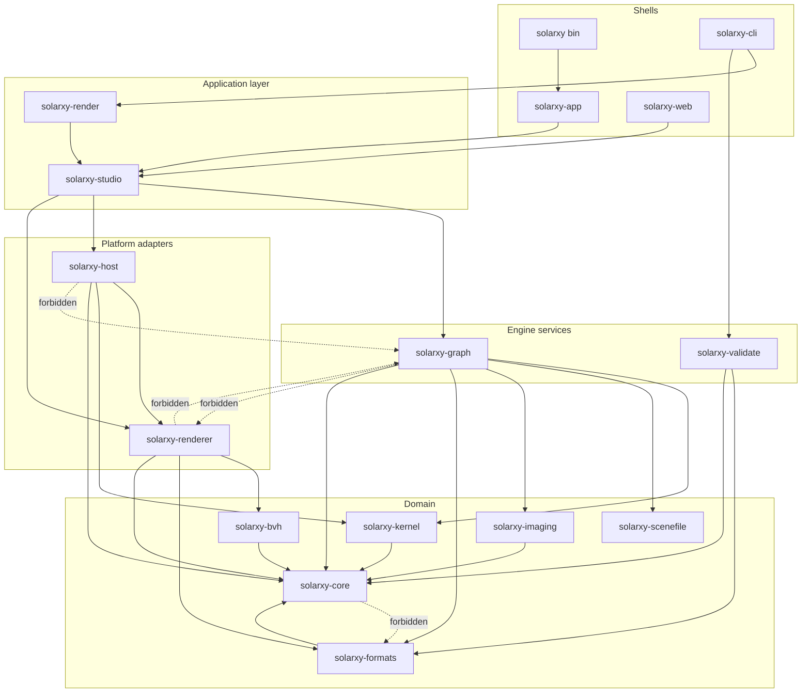
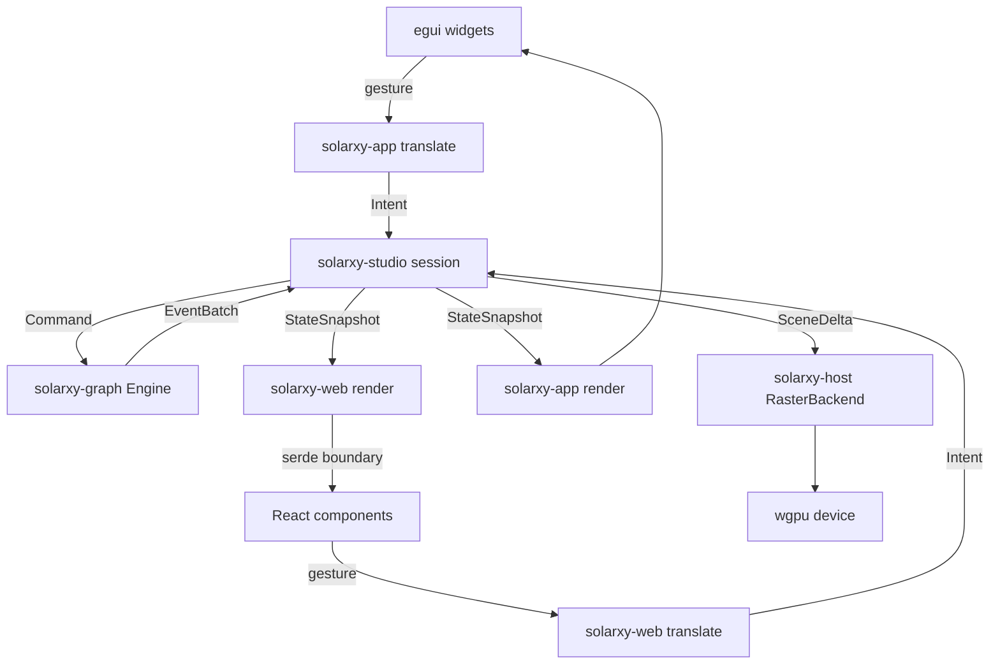
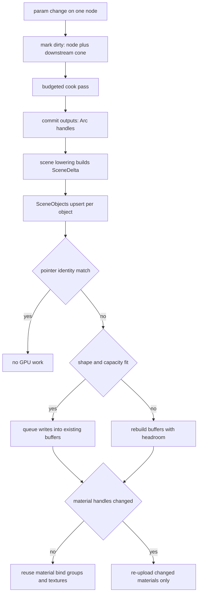
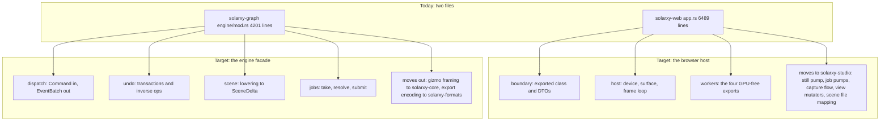

# Target architecture

This document is prescriptive. Nothing in it describes the system as it is unless a sentence
says so explicitly, and those sentences begin with "Today". Everything else is the shape the
code is being moved toward.

[03-current-architecture.md](03-current-architecture.md) is the descriptive counterpart. Where
this document and that one disagree, that is the gap, not a contradiction.

Three decisions are already ratified and are not reopened here.
[ADR 0012](adr/0012-shared-application-layer-is-a-new-crate.md) settles that the shared headless
application layer is a new crate. [ADR 0013](adr/0013-path-tracer-is-the-shading-ground-truth.md)
settles that the path tracer defines correct shading.
[ADR 0014](adr/0014-two-attribute-domains.md) settles that two attribute domains is the ceiling.
This document specifies the seams those decisions imply.

## Stability levels used in the cards

Every responsibility card names a stability level for the crate or module's public surface.
There are three, and they are a commitment about what a change costs.

| Level | Meaning |
|---|---|
| Stable | A breaking change needs an ADR. Other repositories, shipped files, or published artefacts depend on the shape. |
| Internal | May change freely, but the change is a workspace-wide edit and every consumer is in this repository. |
| Private | No consumer outside the crate or module. Changing it costs nothing beyond its own tests. |

Today most of the workspace has no distinguishable level at all: `solarxy-renderer` declares 41
public modules and no private ones (`crates/solarxy-renderer/src/lib.rs`), `solarxy-kernel`
declares 19 public and 1 private, `solarxy-graph` 17 and 1. Assigning a level per crate is
therefore itself a target, and the first migration step for several cards is a facade that makes
the level real.

## The layers

Five layers, top to bottom. A crate may depend downward and sideways within its own layer only
where a card says so. It may never depend upward.

**Domain.** GPU-free, I/O-free, platform-free data and algorithms. Geometry, images, the
engine-to-renderer contract, the scene file format, format parsers, ray queries. Nothing here
knows a document exists.

**Engine services.** The document, its topology, the cook, the registry, expressions, undo,
review, validation orchestration. Knows nothing about a GPU, a window, or a shell.

**Shared headless application layer.** One crate, `solarxy-studio`, that sees both the engine
and the render host and owns the session: what is selected, which tool is armed, what a menu
item does, what a keystroke means, when to autosave, how a render job is driven. It has no view
layer.

**Platform adapters.** The GPU. `solarxy-renderer` owns wgpu; `solarxy-host` owns the per-pane
orchestration that both graphical shells drive. Neither may see the engine.

**Shells.** Device and surface acquisition, an event loop, and a way to paint. A shell
translates a gesture into an application intent and renders what comes back. It interprets no
document.

### Diagram: target crate dependency graph

What to notice. The graph is acyclic and every solid edge points downward through the layer
stack, so a crate's layer can be read off its longest path to `solarxy-core`. `solarxy-studio`
is the only crate that sits above both `solarxy-graph` and `solarxy-host`, which is exactly
what makes it the one place a document-aware behaviour can be written once for both graphical
shells. The four dotted edges are the deny-list entries that carry real weight. Three of them
hold today and must keep holding: `solarxy-host` has no `solarxy-graph` edge in any dependency
kind, and `solarxy-graph` and `solarxy-renderer` have no edge in either direction. The fourth,
`solarxy-core` to `solarxy-formats`, exists today as a development dependency for one
performance test at `crates/solarxy-core/src/raycast.rs` and is a target removal, not a current
fact. Note also that `solarxy-scenefile` has no outgoing edge at all: it is the true root of the
graph, and the only member that can be changed and tested in isolation.

## Responsibility cards

Sixteen Cargo members, plus each `web/src` module. `solarxy-studio` arrived in 0.10.0 with the
presentation half of its charter and widens as the migration in
[09](09-evolution-and-roadmap.md) proceeds; its card below is the target, and the gap between
the target and what it holds today is stated in the card itself. A card's `Does not own` and `Must not depend on` fields are the ones that prevent drift,
and they are the fields to read first.

### solarxy, the root binary

| Field | Content |
|---|---|
| Name | `.` (crate `solarxy`, `src/main.rs`) |
| Purpose | Parse the desktop viewer's own small argument set, set up tracing, and hand control to the desktop shell. |
| Owns | The desktop process entry point, the argument surface of the `solarxy` command, and the Windows subsystem attribute that suppresses a console window in release builds. |
| Does not own | Any application behaviour whatsoever. No window, no state, no rendering, no preference loading beyond the call that triggers it. A feature added here is a feature added in the wrong place. |
| Public surface | None. The crate exposes no library items. Private. |
| May depend on | `solarxy-app`, `solarxy-core`. |
| Must not depend on | `solarxy-graph`, `solarxy-renderer`, `solarxy-host`, `solarxy-studio`, all directly: a launcher that reaches past its shell is a second shell. |
| Platforms | desktop |
| Test strategy | None of its own. It is 89 lines and every line is covered by the desktop shell's own startup path plus the packaging smoke builds. |

### solarxy-core

| Field | Content |
|---|---|
| Name | `crates/solarxy-core` |
| Purpose | The GPU-free, I/O-free data types and algorithms that more than one layer needs, and nothing else. |
| Owns | Geometry and image records, the axis-aligned bounding box, ray queries, the validation vocabulary, the engine-to-renderer contract in `scene` including `SceneDelta` and `CookedGeometry`, the transform-role declaration in `gizmo`, and the interface palette in `theme` that the desktop shell, the terminal surfaces and the generated web tokens all read. |
| Does not own | Anything a document knows about: nodes, params, cook state, undo. Any GPU type. Any filesystem path in an ungated type. Today `RawMaterialData` carries 17 ungated `Option<PathBuf>` texture-path fields at `crates/solarxy-core/src/geometry.rs`, which ship in every WebAssembly build where a host path has no meaning; the target replaces them with the content-addressed asset key the scene file already uses, and this is not yet true. |
| Public surface | The 14 declared modules, of which `install_source`, `preferences`, `view_config`, `json`, `project_config`, `report` and `review` are feature-gated. Stable for `scene`, `gizmo`, `validation` and `theme`, because those are boundary contracts; Internal for the rest. |
| May depend on | Nothing in the workspace. |
| Must not depend on | Every other member, in every dependency kind: 13 of the other 14 depend on it, so an upward edge is a package cycle and a rebuild of the world. The one that exists today, a development dependency on `solarxy-formats` for a fixture-loading performance test, is a target removal; the test moves to `crates/solarxy-core/tests/` with a synthesised mesh. |
| Platforms | all |
| Test strategy | Unit tests per module, plus the drift suite in `crates/solarxy-core/tests/tokens_drift.rs`, which is where every cross-surface source scan lives: generated CSS tokens against the palette, registry glyph keys against the frontend, expression type names against the frontend, the WebAssembly boundary enums' field renaming, and the ban on planning codes in comments. |

### solarxy-formats

| Field | Content |
|---|---|
| Name | `crates/solarxy-formats` |
| Purpose | Turn bytes in a published file format into the domain's records, and turn those records back into bytes. |
| Owns | The OBJ, PLY, STL and glTF/GLB readers, the Radiance and OpenEXR readers, the Adobe cube LUT reader, the writers for OBJ with MTL, PLY, STL, GLB, PNG and JPEG, and the companion-file resolution rules an OBJ or a glTF needs. |
| Does not own | What a parsed model means. It emits `RawModelData` and never decides whether a mesh is valid, displayable, or worth cooking. It also does not own asset staging or content addressing, which belong to the engine. |
| Public surface | The per-format `load_*_bytes` and `write_*_bytes` functions, always available; the path-taking wrappers behind `std-fs`. Stable, because external vendors and the headless command both call it. |
| May depend on | `solarxy-core`. |
| Must not depend on | `solarxy-graph`, because a parser that knows about a document cannot run inside the GPU-free import worker; `solarxy-renderer`, because a decoded texture must reach the CPU before any device exists; `solarxy-kernel`, because the kernel's geometry is a cook-time shape and a loader must not produce one. |
| Platforms | all; `std-fs` is off in every WebAssembly consumer |
| Test strategy | Fixture-driven integration tests in `crates/solarxy-formats/tests/loaders.rs` against committed sample files, one per format and per malformation class. |

### solarxy-imaging

| Field | Content |
|---|---|
| Name | `crates/solarxy-imaging` |
| Purpose | Deterministic, single-threaded, CPU-only image operators for the texture context. |
| Owns | Adjust, composite, generate, filter and channel-packing operations over `RawImageData`, and the determinism guarantee that the same input produces the same bytes on every platform and every build. |
| Does not own | Image decoding or encoding, which is `solarxy-formats`. Node wrapping, which is `solarxy-graph`. Any notion of a texture on a GPU. |
| Public surface | The operator functions and their parameter records. Internal. |
| May depend on | `solarxy-core`. |
| Must not depend on | `solarxy-graph`, because an operator must be callable without a document; `solarxy-renderer`, because these run on the CPU by definition and a device edge would break the WebAssembly worker; `rayon` or any thread pool, because determinism and the single-threaded WebAssembly target are the crate's whole premise. |
| Platforms | all |
| Test strategy | Per-operator unit tests with committed reference values, including at least one bit-exactness assertion per operator so a platform difference fails rather than drifts. |

### solarxy-kernel

| Field | Content |
|---|---|
| Name | `crates/solarxy-kernel` |
| Purpose | The parametric geometry kernel: the in-memory mesh and set model, the primitive generators, and every operator that transforms geometry. |
| Owns | `KernelMesh` and `GeometrySet`; the two attribute domains and the four lane types ratified in [ADR 0014](adr/0014-two-attribute-domains.md); the reserved lane names and, in the target, their machine-readable type contract; instance placements and the bake; the primitive ceiling; and the worker transfer codec for geometry. |
| Does not own | Cook scheduling, dirty marking, node types or params: those are engine concerns and the kernel must stay callable from a plain test with no document. It also does not own the renderer's mesh shape; `to_cooked` is the one lowering and it lives here because only this crate knows what a lane means. |
| Public surface | The set model, the operator functions, and `transfer`. Internal, with `GeometrySet::to_cooked` Stable because it is half of the engine-to-renderer contract. |
| May depend on | `solarxy-core`. |
| Must not depend on | `solarxy-graph`, because the kernel is the layer a node body calls and the reverse edge would be a cycle; `solarxy-renderer` and `wgpu`, because the kernel runs in the GPU-free import worker; `std::fs`, `std::thread` and `std::time`, none of which it uses today and all of which are unavailable in the worker. |
| Platforms | all |
| Test strategy | Per-operator unit tests, plus two invariants that must become checks rather than conventions: a lane's length equals its domain's element count, and a reserved lane carries its declared type. Today neither is checked anywhere and `subdivide` and `delete` both violate the first. |

### solarxy-bvh

| Field | Content |
|---|---|
| Name | `crates/solarxy-bvh` |
| Purpose | A GPU-free bounding volume hierarchy for ray queries, written so its traversal ports to a shader unchanged. |
| Owns | The 32-byte node record, the binned-SAH builder, the two-level structure over instance bounds, the CPU traversal that the shader kernel is a line-for-line twin of, the versioned transfer codec, and the deterministic ray corpus every comparison of those implementations draws from. |
| Does not own | Any scene concept. It is handed triangles and placements and answers hits; it does not know what a mesh is for. It also does not own the shader: the WGSL twin lives in `solarxy-renderer`, and this crate owns only the reference the twin is checked against. |
| Public surface | The builder, the traversal, `transfer`, and `corpus`. Internal, with the transfer format Stable because a blob crosses a worker boundary. |
| May depend on | `solarxy-core` for the bounding box, and `bytemuck`. |
| Must not depend on | Anything else in the workspace, and specifically not `cgmath`: the traversal is written on plain float arrays precisely so it ports to WGSL unchanged, and it deliberately duplicates one triangle test rather than call `solarxy-core`'s, which speaks `cgmath` types. Depending on `solarxy-core` and `bytemuck` alone is the whole reason the crate exists separately. |
| Platforms | all |
| Test strategy | `crates/solarxy-bvh/tests/parity.rs` pins both levels of the CPU traversal against `solarxy_core::raycast`, and the shader-side twin is pinned against the same corpus from `solarxy-renderer`. |

### solarxy-graph

| Field | Content |
|---|---|
| Name | `crates/solarxy-graph` |
| Purpose | The headless studio core: the document, its topology, the cook, the node registry, the expression language, undo, and in-scene review. |
| Owns | The two-level document and its typed contexts; the 77 registered node types asserted in `crates/solarxy-graph/src/nodes/mod.rs`; the cook driver and its per-node state; the budgeted, resumable cook pass; the expression language and its dependency index; the undo transaction model; the `Command` vocabulary of 35 variants and the `EngineEvent` vocabulary of 21; the scene lowering that produces a `SceneDelta`; and the mapping between a live document and the scene file's types. |
| Does not own | The GPU, in any form. Session concerns above the document: menus, keymaps, dock arrangement, modals, toasts, preferences, autosave policy. The scene file's own serde types, which belong to `solarxy-scenefile`. Manipulator geometry and drag solving, which belong to the host. Today the engine facade additionally does matrix algebra for gizmo framing and writes export archives inline; both are target moves out. |
| Public surface | `Engine`, `Command`, `EngineEvent`, `EventBatch`, the registry snapshot, and the document types. Stable, because the WebAssembly boundary serialises them and a published scene file replays them. Everything under `cook`, `expr`, `refs` and `topology` is Internal and should become private behind a facade. |
| May depend on | `solarxy-core`, `solarxy-kernel`, `solarxy-imaging`, `solarxy-formats`, `solarxy-scenefile`. |
| Must not depend on | `solarxy-renderer`, in any dependency kind, because that non-edge is what lets the cook be tested without a device and the engine compile into a GPU-free worker; `solarxy-host`, for the same reason plus the direction of the layer stack; `wgpu`, `winit`, `egui`; `std::fs`, because the browser has none and every asset already arrives as bytes; `std::time`, because the clock is supplied by the caller. |
| Platforms | all |
| Test strategy | Unit tests per module plus a large in-source integration suite. Two of its tests are production contracts rather than checks and must stay that way: the carry-or-bake sweep derives its case list from the registry so a new geometry-consuming node cannot be added without a decision, and the registry snapshot drift test holds `schemas/registry.json` to the live registry. Today the integration suite is a single 9,295-line in-source module, which is a target split, not a current shape. |

### solarxy-scenefile

| Field | Content |
|---|---|
| Name | `crates/solarxy-scenefile` |
| Purpose | The `.slxy` scene file: its container, its schema-owned document image, its integrity guarantees, and its version gate. |
| Owns | The uncompressed ZIP container and its three entry kinds; `SceneJson` and the manifest as the format's own serde and schema types, deliberately decoupled from the engine's in-memory shapes; content-addressed asset blobs and the hash check on read; and the `schema_version` and `min_reader` compatibility gate. |
| Does not own | The engine's document. The mapping between the two lives in `solarxy-graph`, in one file, on purpose: this crate must never learn what a node does. It also does not own node-level migration, which is registry-driven and belongs with the registry. |
| Public surface | `SceneJson`, the manifest types, `read`, `write`, and the version constants. Stable, and more strictly than anything else in the workspace: a file written by a shipped build must stay readable. |
| May depend on | Nothing in the workspace. |
| Must not depend on | Every other member. It is the root of the dependency graph and the only crate that can be changed and tested in isolation; an edge to `solarxy-core` alone would make a format change a workspace rebuild. In particular not `solarxy-graph`, because the format must be readable by a tool that has no engine. |
| Platforms | all |
| Test strategy | Structural round-trip at the format layer, an integrity-rejection test, and a schema drift test against the committed JSON schema. Two gaps are target work: the container migration is called once rather than stepwise, and no test performs save, load, save and compares. |

### solarxy-renderer

| Field | Content |
|---|---|
| Name | `crates/solarxy-renderer` |
| Purpose | Every wgpu resource and every shader. Pipelines, bind group layouts, render targets, the pass bodies, the path tracer, and the capability contract a backend implements. |
| Owns | The device-facing state: pipelines built once at startup, the single source of bind group layouts, the shared render targets and their resize policy, image-based lighting, the post-processing chain, the finishing chain and its colour-space rules, capture, the split-viewport layout arithmetic, and the compute path tracer including its arena, atlas, denoiser and probes. It also declares the `RenderBackend` contract and `BackendCaps`, which state capability and never identity. |
| Does not own | What to draw. It is handed a scene, a camera and per-pane settings; it never asks a document anything. It does not own the pass sequence either: that is `solarxy-host`. Nor the raster backend implementation, which lives beside the pass chain it wraps. |
| Public surface | Today 41 public modules and 749 public items with no internal distinction. The target is a facade: `Renderer`, `SceneObjects`, `SceneEnvironment`, `RenderBackend`, `BackendCaps`, `capture`, `panes` and `limits` public and Stable; `pipelines`, `bind_groups`, `resources`, `pathtrace::arena`, `pathtrace::atlas` and the pass modules private or Internal. Four crates reach into internals today, so this is a migration, not a description. |
| Must not depend on | `solarxy-graph`, in any dependency kind, because the renderer must compile and be tested with no document and no cook; `solarxy-host` and `solarxy-studio`, because both are above it; `winit` and `egui`, because a shell owns the window and the widgets and the renderer takes a shell-owned surface configuration instead. |
| May depend on | `solarxy-core`, `solarxy-formats`, `solarxy-bvh`, `wgpu`. |
| Platforms | all |
| Test strategy | Unit tests on the CPU-side arithmetic; an opt-in uniform layout suite that computes a shader struct's span and compares it to the Rust size, which is the comparison nothing else in the build makes; shader composition recipes so a fragment no kernel consumes fails the build; path-tracer probes that drive the real kernel bindings and read results back, which is the only way a shader gets unit tested; and a macOS job that runs the GPU tests against a real adapter. |

### solarxy-host

| Field | Content |
|---|---|
| Name | `crates/solarxy-host` |
| Purpose | The rendering orchestration both graphical shells drive: the per-pane pass sequence, the composite, the camera and lighting lifecycle, the raster backend, and the tiled still-render job. |
| Owns | The three pass chains and the composite; the per-pane camera lifecycle and camera-node application; the lighting chokepoint; `RasterBackend` and, through it, `SceneObjects`, which both shells read the document through; the tiled still job and its tile plan, readback policy, progress estimate and preview slot; the auxiliary pass vocabulary `AovKind` and the pass selector keyed on capability; and the one definition of how close two images are. |
| Does not own | Anything a document knows. This is the crate's defining constraint and it is what forces the render-settings resolution out of here and into the application layer. It also does not own a clock: the still job takes `now_ms` from its caller because this crate compiles for the browser and has no `Instant`. Nor a device: three callers want three adapter policies. Nor logging: the raster backend accumulates errors for a shell to drain. |
| Public surface | The pass entry points, the backend implementation, the camera and lighting helpers, the still job, `passes`, and `compare`. Internal. |
| May depend on | `solarxy-core`, `solarxy-kernel`, `solarxy-renderer`. |
| Must not depend on | `solarxy-graph`, in any dependency kind. This is the single most load-bearing deny-list entry in the workspace: it is what keeps the engine and the renderer genuinely separate, what lets the cook be tested with no device, and what lets a GPU-free WebAssembly worker exist. It is also why `solarxy-studio` must exist. Also not `solarxy-studio`, `solarxy-app` or `solarxy-web`, all above it; and not `winit` or `egui`. |
| Platforms | all |
| Test strategy | Integration tests on the still job, the traced backend's accumulator ordering, and the tile plan; plus the golden-capture harness, which lives here as an example so the pixel gate runs through the shared path rather than beside it. Today roughly half the crate's library lines have exactly one consumer, which the migration in [09](09-evolution-and-roadmap.md) either promotes to genuinely shared or moves out. |

### solarxy-studio

| Field | Content |
|---|---|
| Name | `crates/solarxy-studio` (created in 0.10.0 by the migration step named in [09](09-evolution-and-roadmap.md); it holds the shared interface derivation today and none of the session behaviour below, which arrives with the later steps of that sequence) |
| Purpose | The shared headless application layer: the session both graphical shells and the headless surfaces render. |
| Owns | The application intent vocabulary and the state a shell renders; document lifecycle including open, save, autosave and recovery policy; selection and tool or gizmo mode; the pane and workspace arrangement model; the menu model and the single keymap table; the notification and modal model; the preferences schema, distinct from any one platform's storage; render-settings resolution from the document and its mapping into backend settings; the still-render job driver; and the progress view model every surface presents. |
| Does not own | Any view. No widget, no DOM, no terminal cell, no colour choice beyond reading the shared palette. No device or surface acquisition. No platform storage: it says what to persist, not where. No clock: like the still job, it takes time from its caller, because one of its consumers is a WebAssembly build. If a type in this crate names a widget, the crate has become a third shell. |
| Public surface | The intent enum, the session type, the state snapshot it returns, and the keymap table. Stable once it exists, because it is what both shells are written against. |
| May depend on | `solarxy-graph`, `solarxy-host`, `solarxy-renderer`, `solarxy-core`, `solarxy-formats`. It takes only `solarxy-graph`, `solarxy-core` and `serde` today, which is the presentation charter's whole need; the rest arrive with the session behaviour. |
| Must not depend on | `winit`, `egui`, `wasm-bindgen`, `rfd`, `ratatui` or any view or platform toolkit, because a view dependency is how a shared layer becomes a shell; `solarxy-app`, `solarxy-web`, `solarxy-cli`, `solarxy-render`, all of which are its consumers; `std::fs` in the required path, because the browser has none and every persistence decision must be expressible as bytes plus a destination the shell resolves. |
| Platforms | all |
| Test strategy | The layer's whole point is that a behaviour is testable once. Every intent gets a headless test that drives a session and asserts the resulting state, with no device and no window. The cross-shell parity tests that exist today, which compare two hand-written resolvers field by field, are deleted rather than extended, because after the move there is one body to test. |

### solarxy-app

| Field | Content |
|---|---|
| Name | `crates/solarxy-app` |
| Purpose | The desktop shell: a winit event loop, an egui view layer, and a wgpu surface, rendering a `solarxy-studio` session. |
| Owns | Window and surface lifecycle; the egui widget tree, docking, menus, modals and the status bar; native file dialogs; desktop preference storage as a TOML file; the desktop's own capture and screenshot flow; and the translation of keyboard and pointer events into application intents. |
| Does not own | Any document behaviour. Today it dispatches two of the engine's 35 commands directly, holds two mutually exclusive scene representations, hand-rolls a screenshot readback the renderer already exports, and carries its own copy of the still pump, the pane driver and the render-settings resolver. All of that is target-removed: after the migration the shell holds a session, not an engine. |
| Public surface | `run_viewer` and the theme adapter. Private otherwise. |
| May depend on | `solarxy-studio`, `solarxy-core`, `winit`, `egui`, `wgpu`, `rfd`. |
| Must not depend on | `solarxy-graph` directly, because a shell that constructs a `Command` is interpreting the document and has stepped over the seam; `solarxy-host` and `solarxy-renderer` directly, except for the two things a shell genuinely owns, the device request and the surface configuration, which are named exceptions rather than a general edge; `solarxy-web`, `solarxy-cli`. |
| Platforms | desktop |
| Test strategy | Unit tests on the pure translation from an input event to an intent, and on the snapshot round-trip between the view and the session. Everything below the seam is tested in `solarxy-studio`. The manual desktop checklist in `docs/qa/` covers what only a human at a real adapter can. |

### solarxy-web

| Field | Content |
|---|---|
| Name | `crates/solarxy-web` |
| Purpose | The browser shell's Rust half: the `wasm-bindgen` boundary, the WebGPU host, and the GPU-free worker exports. |
| Owns | The exported class the frontend calls; the boundary data types and their serde shapes; device, surface and canvas lifecycle in the browser; the per-frame loop that ticks the clock, runs a budgeted cook, ingests a delta and renders each pane; the browser's job pumps; and the four worker exports that run in a second, headless instance of the same module. |
| Does not own | Application behaviour. Today one 6,489-line file holds the boundary, the host, the frame loop, roughly 20 boundary record types, the still pump, the gizmo drag address, capture, the asset preview and every worker pump, and the majority of what it holds is application layer that belongs in `solarxy-studio`. After the migration this crate is a boundary and a host, and little else. |
| Public surface | The exported class and free functions, and their serialised shapes. Stable, because `web/src/engine/types.ts` mirrors them and a mismatch is silent at runtime. |
| May depend on | `solarxy-studio`, `solarxy-host`, `solarxy-renderer`, `solarxy-kernel`, `solarxy-core`, `solarxy-scenefile`, `wasm-bindgen`. |
| Must not depend on | `winit`, `egui`, `rfd`, because the browser owns the window and the frontend owns the widgets; `std::fs`, `std::thread`, `std::time::Instant`, none of which exist in the target; `solarxy-app`. |
| Platforms | web; two of its modules compile natively only so native continuous integration runs their tests |
| Test strategy | Today the crate has 11 tests, in two modules, and none in the 6,489-line host. The target is that everything testable without a device moves to `solarxy-studio` and is tested there, the boundary shapes are pinned by a generated-versus-hand-written comparison rather than by spot checks, and what remains is exercised by the browser smoke pages plus the frontend's own suite. |

### solarxy-validate

| Field | Content |
|---|---|
| Name | `crates/solarxy-validate` |
| Purpose | Validation orchestration and the adapters that turn a result into a continuous-integration system's format. |
| Owns | The batch validation run over a set of paths, the report shape external consumers depend on, and the pipeline adapters. |
| Does not own | The validation rules themselves, which are `solarxy-core::validation`, so that the viewport and the command line can run the same checks. |
| Public surface | The library API and the report types. Stable: it is explicitly a wire-format library for consumers who want structured results without a subprocess. |
| May depend on | `solarxy-core`, `solarxy-formats`. |
| Must not depend on | `solarxy-graph`, because validating a file must not require a document; `solarxy-renderer`, because validation is a CPU answer; `solarxy-cli`, its own consumer. |
| Platforms | desktop, command line |
| Test strategy | Golden report comparisons per adapter format, and per-rule fixtures inherited from `solarxy-core`. One target fix: the viewport and the analyzer must run validation with the same configuration, which today they do not. |

### solarxy-render

| Field | Content |
|---|---|
| Name | `crates/solarxy-render` |
| Purpose | Render a scene with no browser and no window: the headless render command's library half. |
| Owns | Bringing a device up with no surface; the progress stream and the sink that receives it; the output taxonomy, including auxiliary pass sibling files and the JSON report; the tile budget that lets a watching surface see a picture converge; and the error mapping onto the command's exit codes. |
| Does not own | After the migration, the application-layer pieces it holds today: the one-path loader that turns either a scene file or a bare model into one cooked engine, the render-settings resolver, the settings mappers, and the tile drive loop. Those move to `solarxy-studio` and this crate consumes them. It also does not own the adapter policy of the other two shells, which is why the device request stays here rather than being shared. |
| Public surface | `run_render`, `RenderOptions`, `RenderProgress`, `RenderSink`, `Output`, `RenderError`. Stable. |
| May depend on | `solarxy-studio`, `solarxy-host`, `solarxy-renderer`, `solarxy-graph`, `solarxy-formats`, `solarxy-core`. |
| Must not depend on | `winit`, `egui` or any windowing toolkit, because headless is the crate's definition; `solarxy-cli`, its consumer; `solarxy-app`, `solarxy-web`. |
| Platforms | desktop, command line |
| Test strategy | Contract tests on the option validation and the exit-code mapping, and an assertion that two different tile budgets render the same image through both engines, which is what keeps the tiling honest rather than assumed. |

### solarxy-cli

| Field | Content |
|---|---|
| Name | `crates/solarxy-cli` |
| Purpose | The terminal shell: argument parsing, the terminal user-interface substrate, and the two surfaces built on it. |
| Owns | The argument surface; the terminal substrate, which is generic over both its panel vocabulary and its subject and is the most rigorously deduplicated view layer in the product; the analyzer surface; the render dashboard; and the plain-line fallback when standard error is not a terminal. |
| Does not own | Rendering, which goes entirely through `solarxy-render`. Validation rules, which come from `solarxy-core`. Today it additionally owns a fourth graphical shell behind an off-by-default feature that is on in the shipped build: its own window, its own adapter and device, its own shader and its own image pan-and-zoom. The target either routes that window through the shared host or removes it; a command-line tool that contains a windowing toolkit is a naming problem and a maintenance one. |
| Public surface | The library half is Internal; the binary's argument surface is Stable, because a flag is a user-visible contract. |
| May depend on | `solarxy-render`, `solarxy-validate`, `solarxy-formats`, `solarxy-core`, and in the target `solarxy-studio` for the keymap table and the progress view model. |
| Must not depend on | `solarxy-graph` directly, because the terminal is a shell and reaches the engine through the layer above it; `solarxy-renderer` and `solarxy-host` directly, for the same reason and because it currently reaches them only transitively, which is the correct shape. |
| Platforms | desktop, command line |
| Test strategy | Contract tests on the argument surface and the exit codes; snapshot tests on the terminal layout solver at several sizes and capability tiers; unit tests on the pan-and-zoom transform, which today is one of four independent implementations of the same arithmetic. |

## The frontend

`web/src` is roughly 34,000 lines of TypeScript and TSX across 200 files. The target layering is
strict and, unlike the Rust workspace, nothing enforces it today: there are six genuine import
cycles, and in every one the boundary layer is on the wrong side.

The target layers, lowest first:

- **W0** `styles`, `assets`, `wasm`. Build artefacts and static files.
- **W1** `registry`, `render`, `input`, `persistence`. Pure functions and tables. No React, no
  store, no session.
- **W2** `store`. The zustand state.
- **W3** `engine`. The boundary wrapper and the frame pump.
- **W4** `flow`, `dock`, `hooks`, `export`. Feature modules.
- **W5** `components`. The view.
- **W6** `App.tsx`, `main.tsx`.

`landing`, `public`, `references`, `roadmap` and `player` are separate build entries that share
nothing with the app shell except tokens.

`engine/types` is the one permitted exception to the layer order: any layer may import it,
because it holds the boundary's type declarations plus a small number of pure helpers and no
behaviour.

### web/src/components

| Field | Content |
|---|---|
| Name | `web/src/components` |
| Purpose | Every React component of the app shell: panels, modals, menus, parameter widgets, viewport chrome, review interface, onboarding. |
| Owns | Presentation and gesture capture. Nothing else. It reads the mirror and the registry snapshot, and dispatches intents. |
| Does not own | Document state, session state, or any rule about what a node type means. Today seven components branch on a specific node type id and the parameter panel diverts one type's action button into a different dialog, against a stated zero-frontend-change contract; each of those is a target move into a registry declaration. |
| Public surface | The exported components. Internal. |
| May depend on | `store`, `engine`, `flow`, `dock`, `hooks`, `registry`, `render`, `input`, `persistence`, `styles`, `icons`. |
| Must not depend on | Nothing below it may import it back. Specifically `engine` must not import a component, which today it does twice, and `store` must not import a component's type, which today it does once. Both edges make the boundary layer untestable without the view. |
| Platforms | web |
| Test strategy | Vitest unit tests on the pure helpers a component delegates to, in preference to rendering tests. A component that cannot be tested without a canvas has too much logic in it. |

### web/src/engine

| Field | Content |
|---|---|
| Name | `web/src/engine` |
| Purpose | The WebAssembly boundary: one typed wrapper per export, the frame pump, the worker protocol, and applying event batches into the mirror. |
| Owns | The single client instance and its lifecycle; the per-frame drive; the worker's creation, message protocol and result routing; and the mirror-apply tail every batch passes through, including desync detection and snapshot recovery. |
| Does not own | Application policy. Today `session.ts` is 1,248 lines and 58 exports covering autosave, save and open, copy and paste, review command construction, every view mutator and one toast's wording, which is the web shell's application layer and has no Rust counterpart. All of it moves to `solarxy-studio`; what remains here is a boundary and a pump. |
| Public surface | The client wrapper, the type declarations, and the frame entry point. Stable for `types.ts`, because it mirrors a serde contract. |
| May depend on | `store`, `registry`, `persistence`, `input`, `wasm`. |
| Must not depend on | `components` and `flow`, because a boundary that imports the view cannot be extracted or tested without it, and both edges exist today; `dock`, for the same reason. |
| Platforms | web |
| Test strategy | The boundary's shape is pinned mechanically rather than by hand, which is the subject of [05](05-boundaries-and-contracts.md). The worker protocol gets one shared module and a test that a request built by the caller type-checks against the worker's declaration. |

### web/src/flow

| Field | Content |
|---|---|
| Name | `web/src/flow` |
| Purpose | The node canvas: node and edge rendering, canvas gestures, auto-layout, and the reconciliation between the canvas library's state and the mirror. |
| Owns | Node visual derivation from the registry snapshot, typed handle rendering, the radial menu, the list view, auto-layout, and the seed reconciliation that merges the mirror's selection and positions with the canvas library's own. |
| Does not own | Selection or position truth: the mirror is authoritative and a drag is canvas-owned only until commit. It also does not own node semantics; the one deliberate exception is the note node, which is a non-registry component by design. |
| Public surface | The canvas component and the node types it registers. Internal. |
| May depend on | `engine`, `store`, `registry`, `hooks`, `styles`. |
| Must not depend on | `components`, because the canvas is a leaf of the view and the reverse edge exists today; `dock`, because pane arrangement is not a canvas concern. |
| Platforms | web |
| Test strategy | Unit tests on the pure helpers: reconciliation, layout, visual derivation, label formatting. The registry-interpretation guarantee is held by an extensibility test that constructs a synthetic registry snapshot and asserts the canvas renders it with no code change. |

### web/src/store

| Field | Content |
|---|---|
| Name | `web/src/store` |
| Purpose | The nine zustand stores: the document mirror plus eight view-local stores. |
| Owns | The mirror, which is written only by applying an event batch or replacing from a snapshot, and the view-local state a shell legitimately keeps: pointer-over flags, modal flags, transient drafts. |
| Does not own | Anything the session owns. Today `prefs`, `desks`, `ui` and most of `review` hold state that has a Rust counterpart or should have one, and three preference slices are pushed one way into Rust and can disagree until the next push. In the target those stores mirror `solarxy-studio` state instead of holding it. |
| Public surface | The store hooks and their selectors. Internal. |
| May depend on | `registry`, `render`, `input`, `engine/types`. |
| Must not depend on | `engine/session`, `dock` and `components`, all three of which it imports today. Each is a cycle, and each is the same mistake: state reaching sideways to make something happen instead of recording that it should. |
| Platforms | web |
| Test strategy | Unit tests on each store's reducers, and specifically on the mirror's desync detection and its recovery path, which today does not clear the per-node cook and validation maps and can therefore leave a new node wearing a deleted node's badge. |

### web/src/dock

| Field | Content |
|---|---|
| Name | `web/src/dock` |
| Purpose | Integration with the docking library: panel registration, layout serialisation, and drop-target behaviour. |
| Owns | The mapping between the session's pane and workspace model and the docking library's own representation. |
| Does not own | The arrangement model itself. In the target that lives in `solarxy-studio` so the desktop's docking and the browser's docking are two renderings of one model rather than two models. |
| Public surface | The dock component and the layout functions. Internal. |
| May depend on | `components`, `store`, `styles`. |
| Must not depend on | `store` importing it back, which happens today; `engine`, because a panel arrangement is not a document operation. |
| Platforms | web |
| Test strategy | Unit tests on layout serialisation and on hover and drop-target arithmetic, both of which are pure. |

### web/src/hooks

| Field | Content |
|---|---|
| Name | `web/src/hooks` |
| Purpose | Reusable React behaviour: the global keyboard dispatcher, drag-to-resize, and precision dragging. |
| Owns | The bridge between a browser event and an application intent, and the drag ergonomics a pointer gesture needs. |
| Does not own | The keymap itself, which is a table in `input` and, in the target, a table in `solarxy-studio` that both shells read. |
| Public surface | The hooks. Internal. |
| May depend on | `engine`, `store`, `input`. |
| Must not depend on | `components` and `flow`, because a hook that knows a component is not reusable. |
| Platforms | web |
| Test strategy | Unit tests on the pure arithmetic of the drag hooks; the keyboard dispatcher is tested through the keymap table. |

### web/src/export

| Field | Content |
|---|---|
| Name | `web/src/export` |
| Purpose | Browser-only delivery: the published-scene bundle, turntable video encoding, and the player configuration. |
| Owns | Assembling a static-hostable archive around a scene, driving the browser's video encoders, and the player's configuration shape. |
| Does not own | What is in a scene. It packages bytes the engine produced and never reinterprets them. Rendering the frames is the host's job. |
| Public surface | The export entry points. Internal, with the player configuration shape Stable because a published bundle carries it. |
| May depend on | `engine`, `store`, `render`. |
| Must not depend on | `components`, because export is a flow, not a view; `flow`, `dock`. |
| Platforms | web |
| Test strategy | Unit tests on the bundle's manifest assembly and on the player configuration round-trip. Video encoding is exercised by the manual browser checklist. |

### web/src/render

| Field | Content |
|---|---|
| Name | `web/src/render` |
| Purpose | Presentation arithmetic for the render surfaces: duration formatting, image fit and pan-and-zoom, and pass selection. |
| Owns | Nothing conceptually. Every function here is a deliberate reimplementation of a Rust function, done in TypeScript so a readout does not cost a boundary crossing. |
| Does not own | The definitions themselves. `duration.ts` mirrors the host's duration formatter and `view.ts` is a port of the terminal shell's pan-and-zoom. In the target each is pinned to its Rust original by a source-scraping test of the kind the repository already uses elsewhere, or generated. Today neither is pinned and the two can print different elapsed times with only a human noticing. |
| Public surface | The formatting and transform functions. Internal. |
| May depend on | `engine/types` only. |
| Must not depend on | `store`, `components`, `engine/session`, because these must stay pure functions if they are ever to be checked against their Rust originals. |
| Platforms | web |
| Test strategy | Case tables asserted against the Rust test's cases, which is the current state, plus the mechanical pin that makes the two lists one. |

### web/src/registry

| Field | Content |
|---|---|
| Name | `web/src/registry` |
| Purpose | Interpret the registry snapshot: handle colours and shapes, and coercion legality. |
| Owns | The rendering rules the typed-handle interface needs. |
| Does not own | The registry. It reads a snapshot and adds no knowledge. Today it hardcodes 14 colour literals with no source in the shared palette, against the rule that colour is owned in Rust and drift-tested; those move into the generated tokens. |
| Public surface | The lookup functions. Internal. |
| May depend on | `engine/types`, `styles`. |
| Must not depend on | `store`, `components`, `flow`, because the whole point is that this module is a pure interpreter any surface can call. |
| Platforms | web |
| Test strategy | The extensibility test: build a synthetic registry snapshot containing an unknown node type and unknown ports, and assert that the palette, the handles and the parameter panel render it. This is the mechanical form of the zero-frontend-change contract. |

### web/src/persistence

| Field | Content |
|---|---|
| Name | `web/src/persistence` |
| Purpose | Browser storage: the origin-private filesystem autosave ring, and reading a dropped folder. |
| Owns | Where bytes go in a browser and how a recovery candidate is found. |
| Does not own | What to save or when. Autosave policy, the dirty rule and the recovery prompt are session concerns and belong in `solarxy-studio`; this module executes a decision it is handed. |
| Public surface | The storage functions. Internal. |
| May depend on | Nothing above W1. |
| Must not depend on | `engine`, `store`, `components`, because storage that knows about a document cannot be swapped for a different backing store. |
| Platforms | web |
| Test strategy | Unit tests on the drop-entry traversal, and tests on the ring's rotation and recovery selection against a fake storage handle. Values read back from storage are parsed and validated, not asserted into a type. |

### web/src/input

| Field | Content |
|---|---|
| Name | `web/src/input` |
| Purpose | The keymap table: one typed list of bindings feeding both the dispatcher and the generated shortcuts modal. |
| Owns | Today, the browser's binding table and its context resolution. |
| Does not own | In the target, the table itself: the keymap becomes one table in `solarxy-studio` that both shells read, which is what closes the current gap where the browser has one generated table and the desktop maintains two hand-written ones. This module then becomes the browser's adapter over that table. |
| Public surface | The table and the context resolver. Internal today, and after the move, a thin adapter. |
| May depend on | `engine/types`. |
| Must not depend on | `store`, `components`, because a keymap that imports the view cannot be generated from a shared source. |
| Platforms | web |
| Test strategy | A test that every binding is reachable, that no two bindings collide within a context, and, after the move, that the table matches the shared one exactly. |

### web/src/landing

| Field | Content |
|---|---|
| Name | `web/src/landing` |
| Purpose | The public landing page, a separate build entry. |
| Owns | Its own markup, styles and responsive behaviour. |
| Does not own | Anything the app shell owns. It shares only design tokens. |
| Public surface | A build entry. Stable, because a route in the edge configuration points at it. |
| May depend on | `styles`, `public`. |
| Must not depend on | `engine`, `store`, `components`, `flow`, because the landing page must not carry the application bundle. |
| Platforms | web |
| Test strategy | The build's size accounting, plus the live-site verification step in the release train that compares page content rather than a status code, because the vhost ends in a fallback that returns 200 for any unknown path. |

### web/src/player

| Field | Content |
|---|---|
| Name | `web/src/player` |
| Purpose | The published-scene player: a minimal entry that runs an exported scene with no editor. |
| Owns | Player-mode boot and the smallest possible surface over the engine. |
| Does not own | Any editing affordance. Its size budget is what enforces that: 51,200 bytes gzipped, checked in the release workflow. |
| Public surface | A build entry and the player configuration it reads. Stable. |
| May depend on | `engine/client`, `engine/types`, `wasm`, `styles`. |
| Must not depend on | `components`, `flow`, `dock`, `store` beyond the mirror, because every one of those would put the editor bundle inside the player and break the budget. A drift test on the player's import graph already exists. |
| Platforms | web |
| Test strategy | The import-graph test plus the gzipped size budget. |

### web/src/public

| Field | Content |
|---|---|
| Name | `web/src/public` |
| Purpose | Shared chrome and base styles for the public pages. |
| Owns | The navigation and footer shared across the landing, roadmap and references pages, and their base stylesheet and font declarations. |
| Does not own | Page content. |
| Public surface | The chrome module and the stylesheets. Internal. |
| May depend on | `styles`. |
| Must not depend on | Any app-shell module, so the public pages never pull the editor bundle. |
| Platforms | web |
| Test strategy | Covered by the public pages' build and the live verification step. |

### web/src/references

| Field | Content |
|---|---|
| Name | `web/src/references` |
| Purpose | The public references page, a separate build entry. |
| Owns | Its entry and stylesheet. |
| Does not own | Content beyond what its data source provides. |
| Public surface | A build entry. Stable, because an edge route points at it. |
| May depend on | `public`, `styles`. |
| Must not depend on | Any app-shell module. |
| Platforms | web |
| Test strategy | Build and live verification only. |

### web/src/roadmap

| Field | Content |
|---|---|
| Name | `web/src/roadmap` |
| Purpose | The public roadmap page and its hand-authored data module. |
| Owns | The public, redacted statement of what is shipped and what is planned. |
| Does not own | The planning documents it mirrors. Nothing generates this module and nothing validates it against its sources, so a documentation change silently desynchronises it; keeping the two in step is a deliberate, procedural step, not a mechanical one. |
| Public surface | A build entry. Stable. |
| May depend on | `public`, `styles`. |
| Must not depend on | Any app-shell module, and no string in it may name a competitor product, because the module renders publicly. |
| Platforms | web |
| Test strategy | None mechanical today. The target is a check that every count the page states matches the source it claims to mirror. |

### web/src/styles

| Field | Content |
|---|---|
| Name | `web/src/styles` |
| Purpose | Design tokens: the generated ones and the hand-authored layer above them. |
| Owns | Nothing it authors. `tokens.generated.css` is produced from the Rust palette, and `tokens.css` may reference generated tokens but must not redefine one. |
| Does not own | Colour. Colour is owned by the shared palette in `solarxy-core` and regenerated from it; editing a generated value here is the drift the token tests exist to catch. |
| Public surface | The custom properties. Stable, because every stylesheet in the frontend resolves against them. |
| May depend on | Nothing. |
| Must not depend on | Anything, being CSS. |
| Platforms | web |
| Test strategy | Two Rust-side scans: every custom property used anywhere resolves to a defined token, and hand-authored CSS does not redefine a generated one. |

### web/src/assets

| Field | Content |
|---|---|
| Name | `web/src/assets` |
| Purpose | Static binary assets the app shell needs at runtime. |
| Owns | The committed files themselves. |
| Does not own | Anything generated. A file here is a gated addition under the repository's working agreement, because a committed binary is supply chain. |
| Public surface | The asset URLs the bundler emits. Internal. |
| May depend on | Nothing. |
| Must not depend on | Anything. |
| Platforms | web |
| Test strategy | The bundle size accounting is the only check, and it is the right one. |

### web/src/wasm

| Field | Content |
|---|---|
| Name | `web/src/wasm` |
| Purpose | The build output of the Rust WebAssembly host, regenerated by the build script and not committed. |
| Owns | Nothing. It is a generated artefact. |
| Does not own | The boundary's types. The generated declarations type every export's return as an untyped value, which is why the hand-authored mirror exists and why the mirror needs a mechanical pin. |
| Public surface | The generated module. Its shape is Stable in the sense that the frontend is written against it, but it is not authored here. |
| May depend on | Nothing. |
| Must not depend on | Anything. |
| Platforms | web |
| Test strategy | The gzipped size budget of 2,621,440 bytes, checked in the release workflow. |

## Position 1: where the shared headless application layer sits

**Rule.** `solarxy-studio` owns everything above the document and below the view. A shell
translates a device gesture into an application intent, hands it to the session, and renders the
state that comes back. A shell never constructs a `solarxy_graph::Command`, never resolves a
render setting, and never decides what a menu item does.

[ADR 0012](adr/0012-shared-application-layer-is-a-new-crate.md) settles that this is a new crate
depending on `solarxy-graph` and `solarxy-host`. What follows is the seam.

### What the layer owns

- **The intent vocabulary.** One enum, at the application level, distinct from the engine's
  `Command`. An intent may lower to several commands inside one undo transaction, or to none.
  "Open a scene", "toggle this panel", "start a still render" and "reset this parameter tab" are
  intents; only the last lowers to a command.
- **Document lifecycle.** One path that loads either a scene file or a bare model and returns
  one cooked session. That path exists today, in `solarxy-render`, and is the single largest
  parity win available: the desktop needs two separate flows plus a third throwaway synthesis to
  do the same job, and carries two mutually exclusive scene representations as a result.
- **Session state.** Selection, armed tool, pane and workspace arrangement, per-pane look and
  look-through, camera lock, active pane. Today the host owns five of those fields and each
  shell re-declares four more on its own type.
- **Policy.** Autosave cadence and the dirty rule; what a keystroke means; what a notification
  says and how long it lives; which parameter widget a param type gets and when a param is
  visible.
- **Render job driving.** The still job's pump loop, the render-settings resolution from the
  document, and the mapping into backend settings. Today the pump exists three times, the
  resolver twice, and the settings mappers three times each.

### What each shell keeps

- Device, adapter and surface acquisition. Three callers legitimately want three adapter
  policies, and the host already declines to share this for that reason.
- The event loop and the paint.
- Platform storage and platform dialogs. The session says "persist this document"; the shell
  decides that means a file picker, or the origin-private filesystem, or a path from an
  argument.
- A clock. `solarxy-studio` compiles for the browser, so like the still job it takes a
  monotonic reading from its caller rather than reading one.

### How the two paths become identical

Today the asymmetry is arithmetic: the engine has 35 command variants, the browser drives
effectively all of them, and the desktop's production code dispatches two, a selection change and
one boolean parameter. That is not a porting gap, it is an application layer that was never
written on one side.

After the migration both shells call the same function with the same argument. The desktop's
menu item and the browser's menu item both produce `Intent::ResetParams { .. }`; the session
lowers it, applies it to the engine, updates its own state, and returns one snapshot; each shell
renders that snapshot with its own widgets. Neither shell contains the rule.

### Diagram: the seam

What to notice. Every arrow crossing into or out of `solarxy-studio` carries one of exactly four
things: an intent in, a state snapshot out, a command down to the engine, and an event batch
back. The two translate boxes are the only shell-specific code on the input side, and they
contain no rules, only a mapping from a platform event to an intent. The two render boxes are
the only shell-specific code on the output side. The browser's path has one extra hop, a serde
boundary, and that is the sole structural difference between the shells; everything else is the
same call. Note also that the engine and the render backend never touch: the session hands a
delta from one to the other, which is the same non-relationship the crate graph enforces.

## Position 2: invalidation granularity

**Rule.** The unit of dirtiness is the node, and it stays the node. Per-port and per-parameter
dirty bits are not proposed. What changes is that dirtiness must be declarable, prunable, and
bounded.

Today invalidation is push-forward: marking a node dirty marks its entire transitive downstream
dirty, at `crates/solarxy-graph/src/cook/driver.rs:198`, with no regard for whether the changed
parameter feeds anything downstream. Evaluation is a topologically ordered sweep over the dirty
set intersected with the displayed node's predecessor cone. Nothing finer exists anywhere in the
crate.

Three target changes.

**Dirtiness is declared, not assumed.** `mark_dirty` must see the key that changed, and a
`ParamSpec` must be able to declare that its key does not affect a cook. The first exemption is
`description`, which is on every node, is read by no cook body, and today recooks the whole
chain below it on every commit. `name` is not exempt, because expressions resolve by name.
Declaring this on the spec rather than in a hardcoded list is what keeps it a contract rather
than a special case.

**Downstream propagation is pruned by output identity.** When a recook produces outputs whose
buffers are pointer-identical to the previous ones, the downstream cone must return to its prior
state rather than staying dirty. Today the commit performs no comparison at all, so a recook
that produces a bit-identical result still leaves everything below it marked. The identity rule
to use already exists: the renderer's upload path decides the same question by pointer equality
over the same immutable buffers.

**A parked node is not re-dirtied.** The cook state machine documents a pending node as one that
is never re-cooked, because re-cooking would spawn a duplicate job; the dirty-marking loop
overwrites that state unconditionally, so a downstream import or validate node parked on a worker
job is re-cooked and a second job is spawned at the same generation. The cost today is duplicated
worker work rather than a wrong value, but the guard the design relies on is not the one it
describes.

### What a slider drag costs

Today, per drag frame: the host streams a preview, which parks the value and marks the node
dirty; the node and its entire downstream cone recook under the frame budget, which is 6
milliseconds in the browser and 8 on the desktop. On release, one commit marks the node dirty
again and rebuilds the whole document's expression dependency index from scratch.

The target budget is stated rather than emergent:

- A drag frame costs one node cook plus the downstream cone, and nothing else. No index rebuild
  during a drag, because a preview does not change any reference.
- The frame budget is honoured per pass, not per context. Today the forward-progress exemption
  is keyed on a report constructed fresh inside each context's sweep, so a document with many
  subflows cooks at least one node past the deadline per context, and nothing bounds the count.
- A preview must dirty the expression referrers of the previewed parameter even when that
  parameter has never been stored, because a reference resolves against the spec default. Today
  the referrer lookup enumerates stored keys only, so dragging a parameter still at its default
  shows the drag on the dragged object and not on the object driven by it.

## Position 3: the expression subsystem's place in the graph

**Rule.** The expression subsystem is a peer of the wire topology for invalidation, and a
non-participant in cook ordering. That split is ratified. Cycle detection lives in two places
because there are two graphs, and both must cover every write path, which today neither does.

### What the code does, and why the split is right

An expression's `ch()` call reads a parameter, which is document state, not a cook output. The
reference resolver simply recurses into the referenced expression on demand, so nothing needs to
be cooked first and cross-node references impose no ordering constraint. Cook order stays pure
wire topology, computed by Kahn's algorithm with a smallest-identifier tie-break so it is
deterministic, and an existing test proves chained expressions resolve in any cook order.

Invalidation is a different question, and there the expression graph is a genuine peer. A
rebuilt-per-command forward and reverse index maps parameter keys to parameter keys, and the
engine's dirty marking walks it transitively alongside the wire downstream. The index is rebuilt
rather than patched, and the file records the measurement that justified it: a scan-based reverse
lookup cost 1.68 milliseconds per parameter write at 210 nodes and 25.5 milliseconds at 840.

### Where cycle detection lives

Three checks, in three places, for three graphs:

- **Wire cycles** are refused at connect time by a depth-first search over live successors, in
  `crates/solarxy-graph/src/topology.rs`, enforced at the single choke point every structural
  path routes through. This one is complete: a cycle cannot enter the wire topology from any
  direction, including load and paste.
- **Expression cycles** are refused at parameter-set time, keyed on parameter pairs rather than
  nodes so that one node reading another of its own parameters stays legal, with a depth cap of
  `MAX_REF_DEPTH = 32` at `crates/solarxy-graph/src/refs.rs:31` as the backstop.
- **Node-reference cycles**, the by-identifier reference kind, are refused by a separate function
  over nodes rather than parameter pairs, called from the same single site.

### Four target changes

**Every reference mechanism registers in the index.** Today the index walks expression-sourced
parameters only, so a wrangle program's `ch()` calls produce no edge, no dirty propagation and no
rename rewrite, while the node's own shipped documentation advertises the capability. Either the
index reads snippet programs or the capability is removed and the documentation with it. The
first is correct; the second is honest. Doing neither is what exists.

**Cycle refusal covers every write path.** The expression and node-reference checks run only at
parameter-set time. Loading a scene file installs whatever the file says, and the code
acknowledges it and relies on a convergence fallback. A file from any other writer can therefore
put the document in a state the stated invariant says is impossible. Load must validate.

**One reference model, or a stated rule for choosing.** Two coexist: expression paths by name,
rewritten on rename, indexed; and node references by stable identifier, scanned per dirty node
over the whole document, cycle-checked differently. Both are defensible in isolation. Having both
with no rule for which a new feature uses is not.

**Every evaluation context carries the live clock.** The scene lowering builds its evaluation
contexts with a stopped clock at six sites, so a time-driven light, camera or container transform
is re-dirtied every frame, re-lowered every frame, and produces the frame-zero value every time.
Only geometry that flows through a cook body animates. Three further call sites resolve
parameters with no reference or geometry capability at all and swallow the failure three
different ways, one of which makes the transform gizmo silently vanish for any node carrying an
expression on any parameter.

## Position 4: the attribute schema contract

**Rule.** The attribute contract is declared and checked, and the check happens once, at cook
commit, in the driver. It is not a convention re-implemented per consumer.

[ADR 0014](adr/0014-two-attribute-domains.md) settles the domains: point and primitive, with
position, normal, UV and topology as fixed fields rather than attributes. This position specifies
what a lane must satisfy and who enforces it.

Today there is no schema and no declaration. A lane is created by whoever writes it and its type
is decided at write time, from a node enum for some producers and from a program's first
assignment for the wrangle. Validation is two warnings, neither of which is an error. Nothing
anywhere validates a lane's length against its domain's element count, and that invariant is
already violated in shipped code by two operators that change the primitive count while copying
the primitive lanes verbatim. The reserved names' type contract is prose in the kernel and a
hand-written condition chain in a different crate, called by three of the writing nodes and none
of the others, with three more consumers each re-implementing the same rule.

Four target clauses.

**One machine-readable reserved-lane table.** Name, domain, required lane type, in
`solarxy-kernel`, beside the constants. Every consumer reads that table. The four places that
independently encode "colour is a four-component lane" become one.

**A length invariant, checked at commit.** A lane's length equals its domain's element count.
Enforced in the cook driver when an output is committed, producing a named cook error rather than
a silent corruption. This is the clause that closes the two operator bugs and, more importantly,
makes it impossible to write a third: defensive readers exist today precisely because the
invariant is known to be untrustworthy.

**A reserved lane with the wrong type is refused, not warned.** Today the write succeeds and the
lane is inert, so a user gets a warning and no colour, from two independent checks that both have
to agree.

**A port may declare the lanes it requires.** `PortSpec` gains an optional list of required
input lanes as name, domain and type. The driver checks it before the cook body runs, the same
way it bakes uncarried placements before the cook body runs. This is not yet true, and it is the
clause that lets a node author state a requirement instead of writing a defensive read.

What stays schemaless by design: user lanes. A user may create any lane of any of the four types
in either domain without declaring it anywhere, and an operator that does not know about a lane
must carry it through untouched. That is the current behaviour and it is correct.

## Position 5: cache ownership and geometry sharing

**Rule.** The cook cache is owned solely by the cook driver, keyed by node identifier, and
invalidated by dirty marking rather than by content. Geometry is shared by reference count and is
immutable once committed. That immutability is an invariant, not an accident, because pointer
equality is what the entire upload path rests on.

Today there is no cache key at all: the store is a map from node identifier to committed outputs,
sitting beside eight sibling maps, and correctness rests entirely on every mutation path calling
dirty marking, which it does. The non-obvious inputs are covered: asset bytes are content
addressed so different bytes are a different parameter value, scene time is indexed, and drag
previews dirty explicitly.

Ratify that. A content-hashed cache would mean hashing every buffer of every output on every
cook, and the mechanism that exists is correct because the mutation surface is small and every
path was wired deliberately.

Five target clauses.

**Immutability is stated.** A committed output's buffers are never mutated in place. The
renderer's upload dedupe compares by pointer identity and its own documentation states the
contract this rests on; the contract belongs on the producing side too, because that is where it
can be broken.

**Residency is bounded.** The cache has no eviction, no size accounting and no ceiling, so a
ten-node chain over a heavy import retains ten full intermediate results permanently, displayed or
not. On the browser this is a 32-bit address space where an allocation failure takes the tab, a
constraint the codebase already acknowledges elsewhere. The target is a stated per-document
residency budget with eviction of nodes outside the display cone, least-recently-cooked first.
This is not yet true and nothing bounds it today.

**Cache lifecycle is derived from one field list.** The driver holds eleven parallel per-node
maps, and the two functions that tear entries down are hand-maintained lists that have drifted in
opposite directions: the reset omits the colour-grading tables, and the per-node forget omits
warnings and cook counts. One list, two consumers.

**Side-channel caches follow the same rules as outputs.** Bypassing a node clears its cached
validation and neither its cached environment nor its cached grading tables, both of which the
scene lowering reads directly rather than through the outputs. Whatever the rule is, it must be
the same for all three.

**Geometry crossing a worker boundary is versioned.** Cooked geometry stays in the WebAssembly
heap for rendering, and that is the invariant the boundary rests on. But a kernel geometry set is
packed to bytes and handed to JavaScript for the validation worker and the asset preview, and
that codec carries no magic word and no version, while its sibling in the same workspace carries
both and rejects a mismatch with a dedicated error. The weaker codec is the one carrying user
geometry across a boundary a page can cache. It gets the same framing.

**One identity definition per question.** Three exist and that is correct, because they answer
three questions: identity for upload is pointer equality including placements, identity for a
per-mesh acceleration structure is pointer equality excluding placements because a placement
change does not invalidate one, and identity for annotation staleness is a structural hash. The
third is the problem: it reads neither placements nor the cached bounds, so a re-seeded scatter
leaves every anchored annotation marked fresh while every copy has moved. It must either become
placement-aware or state in its own documentation exactly what it ignores.

## Position 6: node-type definition as a contract

**Rule.** A node type's descriptor is the single source for the palette, the parameter interface,
the cook, the persisted form and the migration. Nothing about a node type may be learned by
matching on its identifier string.

The descriptor already does most of this and it is ratified as the mechanism. It declares the
identifier, the version, the display name, the category, the contexts it is legal in, the child
context it opens, its input and output ports with their data types and their placement-carrying
declaration, its parameter specifications, its bypass behaviour, its documentation, its search
aliases, its glyph, its role, its cook function and its optional migration function. The registry
runs roughly twenty structural invariants at construction, so a registry that constructs is a
valid one. A committed snapshot is generated from it and drift-tested against the live registry,
and the frontend reads a snapshot at runtime rather than reading that file, which is what makes
the zero-frontend-change property real.

Five things are missing, and each one is a place where the string identifier is matched today.

**Scene contribution.** The scene lowering dispatches on hardcoded identifiers for containers,
cameras and the environment, plus a six-arm condition for lights. A descriptor must declare what
it contributes to a scene. The existing role field is not the answer as it stands, because the
environment node carries the light role, so role-based dispatch would fold the environment into
the light list. The declaration needs to be its own field.

**Transform roles.** A hardcoded identifier table declares which transform roles a node has and
what it calls them, even though a type exists in `solarxy-core` for exactly that purpose,
deliberately placed there so a manipulator can write a position on a light and a translation on a
container without either side knowing what a light is. The descriptor declares its transform
parameters; the table goes.

**Actions.** Action invocation matches identifier and key pairs. An action is descriptor data:
its key, its label, and what it produces.

**Parameter visibility.** Visibility conditions are declared on the parameter specification and
validated by the registry, and no Rust code evaluates one. The only evaluator in the repository
is thirty lines of TypeScript. Any second consumer of the registry, a desktop parameter panel, a
documentation generator, a schema exporter, must reimplement it against nothing. One evaluator, in
Rust, exposed on the same resolution path the parameter panel already pulls.

**Version and migration coupling.** A version above one with no migration function is legitimate
when every step was a pure addition, and today seventeen types register a hook while seven carry a
higher version with none, relying on a convention nothing enforces. The registry must require the
descriptor to say which it is.

What stays engine-internal on purpose: the placement-carrying declaration. It is not in the port
snapshot, so the committed registry file and the frontend do not move when it changes, and its
other half is enforced by a registry-derived build gate that cooks every geometry-consuming node
both instanced and baked and compares. That is the strongest contract in the codebase and it is
the model the four clauses above should be held to.

## Position 7: the geometry and render seam

**Rule.** The cook produces a scene delta of immutable, reference-counted geometry. The renderer
consumes that delta and owns every GPU resource derived from it. The delta must be able to be
empty, and a recook that changed nothing must cost nothing.

### What crosses

The cook produces a kernel geometry set on wires. The engine's scene lowering converts a
displayed container's set into the renderer-facing shape and emits it as an upsert operation in a
`SceneDelta`, which is defined in `solarxy-core` and is the only type the engine and the renderer
share. The conversion costs one vector allocation, one name clone per mesh and a handful of
reference-count bumps; no buffer is copied.

### Who owns GPU lifetime

- `SceneObjects`, owned by the raster backend in `solarxy-host`, owns the per-object vertex,
  index, edge, colour and instance buffers, the material bind groups, and the per-object
  validation overlay resources. Both graphical shells read the document through it.
- `Renderer`, in `solarxy-renderer`, owns every shared render target, every pipeline, the layout
  registry, the outline ping-pong and the host-fed vertex channels. All of them are single
  instances aliased across every pane of a split layout, which is safe only because a pane
  submits its encoder before the next pane encodes. That invariant lives in a comment and must
  become an assertion.
- `SceneEnvironment` is shell-owned, one per session, and holds the lights uniform, the shadow
  map and the fixed geometry buffers.
- The path tracer holds a second, independent GPU copy of the same geometry in its arena, and
  that is deliberate.

### How a recook becomes the minimum upload

Three tiers, and the first is the important one. On an upsert, the ingestion compares the incoming
geometry against the object's current geometry by pointer identity over the mesh and material
buffers plus the placement list, and returns immediately when they match. When they differ but the
mesh count, material count and buffer-presence patterns match and every new buffer fits the
capacity recorded with headroom at first build, the update is a set of queue writes into the
existing buffers, with materials re-uploaded only when their own handles changed. Otherwise the
object is rebuilt.

Four target changes.

**The delta must be able to be empty.** The lowering unconditionally appends light, camera and
environment operations, so the operation list is never empty on any frame. Both shells guard
overlay invalidation on that emptiness, so the browser's guard is always taken and the desktop's
is saved only by an outer condition. The most expensive consequence is that a traced preview pane
resets its accumulator to zero samples before every encode and cannot converge across frames.
Emitting those three operations only when they changed is what makes every downstream guard mean
something.

**A material change must not rebuild geometry.** The mesh rebuild runs before the tier decision
and after the dedupe, so any change to a handle pays a full CPU-side rebuild of interleaved
vertex arrays, padded positions and edge lists, even when the change was one material scalar. The
operation vocabulary should separate a material update from a geometry update.

**The unit of upload should be narrower than a container.** Today it is a whole root container, so
a change anywhere inside one re-uploads all of it.

**The backend contract's output parameter is honoured or removed.** The trait hands a backend a
target view; the raster implementation accepts and ignores it, writing the renderer's own target
instead, so the raster path is not actually retargetable. Either implementation is fine; a trait
parameter that one implementation ignores is not.

### Diagram: a recook reaching the GPU

What to notice. Everything left of the first decision is engine work that happens regardless: the
lowering rebuilds the whole scene every frame, so the pointer comparison on the right is the
entire incrementality mechanism. Objects the recook did not touch take the `no GPU work` branch,
because their buffers are the same allocations they were last frame. An object that did change
usually takes the middle branch, because the buffers were built with headroom precisely so a
small growth is a write rather than a reallocation. The material decision is separate from the
geometry decision, and unchanged textures cost nothing because they resolve through a
content-hashed cache. The two things this diagram does not yet show, because they are not true
today, are an empty delta on an idle frame and a material-only update that skips the mesh rebuild
entirely.

## Position 8: the material seam

**Rule.** There is one material contract. A parameter has one meaning, stated once, and both
implementations honour it or one of them is wrong.
[ADR 0013](adr/0013-path-tracer-is-the-shading-ground-truth.md) settles which one is wrong: the
path tracer defines correct shading and the rasterizer approximates it.

### How one definition is achieved

The authoring record already is one definition: a metallic-roughness set following the published
glTF extension family, with 28 scalars and 17 texture slots, in `solarxy-core`. The node graph
authors it, the importer fills it, the exporter writes it back. That half is settled.

The shading half is not. Today the model is defined three times: once as authoring data, once as
the raster GPU record plus the raster shader's semantics, once as the traced GPU record plus the
tracer's. The two CPU converters are held together by a test that every principled scalar
survives the build. Nothing holds the two shaders together, and they diverge on nearly every
parameter: roughness floors at 0.04 in one and 0.001 in the other and the node's own documented
statement about it is false for a traced render, anisotropy stretches symmetrically in one and
along one axis in the other, clearcoat attenuates and adds in one and blends in the other, and
`thickness` is a Beer-Lambert path length in one and a boolean in the other.

Four target clauses.

**A machine-readable parameter table.** One table, in `solarxy-core` beside the authoring record,
stating for each parameter its range, its unit, its physical meaning, and which of the two
implementations may deviate and how. Both converters are checked against it. That table, not a
doc comment on a node parameter, becomes the thing a documentation page is generated from.

**A shading agreement gate.** A test that renders a shared scene through both engines and
compares within a stated tolerance per parameter. Any parameter not listed as a deliberate
approximation in [06b](06b-rendering-and-shading.md) must agree. This is the mechanical form of
ADR 0013 and nothing like it exists today: the tracer is tested against analytic expectations,
the rasterizer is held against its own past by the golden capture gate, and nothing compares the
two.

**A parameter neither shader reads is not uploaded.** Three exist today: one is filled into the
raster uniform, declared in the shader struct and read by nothing, so a scene authored with it
differs between viewport and render by the full value; one is computed in the tracer and never
read; one texture slot is imported, exported and sampled by neither. Uploading a parameter no
shader reads is how a divergence stays invisible.

**The authoring-versus-shading gap is stated, not discovered.** The graph can author five texture
slots; the importer fills seventeen. The twelve the graph cannot author survive import, save,
load and export losslessly and influence no pixel in either renderer. The rasterizer's reason is
a real platform limit, ten of the sixteen sampled textures core WebGPU guarantees are already
spent in the fragment stage, so this is a design cut line rather than an oversight. A cut line
still has to be visible from inside the application: a material carrying a map nothing samples
must say so.

### Where auxiliary pass definitions live

`solarxy-host::passes` owns the auxiliary pass vocabulary: the kinds, their float-to-display
mappings, and a selector keyed on backend capability rather than on which engine is running. That
home is ratified. It cannot be `solarxy-graph`, because the host must not depend on the graph and
both a browser and a terminal read this; it cannot be `solarxy-renderer`, because a shell needs to
know what a render will produce before it has a backend.

Three clauses:

- **A pass is defined once** as a kind, a source plane, a display mapping and a file encoding. A
  backend declares which kinds it writes through its capability record.
- **A pass comes from the same evaluation as the beauty image, or is a listed approximation.**
  Albedo and normal are recorded inside the same bounce loop from the same surface record, so
  they agree by construction. Depth is a second compute kernel, which is justified because depth
  must not be averaged and is therefore a listed approximation; but that kernel performs no alpha
  test, so for any masked cutout it reports a surface the beauty ray passed through, and that is
  a defect rather than an approximation.
- **A surface that asked for passes and cannot get them is told.** The raster backend declares it
  writes no auxiliary passes even though its own prepass already computes a world normal and view
  position; a rasterized still therefore silently produces no passes whatever was asked for. Either
  the raster exposes them through the same vocabulary, or the request is refused.

## Decomposing the worst files

Four production files carry disproportionate weight: the browser host at 6,489 lines, the engine
facade at 4,201, the renderer's frame module at 2,549, and the path tracer's scene ingestion at
2,218. The engine's in-source test module, at 9,295 lines, is larger than nine of the fourteen
crates.

Two of those are structural rather than incidental, and both are boundaries in disguise.

### Diagram: target decomposition of the two worst files

What to notice. Neither file becomes several files of the same kind; in both cases the largest
outgoing arrow points at a different crate. Roughly half the browser host is application layer
that has no business being in a shell at all, and the split that matters is the one that moves it
to `solarxy-studio`, not the one that files the remainder into three modules. The same is true of
the engine facade: it does matrix algebra for gizmo framing and writes archives inline, and both
belong in crates that already exist for those jobs. A decomposition that only files a large file
into smaller files in the same crate leaves the boundary problem exactly where it was.

The engine's test module is a third case and a simpler one. It holds a production contract, the
carry-or-bake exemption table, that exists nowhere else, so the split is: the contract moves to
the registry as declared data, and the remaining tests move to `crates/solarxy-graph/tests/`
where they can be run selectively.

## Open questions

These could not be settled from the code and are recorded here rather than asserted. They are
carried into [10-risks-and-open-questions.md](10-risks-and-open-questions.md).

- Whether the desktop's file-loaded scene representation is intended to survive at all, or
  whether every desktop model load should synthesise a one-node document the way the still render
  already does. The answer decides whether an adapter module that collapses many engine objects
  back into single-model shapes has a future or is deleted.
- What the residency ceiling for the cook cache should be on the browser, in bytes. Nothing today
  measures peak residency, so the number cannot be chosen from evidence yet.
- Whether the terminal shell's window keeps its own device permanently, or routes through the
  shared raster backend once the desktop shell can host a render preview.
- Which review model wins: the sidecar-file model used only by the desktop, or the engine model
  used only by the browser. Both are actively maintained, neither has an adapter to the other,
  and an annotation authored in one shell is invisible in the other.
- Whether the two shells' preference stores are meant to converge, or whether a browser session is
  deliberately independent of a desktop installation. There is no migration path or shared schema
  either way, so the current state does not indicate an intent.
- Whether the scene lowering should see the live clock. Making it do so would animate time-driven
  lights, cameras and transforms, and would also change what every existing golden capture lowers
  if any such scene exists.
