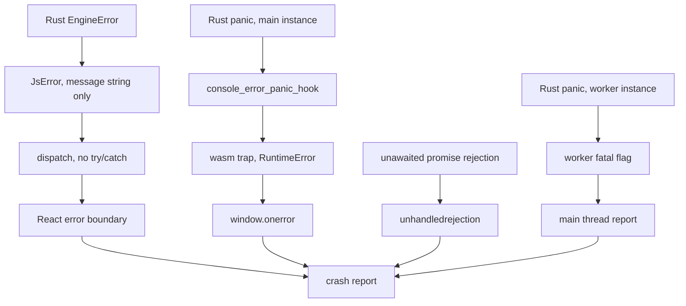
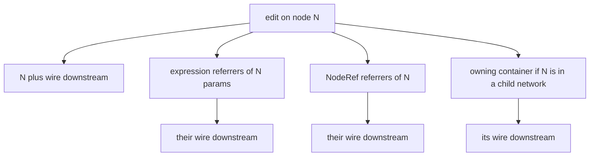

# Cross-cutting concerns

The concerns in this document are the ones no single crate owns: how errors travel, what runs
where, how memory is held, when a cached result stops being valid, whether a cook reproduces,
what gets logged, what an attacker can reach, and who can use the thing.

Everything stated here is true of the code today and cites the path it came from. Where a
section prescribes rather than describes, it says so in words. Line numbers are hints; paths
are the claim.

## 1. Error handling and propagation

### The library-versus-binary convention

The rule is that library crates define their own error type with `thiserror` and binary crates
use `anyhow`. Measured against every `Cargo.toml` in the workspace, it holds, with one stated
exception and one thing worth knowing.

| Crate | `thiserror` | `anyhow` |
|---|---|---|
| `solarxy-core` | yes | yes, optional, behind the `serialization` feature |
| `solarxy-formats`, `solarxy-graph`, `solarxy-imaging`, `solarxy-kernel`, `solarxy-render`, `solarxy-scenefile`, `solarxy-validate` | yes | no |
| `solarxy-renderer` | yes | dev-dependency only |
| `solarxy-host` | no | dev-dependency only |
| `solarxy-app`, `solarxy-cli` | no | yes |
| `solarxy-bvh` | no, hand-written error type | no |
| `solarxy-web` | no, uses `JsError` | no |

`solarxy-core`'s `anyhow` is real but reaches exactly two lines, both in
`crates/solarxy-core/src/json.rs:295-297`, where a report serializer returns
`anyhow::Result<String>`. That is the documented exception rather than drift. The
`solarxy-renderer` and `solarxy-host` entries are under `[dev-dependencies]` only
(`crates/solarxy-host/Cargo.toml:40` sits below the `[dev-dependencies]` header at `:28`), for
their examples and the golden-capture harness; neither library exposes it. `solarxy-bvh` writes
its error type by hand rather than take `thiserror`, because depending only on `solarxy-core`
and `bytemuck` is the reason that crate exists.

Conversion happens at the shell boundary, in the right direction. The desktop's background
model load sends its result down a channel as `result.map_err(anyhow::Error::from)`
(`crates/solarxy-app/src/state/update.rs:426`), and the HDRI load does the same at
`crates/solarxy-app/src/state/input/dialogs.rs:64-66`.

### No `unwrap` outside tests

Counting `.unwrap()` and `.expect(` in production code, meaning every `src` file with its
in-file test module cut off at the `#[cfg(test)]` marker and dedicated `tests.rs` files
excluded, the rule holds well: eleven real sites in the whole workspace, three in
`solarxy-formats`, three in `solarxy-kernel`, two each in `solarxy-graph` and `solarxy-host`,
one in `solarxy-renderer`, none anywhere else. Every apparent hit in `solarxy-core` and
`solarxy-cli` is inside a test module or is a parser method that happens to be named `expect`.

Each of the eleven is locally justified by a check on the line above:
`crates/solarxy-graph/src/document/mod.rs:276` reads `"checked contains_key above"`,
`crates/solarxy-graph/src/engine/snapshot.rs:114` reads `"root always exists"`,
`crates/solarxy-host/src/still.rs:1087` and `:1117` and
`crates/solarxy-renderer/src/pathtrace/denoise.rs:261` all read "just allocated".

One is worth a second look. `crates/solarxy-formats/src/export.rs:318-326` writes
`mesh.normals.unwrap()[i]` inside the PLY writer. The `.unwrap()` is proven by the
`with_normals` predicate at `export.rs:292`, which is
`meshes.iter().all(|m| m.normals.is_some())`. The *index* is not. The loop iterates
`mesh.positions` and indexes the normal, texture-coordinate and colour buffers with the same
`i`, and nothing checks that those buffers are as long as `positions`. A caller that hands the
exporter a mesh with mismatched buffer lengths gets a panic in a library crate.

**The rule is enforced by review, not by the compiler.** No crate enables
`clippy::unwrap_used` or `clippy::expect_used`, and every crate explicitly allows
`clippy::missing_panics_doc` in its `lib.rs` lint header, which removes the one nudge that
would otherwise make a panicking public function document itself. The CI clippy invocation
also omits `--all-targets`, so examples, tests and benches are never linted at all.

The workspace contains exactly three `unsafe` blocks, all in
`crates/solarxy-formats/src/export.rs:944-957`, all the same shape: reinterpreting a slice of
float arrays as bytes for the glTF binary chunk. `bytemuck` is already a workspace dependency
and would do this with no `unsafe` at all.

### What happens to an error crossing into TypeScript

Every fallible WebAssembly export returns `Result<JsValue, JsError>`. There are 164 `JsError`
occurrences in `crates/solarxy-web/src/app/` alone. The construction is uniformly
`JsError::new(&format!("{e}"))`, for example at `crates/solarxy-web/src/app/lifecycle.rs:248-252`,
where `dispatch` flattens a typed `EngineError` into a string on both the deserialization arm
and the engine arm.

That flattening is total and lossy. The engine's `EngineError` variants, the resolver's
`ResolveFailure` with its byte `span` (`crates/solarxy-graph/src/registry/resolve.rs:57-66`)
and the parser's `ExprError` with its span (`crates/solarxy-graph/src/expr/error.rs:12-18`) all
reduce to one string. The frontend cannot branch on an error kind because there is no kind on
the wire, and the only position that survives is whatever a producer wrote into the prose. The
wrangle editor recovers a caret by running `/\bline (\d+)/` and `/\bcolumn (\d+)/` over the
message (`web/src/components/inputs/snippetError.ts`), against a format produced by two
independent `format!` calls in Rust
(`crates/solarxy-graph/src/nodes/attribute_wrangle_node.rs:159` and
`crates/solarxy-graph/src/expr/stmt.rs:601`) that no test holds to each other. The parameter
expression field discards the span entirely (`web/src/components/inputs/ExpressionField.tsx:60-70`).

On the TypeScript side, a thrown `JsError` is mostly not caught. `dispatch`
(`web/src/engine/session.ts:508-516`) has no `try`, and neither does `runFrame` at `:1169`; the
whole file has six `catch` clauses against roughly ninety-five boundary wrappers in
`web/src/engine/client.ts`. That is a posture rather than an oversight: a command the engine
refuses is a frontend programming error, and the crash surfaces are handled centrally instead.
`web/src/telemetry.ts:1-26` names those surfaces and why a React error boundary alone is not
enough.



What to notice: a Rust panic never arrives as a Rust error. The panic hook logs the message to
`console.error` and the instance then traps, which reaches JavaScript as a bare
`RuntimeError: unreachable`. The report is only actionable because `telemetry.ts:37-50` wraps
`console.error` to keep the last message and attaches it as context. Note also that the worker
path is separate all the way down: a second WebAssembly instance in another realm is invisible
to both the boundary and `window.onerror`, which is why it reports for itself.

The worker's classification is the best-designed piece of this.
`web/src/engine/importWorker.ts:186` computes
`const fatal = err instanceof WebAssembly.RuntimeError` and posts it alongside the message, so
a broken glTF becomes a toast and a wasm panic becomes a crash report. Without that flag one
would drown the other.

**Not handled:** there is no recovery. `ensureImportWorker`
(`web/src/engine/session.ts:215-228`) creates the worker once and nothing anywhere calls
`terminate()` or reassigns the handle, so a worker whose instance has trapped stays the worker
for the rest of the session. A trap in the main instance ends the session outright; there is no
device-loss or instance-restart path.

## 2. Execution and threading model

### What runs where

**The browser main thread** runs everything except the four worker job kinds: the WebGPU
device, the render loop, the cook, the gizmo drag solver, and the whole React tree. The frame
pump is `runFrame` in `web/src/engine/session.ts:1169`, driven from a `requestAnimationFrame`
loop inside a React component (`web/src/components/Viewport.tsx`).

**The import Web Worker** is one worker, created lazily, kept alive, and it is the interesting
case. It is a *second instantiation of the same `solarxy_web.wasm`*
(`web/src/engine/importWorker.ts:12-18` imports the identical module URL that
`web/src/engine/client.ts:5-6` does). The browser serves the module from cache, so the download
is paid once, but the instance is separate: its own linear memory, its own heap, its own panic
hook, and no wgpu device is ever created in it. Four exports are reachable there and are
compiled to be GPU-free: `parse_model_job`, `validate_geometry_job`, `prepare_hdri_job` and
`build_bvh_job`, at `crates/solarxy-web/src/app/mod.rs:1031`, `:1076`, `:1096` and `:1117`.

That shape is what the engine-renderer separation buys. Because `solarxy-graph`,
`solarxy-kernel` and `solarxy-bvh` compile with no wgpu dependency, a model parse, a validation
pass, an HDRI convolution and a hierarchy build can all run in an instance that has no GPU at
all. The cost is duplicated heap: a large import exists in the worker's memory and, after
transfer, in the main instance's memory.

The worker carries five message kinds through three different resolution regimes, which is
worth knowing because it is not one protocol. `parse`, `validate` and `decodeImage` resolve
through the engine's own job identifier and generation guard. `hdri` and `buildBvh` resolve
through local promise maps keyed by *negative* tokens (`hdriWaiters` at
`web/src/engine/session.ts:93`, `bvhWaiters` at `:112`), because a hierarchy build is renderer
work rather than a cook job. A third negative range, `previewWaiters` at `:100`, reuses the
`parse` kind for the asset preview. `decodeImage` touches no WebAssembly at all: it is
`createImageBitmap` plus an `OffscreenCanvas` readback.

**Native threads** exist on the desktop and are used twice, both times as a spawn-plus-channel
pair rather than a pool: the model load at
`crates/solarxy-app/src/state/update.rs:410` and the HDRI load at
`crates/solarxy-app/src/state/input/dialogs.rs:62`. Both send a result back over an
`mpsc::channel` that the frame loop polls. `pollster::block_on` appears in the device-request
paths of `solarxy-app`, `solarxy-cli` and `solarxy-render`.

**What WebAssembly forbids here.** The build targets `wasm32-unknown-unknown` and does not
enable the atomics target feature: `.cargo/config.toml` sets one rustflag for that target, the
`getrandom` backend selection, and `crates/solarxy-web/build-wasm.sh` adds none. So there is no
shared memory, no `SharedArrayBuffer`, and `std::thread::spawn` is not available. Concurrency
in the browser is postMessage between instances and nothing else. The address space is 32 bits,
which matters in section 4.

The engine knows about this asymmetry through one flag. `Engine::set_async_jobs` is called with
`true` in exactly one place, `crates/solarxy-web/src/app/lifecycle.rs:161`; it defaults to false
(`crates/solarxy-graph/src/cook/driver.rs:131`, documented as "native cooks parse imports
inline"). The desktop drains jobs synchronously in the frame loop
(`crates/solarxy-app/src/state/update.rs:290-293`: take, resolve, submit, in one pass), so the
entire pending-and-generation machinery is exercised only in the browser and in tests.

### The budgeted resumable cook, and its two budgets

`Engine::cook` takes an opaque `&mut dyn FnMut() -> bool`. The engine has no notion of a budget
unit; the shells supply the meaning, and they chose different numbers with no shared constant:

- `COOK_BUDGET_MS: f64 = 6.0` at `crates/solarxy-web/src/app/mod.rs:73`, documented as about half a
  60 Hz frame.
- `COOK_BUDGET: Duration = from_millis(8)` at `crates/solarxy-app/src/state/update.rs:21`, with
  the same justification written differently.

Resumption is genuinely correct and needs no cursor, because progress lives as per-node state
rather than as a consumed queue: `cook_until` walks a topologically ordered list and skips
anything not `Dirty` (`crates/solarxy-graph/src/cook/driver.rs:281-283`). Re-dirtying a node
the pass already passed is therefore safe by construction.

Two properties of the budget are easy to miss and both are real.

**It is checked between nodes, never inside one.** The predicate is consulted once per
iteration at `crates/solarxy-graph/src/cook/driver.rs:288`. A single expensive cook body, a
wrangle program over several million points, say, runs to completion however long it takes. The
budget bounds how many nodes a frame cooks, not how long a frame is.

**It is honoured per context, not per pass.** `report` is constructed fresh at the top of every
`cook_until` call (`driver.rs:269`), and the forward-progress exemption reads
`if !report.cooked.is_empty() && !should_continue()`. `Engine::cook` calls `cook_until` once per
context in a loop (`crates/solarxy-graph/src/engine/mod.rs:3220-3234`). So a document with many
child networks cooks at least one node per context that still has eligible work *after* the
deadline has already passed. The doc comment at `driver.rs:255-259` describes forward progress
as "always cooking at least one node per call", which is literally true and hides the
aggregate.

## 3. Memory and allocation for the graph

### How the document is held

`Document` (`crates/solarxy-graph/src/document/mod.rs:463-468`) is a root `Graph`, a
`BTreeMap<NodeId, Graph>` of child networks keyed by their owning container, a review store,
and a `next_id: u64`. `Graph` (`document/mod.rs:186-200`) is `BTreeMap<NodeId, NodeData>` plus
`BTreeMap<EdgeId, Edge>` plus a `Topology`.

**Identifiers are neither arena nor slotmap.** `NodeId(pub u64)` and `EdgeId(pub u64)` are
newtypes over a monotonic counter, and `mint_node_id` and `mint_edge_id`
(`document/mod.rs:476-484`) share the *same* `next_id`, so a node id and an edge id can never
collide. There are no generations on the id, so nothing distinguishes a live id from a stale
one; correctness comes from the maps rather than from the id.

Two consequences follow directly. Ids restart low when a scene is loaded, because
`crates/solarxy-graph/src/engine/scenefile.rs:360` sets `next_id: max_id + 1` from the file
rather than continuing the session's counter. And every per-node cache the cook engine holds is
a `BTreeMap<NodeId, _>` keyed by that bare number, which is what makes the collision in section
5 possible.

### What the cook hot path allocates

`cook_until` deep-clones the entire `Graph` on every pass, once per context
(`crates/solarxy-graph/src/cook/driver.rs:275-278`):

```rust
let ordered = {
    let mut g = graph.clone();
    g.topological_filter(&work)
};
```

The clone exists only because the memoized topological sort takes `&mut self`. It copies every
node's full parameter map, every edge, and the topology's own maps, and then throws the rebuilt
memo away with the clone, so the sort is recomputed from scratch each pass and the
memoization buys nothing on this path.

Beyond that, per-frame allocation in the engine is dominated by scene lowering rather than by
cooking. `Engine::take_scene_delta` (`engine/mod.rs:3542`) rebuilds the whole delta on every
host frame, and per displayed object `GeometrySet::to_cooked`
(`crates/solarxy-kernel/src/set.rs:481-508`) allocates one `Vec<CookedMesh>` and one `String`
clone per mesh. Separately, every `GeometrySet` construction recomputes union bounds by walking
all positions (`set.rs:305-315`), so an attribute-only operation that moves no vertex still
pays a full positions sweep.

### Arc sharing of geometry buffers

Sharing is two-level and there is no copy-on-write machinery; `Arc::make_mut` appears nowhere
in the kernel. A mutating operator rebuilds the meshes it changes and refcount-bumps the rest.
`to_cooked` moves every buffer across by `Arc::clone`, so lowering the kernel type to the
renderer contract copies no vertex data, and the renderer then dedupes by pointer:
`same_geometry` (`crates/solarxy-renderer/src/scene_objects.rs:946-973`) compares positions,
indices, normals, texture coordinates, colours, instances and materials with `Arc::ptr_eq`, so
a re-emitted identical delta does zero GPU work. The deliberate full copies are named as such:
`GeometrySet::baked` materializes instance placements under the
`MAX_OUTPUT_PRIMITIVES = 8_000_000` ceiling (`crates/solarxy-kernel/src/array.rs:27`), and
`to_raw` (`set.rs:551-577`) is documented as the one deliberate deep copy in the kernel.

### The browser's address space, and what is unbounded

The wasm target is 32-bit, so a `usize` is four bytes and an allocation failure takes the tab
rather than returning an error. Three structures acknowledge no ceiling at all.

**The cook cache.** `CookEngine.outputs: BTreeMap<NodeId, Arc<Outputs>>`
(`crates/solarxy-graph/src/cook/driver.rs:78`) retains the last committed output of every node
in every context. Entries leave only when a node is deleted (`forget_node`, `driver.rs:183`) or
the document is replaced (`reset`, `driver.rs:162`). There is no eviction, no size accounting,
no high-water mark, and no distinction between a node on the display cone and one merely
present. A ten-node chain over a heavy import holds ten complete intermediate geometry sets
resident, permanently, displayed or not. `MAX_OUTPUT_PRIMITIVES` bounds one operation's output,
not the retained total.

**The asset table.** `AssetTable` exposes `stage`, `add_alias`, `find_by_name`, `get`,
`entries`, `len` and `is_empty` (`crates/solarxy-graph/src/assets.rs`) and no removal path at
all. Neither `load_document` nor `load_slxy` clears it, and `load_slxy` stages the incoming
archive's blobs on top of whatever is there, so asset bytes accumulate across document loads as
well as across imports. `save_slxy` then embeds every staged blob into the archive. That embed
is deliberate and documented at `crates/solarxy-graph/src/engine/scenefile.rs:386-394`: a model
parser resolves companions by name through the resolver, so an unreferenced staged blob may
still be load-bearing, and a naive filter would break reload. What is missing is the bound, not
the reasoning.

**The undo stack.** `UndoStack` (`crates/solarxy-graph/src/engine/undo.rs:159`) has no depth
cap. `UndoOp::RestoreFragment` (`undo.rs:86`) carries a whole graph fragment including a
deleted container's entire child network, and `UndoOp::RestoreReview` (`undo.rs:94`) clones the
whole review store for every annotation edit.

The codebase does bound memory where it has been bitten: `MAX_FLOAT_STILL_PIXELS = 16_000_000`
at `crates/solarxy-web/src/app/mod.rs:690` and `MAX_CAPTURE_PIXELS = 4_000_000` at `app/capture.rs:20` both
exist precisely because a 32-bit allocation failure is fatal. The graph's own residency has not
had the same treatment.

## 4. Dirty propagation and cache invalidation

This is the central design tension of an evaluation engine, and it is where the concrete
defects are.

### The model

Evaluation is push-forward invalidation plus a topologically ordered sweep, gated by a display
cone. Nothing is pull-based; nothing asks an upstream node for a value.

There is exactly one granularity: the node. `CookState` is per node
(`crates/solarxy-graph/src/cook/state.rs`), `self.state` is `BTreeMap<NodeId, CookState>`
(`driver.rs:76`), and there is no per-output-port, per-parameter or per-attribute dirty bit
anywhere in the crate.

`CookEngine::mark_dirty` (`driver.rs:198-204`) is the primitive:

```rust
pub fn mark_dirty(&mut self, graph: &Graph, node: NodeId) {
    *self.generation.entry(node).or_insert(0) += 1;
    self.state.insert(node, CookState::Dirty);
    for down in graph.downstream(node) { self.state.insert(down, CookState::Dirty); }
}
```

`Engine::mark_dirty_inner` (`engine/mod.rs:3852-3900`) wraps it and fans out further.



What to notice: the wire graph is only one of four fan-out edges, and the other three are
derived differently from each other. Expression referrers come from a maintained index keyed on
node-and-key pairs. Reference referrers come from a full document scan
(`engine/mod.rs:3980-4000`), whose own comment declines to index it on the grounds that
documents are interactive-sized, in the same code path where the expression index exists
because the same scan was measured at 1.68 milliseconds per parameter write at 210 nodes and
25.5 milliseconds at 840 (`crates/solarxy-graph/src/refs.rs:328-346`). Both scans run on the
same edit for the same purpose.

**What the retained cache is.** Not a memo cache. There is no key, nothing is hashed, and
nothing is compared for content. `outputs` is a per-node last-committed-value store read
through `upstream_value` (`driver.rs:657-659`), and correctness rests entirely on every
mutation path calling `mark_dirty`. Two commit policies make it stickier than it looks:
`keep_last_good` skips the insert when a cook produces renderable-empty output and a previous
output exists (`driver.rs:672-675`), and `commit_error` (`driver.rs:683-698`) retains the
previous output for every error except a required-input failure. Both are silent: the badge
reads `Ok` in the first case, and downstream keeps consuming stale geometry in both.

**What recooks.** `cook_until` filters the memoized order by a work set that, for a child
network, is the dirty set intersected with the display node's predecessor cone, and for the
root graph is the whole dirty set (`driver.rs:324-338`, since the root has no
`active_output`). Anything outside the displayed cone of a child network keeps its `Dirty` mark
and consumes no budget.

**How the display refreshes.** Not through the dirty set at all. The host calls
`Engine::take_scene_delta` every frame, which calls `build_scene_delta` unconditionally
(`engine/mod.rs:3542`), which rebuilds the whole delta from the committed cook outputs. The
delta is then deduped by pointer identity in the renderer. So invalidation decides what recooks
and pointer equality decides what re-uploads, and the two are independent mechanisms.

### Leak 1: `CookEngine::reset` does not clear the LUT cache

**Confirmed defect, in a corrected form.**

`reset` (`crates/solarxy-graph/src/cook/driver.rs:162-175`) clears ten per-node maps and a job
counter: `state`, `outputs`, `validation`, `environment`, `warnings`, `status`, `stats`,
`cooks`, `generation`, `jobs`, and `next_job = 0`. It does not clear `luts`, declared at
`driver.rs:91` as `BTreeMap<NodeId, [Option<Arc<LutCube>>; 2]>`. `forget_node`
(`driver.rs:183-192`) does remove `luts`, and omits `warnings` and `cooks` instead. Two
hand-maintained field lists that drifted in opposite directions, which is why the omission
reads as an oversight rather than a policy.

`reset` has one caller, `Engine::load_document` (`engine/mod.rs:3630`). Because ids come back
from the file rather than being freshly minted, an id collision between the outgoing and
incoming documents is ordinary. The scene lowering reads this cache directly rather than
through the outputs: `crates/solarxy-graph/src/engine/scene.rs:640` is
`let tables = cook.luts(node.id);` inside `camera_from_node`, called every frame.

**The correction matters.** `commit_luts` (`driver.rs:741-747`) is total: it inserts when the
cook produced tables and removes the entry when it did not. So a colliding id is corrected the
first time that camera node cooks successfully, and `load_document` dirties every node and arms
a cook. The window is bounded by that first cook rather than being permanent, and because the
cook is budgeted and resumable it can still span many frames. The durable half of the defect is
different and is not the headline: entries for node ids that are absent from the new document
are never removed, so `LutCube` allocations from every document opened in the session are
retained for the life of the session. On a 32-bit heap that is the part worth fixing.

### Leak 2: bypass leaves cached environment and grading tables live

**Confirmed defect. Ambiguous intent.**

The bypass arm of `cook_one` (`driver.rs:384-391`) calls `resolve_bypass`, `commit_outputs`,
`commit_validation(node, None, report)`, marks the node clean, and returns. It does not call
`commit_environment` or `commit_luts`. The successful-cook arm calls all four
(`driver.rs:469-473`).

Both omitted caches are read by the scene lowering as side channels rather than through the
node's outputs: `engine/scene.rs:782` reads `cook.environment(node.id)` for the HDRI and
`scene.rs:640` reads `cook.luts(node.id)` for the grading tables. `build_scene_delta` dispatches
on node type with no bypass test anywhere in the loop. So bypassing an environment node leaves
its HDRI lighting the scene, and bypassing a camera node leaves its tables grading it.

The comment on that arm reads "Bypass short-circuits the compute entirely (and clears any
cached validation: a bypassed validate node stops reporting)". The author was reasoning about
exactly this class of side channel and handled one of the three. The three were added at
different times and the bypass arm was updated once.

Why this is ambiguous rather than obviously wrong: bypass clears validation, so the intended
semantics for the other two side channels is genuinely not stated anywhere. A camera whose
grading is bypassed could reasonably mean "no grading" or "grading unchanged". That decision is
owed.

### Leak 3: a wrangle program's `ch()` reads create no dependency edge

**Confirmed defect.**

`ExprIndex::build` collects reference paths only from expression parameters. The guard is
literal, at `crates/solarxy-graph/src/refs.rs:411-413`:

```rust
let ParamSource::Expression { expr } = src else {
    continue;
};
```

Every edge insertion into the forward and reverse maps sits inside it. A wrangle program is a
`ParamType::Snippet` stored as `ParamSource::Literal(ParamValue::Text(..))`, so it contributes
no edge. The only inspection a snippet gets is `node_program_uses_time`
(`refs.rs:376-396`), which parses the program, keeps `uses_time`, and drops everything else
about it.

The capability is real, not dead. The cook driver builds the evaluation context with
`.with_refs(&refs)` (`crates/solarxy-graph/src/cook/driver.rs:416-418`), the wrangle node passes
it straight through (`nodes/attribute_wrangle_node.rs:188`), and the node's own shipped
parameter documentation advertises it: `nodes/attribute_wrangle_node.rs:97` reads
``ch(\"box1/width\") to read another node's parameter``. So a wrangle's `ch()` resolves at cook
time and never learns that its source changed.

The same guard shape repeats in `rewrite_references_to` (`engine/mod.rs:3934`), so renaming the
referenced node does not rewrite the path inside a program either. The identical text in a
parameter expression is rewritten correctly.

One narrowing, from the adversarial pass: this only bites when the referenced node is not also
upstream by wire. A wrangle wired below the node it reads recooks for the ordinary topological
reason. The gap is the unwired cross-network read, which is the case `ch()` exists for.

### Leak 4: `ResetParams` removes parameters before marking dirty

**Confirmed defect.**

`Engine::reset_params` removes each key inside a scoped mutable borrow
(`engine/mod.rs:1926-1936`, the removal at `:1932` is
`if let Some(prev) = node_data.params.remove(&key)`), and calls `self.mark_dirty(ctx, node)`
afterwards at `engine/mod.rs:1981`.

`mark_dirty_inner` derives its expression-referrer set from the node's *currently stored* keys
(`engine/mod.rs:3874-3888`): `n.params.keys().flat_map(|k| transitive_referrer_nodes(&(node,
k.clone())))`. The reset keys are gone by then, so their referrers are never queried.

`SetParam` gets the order right, which is what makes this an asymmetry rather than a design:
`engine/mod.rs:1831-1832` inserts and then marks dirty on the next line. The expression index
rebuild that follows a `ResetParams` does not help, because rebuilding an index dirties
nothing.

The reference the referrer holds stays live throughout, because `DocRefs::read` falls back to
`spec.default` for an unstored key (`refs.rs:277`). So the referrer's correct value genuinely
did change and it genuinely is stale.

This is one instance of a wider shape worth stating: because the referrer lookup is keyed on
stored parameters rather than on the registry's declared parameter list, a `ch()` pointing at a
parameter that has never been written has a reverse-map entry that `mark_dirty_inner` can never
reach.

### The stopped clock in scene lowering

**Confirmed defect.**

`crates/solarxy-graph/src/engine/scene.rs` builds every evaluation context against
`crate::expr::SceneTime::default()`, at six sites: `:57` inside `root_refs`, then `:192`, `:329`,
`:613`, `:757` and `:800`. `SceneTime::default()` is the stopped clock:
`crates/solarxy-graph/src/expr/eval.rs:27-38` gives `seconds: 0.0, frame: 0.0, fps: 24.0`.

The cook path uses the live clock. `Engine::retime` (`engine/mod.rs:3767-3773`) pushes
`self.clock.scene_time()` into the cook engine and dirties every time-dependent node; `cook_one`
builds `EvalCtx::new(self.scene_time)` (`driver.rs:417`). So the two halves of the engine
disagree about what time it is.

The consequence is precise. A container whose translation is a function of scene time, a point
light whose intensity reads the clock, a camera whose focal length reads the frame: each is
re-dirtied every frame by `retime`, re-lowered every frame by `take_scene_delta`, and produces
the same frame-zero value every time. Only geometry that flows through a cook body animates.
Two more resolve sites carry the same stopped clock and are worth naming because one of them is
user-visible: `Engine::render_settings` (`engine/mod.rs:2936`) and `Engine::resolved_param`
(`engine/mod.rs:2969`), the latter being the parameter panel readout, so the panel can show a
different number from the one the cook used.

The in-code justification at `scene.rs` reads that the clock is stopped until the runtime
lands. The runtime has landed: `Command::Play`, `Pause`, `Stop`, `StepFrame` and `SetFrame` all
exist and `Engine::tick` advances the clock. The comment is itself evidence of the drift.

Whether frame-zero lowering was chosen deliberately for reproducibility, or is an unnoticed
omission repeated across six call sites, is not answerable from the code. It is recorded as an
open question below, because the fix would change what every existing scene lowers.

## 5. Determinism and reproducibility

### What is guaranteed

**Cook order is deterministic.** `Topology::compute_topo`
(`crates/solarxy-graph/src/topology.rs:180`) is Kahn's algorithm with a `BTreeSet` ready queue,
so the tie-break is smallest node id first. Subset ordering filters the memoized full order by
membership rather than re-sorting.

**Container iteration is ordered.** The document, every graph, and every per-node cook map are
`BTreeMap`, and the two `HashSet`/`HashMap` uses in the crate
(`crates/solarxy-graph/src/naming.rs:68`, `crates/solarxy-graph/src/expr/stmt.rs:175-177`) are
membership and lookup tables whose iteration order never reaches an output.

**Randomness is a pure function, not a stream.** `crates/solarxy-kernel/src/rng.rs` is a seeded
avalanche hash: every draw is `hash(index, lane, seed)`, so sample `i` produces the same value
regardless of which samples were computed before it. That is what makes a scatter
order-independent and what lets a saved scene reproduce exactly. The header states the property
and a test pins it.

**The expression language's noise is frozen.** `noise()` is hand-written in
`crates/solarxy-graph/src/expr/builtins.rs` rather than imported, with the reason stated at
`builtins.rs:10-14`: an imported implementation could change output in a future version and
every scene using it would re-render differently. `rand()` deliberately reuses the same
generator the scatter node draws from so that "same seed" means one thing.

**Cross-node references impose no ordering constraint.** Because `ch()` reads a *parameter*
rather than a cook output, a referenced expression is re-evaluated on demand by recursion
(`refs.rs:255-275`). Cook order stays pure wire topology, and an engine test named
`chained_expressions_resolve_in_any_cook_order` pins it.

### What breaks it

**Cook state is history-dependent.** The retained store is not a function of the document.
`keep_last_good` and `commit_error` both mean that what a node feeds downstream depends on
which cooks previously succeeded, so two sessions that arrive at the same document by different
edit sequences can render differently. This is the single largest reproducibility hazard in the
engine and it is silent in both directions.

**The stopped clock splits reproducibility in half.** Cooked geometry animates and lowered
lights, cameras and transforms do not, so a rendered frame is not a function of the frame
number for the parts that go through scene lowering.

**Copy-paste of a container can duplicate node ids.** Under the id-remapping insert mode a
pasted container gets a fresh owner id but its child network's node ids are preserved verbatim
(`crates/solarxy-graph/src/document/fragment.rs:174-190`). Every per-node cook map is keyed by
the bare `NodeId` on the stated assumption that ids are document-unique
(`cook/driver.rs:71-73`), so the source and its copy would share one cook state, one retained
output and one generation counter. This was flagged by the adversarial pass as unexamined
rather than verified end to end, so it is recorded as an open question rather than asserted.

**Nothing bounds float behaviour across adapters.** `wgpu::Features::empty()` at every device
request means no optional GPU feature is relied on, but two adapters can still differ in the
last bits. The golden-capture job compares a capture at the head commit against the base
commit on one runner, which holds the rasterizer against its own past on one machine and says
nothing about cross-device reproduction.

## 6. Logging and diagnostics

**The desktop** builds a two-layer `tracing_subscriber` registry in `src/main.rs:69-76`: a
formatting layer writing to standard error, and a `ConsoleLayer` feeding the in-app console.
Each has its own filter. Standard error takes `RUST_LOG` if set, otherwise
`solarxy=info,wgpu_hal=error,wgpu_core=error`, or the debug variant under `--verbose`
(`main.rs:52-61`). The console layer takes `SOLARXY_CONSOLE_LOG` if set, otherwise
`solarxy=trace,wgpu_hal=warn,wgpu_core=warn` (`main.rs:64-67`), so the in-app console is
deliberately more verbose than the terminal.

**The console buffer** is a bounded ring: `LogBuffer` is
`Arc<Mutex<VecDeque<LogEntry>>>` with `MAX_ENTRIES: usize = 500`
(`crates/solarxy-app/src/console.rs:10-22`). Entries carry level, message and a local-offset
timestamp. Oldest entries drop. That is the one diagnostic structure in the workspace with a
ceiling.

**The CLI** installs a single `tracing_subscriber::fmt` subscriber
(`crates/solarxy-cli/src/bin/solarxy-cli.rs:24-27`). The terminal surfaces take the screen by
hand rather than through the framework's initializer, because that initializer hard-wires its
restore and its panic hook to standard output, and the render dashboard can paint on standard
error so it coexists with JSON output.

**The toast rule, and the one place it is broken.** `EguiRenderer::push_toast`
(`crates/solarxy-app/src/gui/renderer.rs:177-188`) emits a `tracing` event on
`target: "solarxy::toast"` for every toast, at the level matching the severity. The rule
recorded at `crates/solarxy-app/src/gui/mod.rs:21` is that callers must not also emit their own
log for the same message, or the console records it twice.

There is exactly one violation, and it is real.
`crates/solarxy-app/src/state/review/sidecar.rs:92-102` emits
`tracing::info!(target: "solarxy::toast", "Saved {} annotations to {}", count, path.display())`
and then calls `self.gui.set_toast(&format!("Saved {count} annotations"), ...)`. `set_toast`
(`gui/renderer.rs:202-204`) routes straight through `push_toast`. Saving review notes therefore
writes two console lines with different text for one event. Nothing enforces the rule
mechanically; a lint or a source-scan test in the style of the existing drift tests would.

**The browser** has the opposite coupling. `pushToast` (`web/src/store/toasts.ts`) writes to a
zustand store and logs nothing at all. The only toast that also reaches the console is the GPU
fault arm in `web/src/engine/session.ts:1189-1202`, which deliberately sends the full message
to `console.error` so the crash reporter captures it as context and keeps the toast short. Both
queues cap at five entries, the desktop by `TOAST_QUEUE_CAP` and the browser by
`s.toasts.slice(-4)`, which is agreement by coincidence rather than by contract.

**Crash reporting** is browser-only, through `web/src/telemetry.ts`, and covers the four
surfaces enumerated in section 1. The reporting endpoint identifier is committed deliberately,
because it grants send access only and no read access, and the module is a no-op when it is
absent so a local build with no environment file still runs.

## 7. Security posture for a fully client-side application

The honest threat model is narrow, and that is the most important thing to say about it.
Solarxy Web is a static page: there is no backend, no account, no server-side storage, and no
user data that leaves the tab except a crash report. The desktop and the CLI are local tools.
The interesting attack surface is therefore a single question: what can a malicious file do
when a person opens it.

### The parser boundary

Model, HDRI and grading-table parsers all treat their input as untrusted and say so:
`crates/solarxy-formats/src/hdr.rs:9` and `crates/solarxy-formats/src/lut.rs:3` both open with
that framing.

The sharpest control is path containment. `DirResolver::read`
(`crates/solarxy-formats/src/lib.rs:136-165`) is the one place a companion reference from
inside a model file becomes a filesystem read, and it refuses any reference carrying a parent,
root or prefix component, then confirms the canonicalized result is still inside the model's
own directory so a symlink cannot escape either. Its comment states the threat precisely: on
the desktop viewer an unchecked join is arbitrary local-file read, and for the validation
library run server-side over uploaded models it is a local file inclusion and a file-existence
oracle. The companion walk reads only what the model asks for, never the containing directory
(`crates/solarxy-formats/src/companions.rs:25-37`).

In the browser this class of attack does not arise at all, because there is no filesystem: an
asset is staged by content hash and referenced by that hash, so a path in a model file resolves
against a table of bytes the user themselves supplied.

Underneath, parsing is delegated to third-party crates (`tobj`, `stl_io`, `ply-rs-bw`, `gltf`,
`image`), so the memory-safety properties of a malformed file are theirs. The workspace's own
`unsafe` footprint is three blocks in the glTF *exporter*, none on any read path.

### The WebAssembly sandbox

The wasm module has no ambient authority: no filesystem, no network, no threads and no shared
memory, since the atomics target feature is not enabled. A parse runs in a second instance with
its own linear memory and no GPU device, so a parser that corrupts its own heap corrupts an
instance holding one model rather than the document. A trap in that instance is caught,
classified and reported (`web/src/engine/importWorker.ts:172-195`); it does not take the
session down. It does, however, leave the worker unusable, because nothing restarts it.

The expression language is a hand-rolled interpreter with no `eval` and explicit sandbox
limits: `MAX_SOURCE_LEN = 4096`, `MAX_DEPTH = 256` and `MAX_CALLS = 256`
(`crates/solarxy-graph/src/expr/parser.rs:14-25`), plus `MAX_STATEMENTS = 256` for a wrangle
program (`crates/solarxy-graph/src/expr/stmt.rs:38`). The recursion limit is counted in parser
stack frames, which is what stops a deeply nested expression from being a stack overflow.

### What a malicious scene file could attempt

`.slxy` is a ZIP with a `scene.json` and content-addressed asset blobs, and the reader is
defensive in the ways that matter most. Entries are Stored, uncompressed, because the `zip`
dependency is taken with default features off
(`crates/solarxy-scenefile/Cargo.toml:21-24`), so there is no compression-ratio amplification.
A `min_reader` floor hard-rejects a file from a newer writer
(`crates/solarxy-scenefile/src/lib.rs:176-181`), a missing or unknown `schema_version` is an
error or a migration, and every asset blob is checked against both the manifest's SHA-256 and
its declared size before it is accepted (`lib.rs:217-240`). Archive entry names are used to
look blobs up inside the archive, never to write to disk, so there is no path-traversal-on-
extract.

Two things are worth stating plainly rather than dramatising.

**A crafted scene can install a state the engine's own invariants say is impossible.** Cycle
refusal for cross-context references lives on one write path, `set_param`
(`crates/solarxy-graph/src/engine/mod.rs:1789`), and neither `load_document` nor `load_slxy`
runs it. Expression cycles have a depth backstop, `MAX_REF_DEPTH = 32`
(`crates/solarxy-graph/src/refs.rs:32`), and reference chains have none, though the resolver is
non-recursive so it cannot overflow. The failure mode is a badged node and a degraded cook
order, not a crash, but the recorded design claim that the document can never hold a loop is
false for a file from any other writer.

**The archive read pre-allocates from a declared size.** `unzip`
(`crates/solarxy-scenefile/src/archive.rs:39-53`) reads every entry into memory with
`Vec::with_capacity(usize::try_from(file.size()).unwrap_or(0))` before any manifest check runs.
Whether the `zip` crate cross-checks that declared size against the entry's actual extent
decides whether a hand-crafted archive can force a large allocation on a 32-bit heap. That is
recorded as an open question rather than asserted, because it was not verified.

### Supply chain and deployment

There is no automated supply-chain check in this repository. `.github/workflows/` contains ten
workflows and none runs `cargo audit`, `cargo deny` or `npm audit`, and there is no
`dependabot.yml`. Dependency review is manual, which is consistent with the working agreement
that every new dependency is gated on an explicit decision, but it means a known advisory in an
existing dependency surfaces only when someone looks.

Response headers, including any content security policy, are not in this repository: the edge
configuration lives in a separate deployment repository. This document therefore cannot state
the deployed header posture, and 10-risks-and-open-questions carries it as an owed item.

## 8. Accessibility and responsive behaviour

The honest answer is that the marketing pages are handled and the application is not, and the
gap is sharp enough that it should be read as unstarted work rather than as partial coverage.

**Responsive layout: essentially absent in the app.** `web/src/styles.css` is 5,556 lines and
contains exactly two width media queries, at `styles.css:2646` and `:2651`, both hiding labels
inside the still-render strip. The application shell has no responsive layout at all. The public
pages do: the landing, base and roadmap stylesheets carry eight breakpoints between them.

**Tablet and mobile are gated, not adapted.** `web/src/components/DeviceGate.tsx:11-22` blocks
coarse-pointer viewports narrower than 560 pixels with a full-screen card before any
WebAssembly is fetched, shows one dismissible warning between 560 and 900, and lets anything
wider through untouched. `UnsupportedBrowser.tsx` blocks non-WebGPU browsers before the module
download. There is no gesture model; touch works only where a pointer event handler happens to
receive it.

**Reduced motion is the one axis that is properly done.** `web/src/store/prefs.ts:177` reads
`prefers-reduced-motion`, `:193` stamps a `reduce-motion` class on the body, `:317` re-applies
it on change; `web/src/styles/tokens.css:46` zeroes the motion tokens under the media query and
`:54` under the class, `styles.css:2549` carries the global override, and the landing and
roadmap pages each have their own block. A three-state user preference of system, reduce or
none sits above it, editable in the preferences modal.

**ARIA is per-widget, not coverage.** About 111 `aria-*` attributes and 35 `role=` usages
across `web/src`, concentrated in a handful of components: the transport bar, the attribute
column, the flow node, the tree pane, the still-render modal and the floating properties panel.
That is deliberate work on individual widgets with nothing systematic behind it.

**Focus management is close to absent.** Two `tabIndex` usages in the whole application. Six
`.focus()` calls. `components/Modal.tsx` has no focus trap; its keyboard handling is Escape
only. Escape itself is well-handled through a central claim ladder in
`web/src/components/escapeClaim.ts`, but that is dismissal, not focus.

**Neither canvas is keyboard-reachable.** The WebGPU canvas is created imperatively at
`web/src/engine/canvas.ts:25` with no `tabIndex`, no `role` and no label, so it cannot receive
focus. The node canvas passes no accessibility props to the flow library. And the keymap
resolves its context by *pointer hover*, through `pointerOverViewport` and `pointerOverCanvas`
in `web/src/store/viewState.ts`, rather than by focus. That last point is the structural one:
every viewport-scoped and canvas-scoped binding is unreachable to a keyboard-only user
independently of any missing ARIA, because the condition that selects the binding is the mouse
being somewhere.

The desktop shell inherits egui's accessibility support and has had no separate work.

**This is roadmap work, and it should be sized as such.** Making the application keyboard
operable is not a pass of adding attributes: it requires the keymap's context model to move
from hover to focus, which changes behaviour the pointer-driven design depends on, and it
requires a focus model for two canvases that today have none.

## Open questions

Recorded here rather than smoothed over. These are carried into
[10-risks-and-open-questions.md](10-risks-and-open-questions.md).

- Was `luts` deliberately excluded from `CookEngine::reset`, or is it the omission it looks
  like? A load-document test asserting that a stale table does not survive would settle it.
- Should bypassing an environment or camera node clear its cached HDRI and grading tables?
  Bypass clears cached validation, so the intent for the other two side channels is genuinely
  ambiguous rather than obviously wrong.
- Is a `ch()` call inside a wrangle program a supported feature or an accident? The node's
  shipped documentation advertises it and the cook wires the capability through, but the
  dependency index, the rename rewriter and the cycle check all skip it. Fix the index, or
  remove the capability and its documentation.
- Was frame-zero scene lowering chosen deliberately for reproducibility, or is it an unnoticed
  omission repeated across six call sites? Using the live clock there would make time-driven
  lights, cameras and transforms animate, and would change what every existing scene lowers.
- Is per-output-port or per-parameter dirty granularity on the roadmap, or is whole-node
  invalidation the settled model? The current shape makes it impossible for `set_param` to
  exempt a cook-irrelevant key, because `mark_dirty` never sees the key that changed.
- What is the intended aggregate cook budget for a document with many child networks? The
  per-context forward-progress rule means the overrun scales with the number of contexts that
  still have eligible work.
- Is there a target for peak cook-cache residency on the browser shell? Nothing bounds it
  today, and the same is true of the asset table and the undo stack.
- Does the copy-paste of a container really duplicate node ids across two child networks, and
  if so what does that do to the per-node cook maps? The insert path was flagged as unexamined
  and this document does not assert it.
- Does the `zip` reader cross-check an entry's declared uncompressed size against its actual
  extent before the archive reader pre-allocates? This decides whether a crafted `.slxy` can
  force a large allocation on a 32-bit heap.
- What response headers, including any content security policy, does the deployed site set?
  The edge configuration is outside this repository and could not be verified from it.
- Was the pointer-hover keymap context model chosen over focus deliberately, with the
  keyboard-only consequence accepted, or was the consequence not considered?
