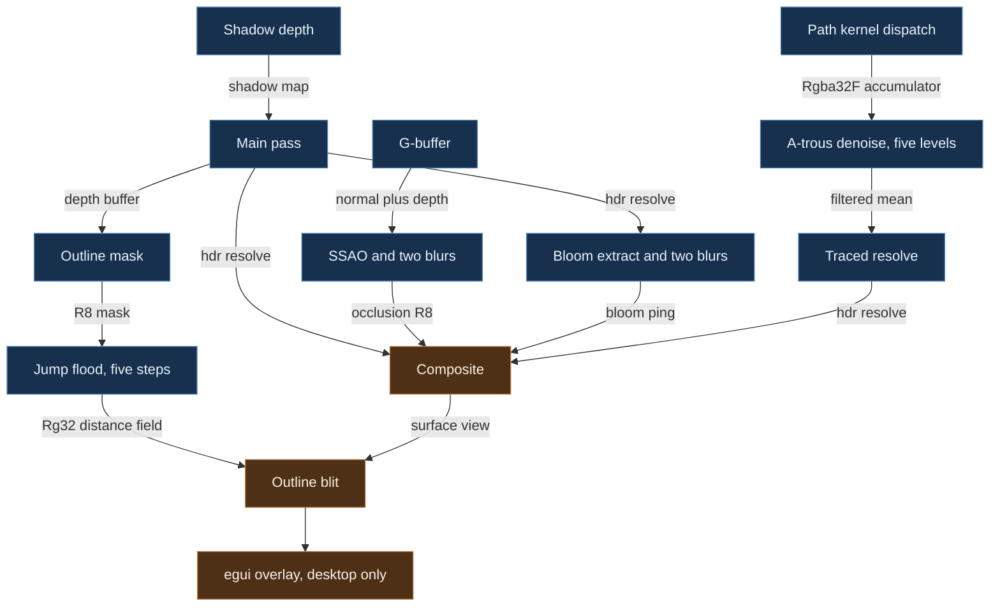
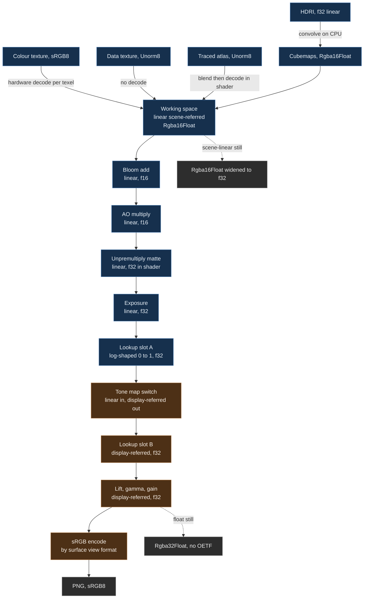
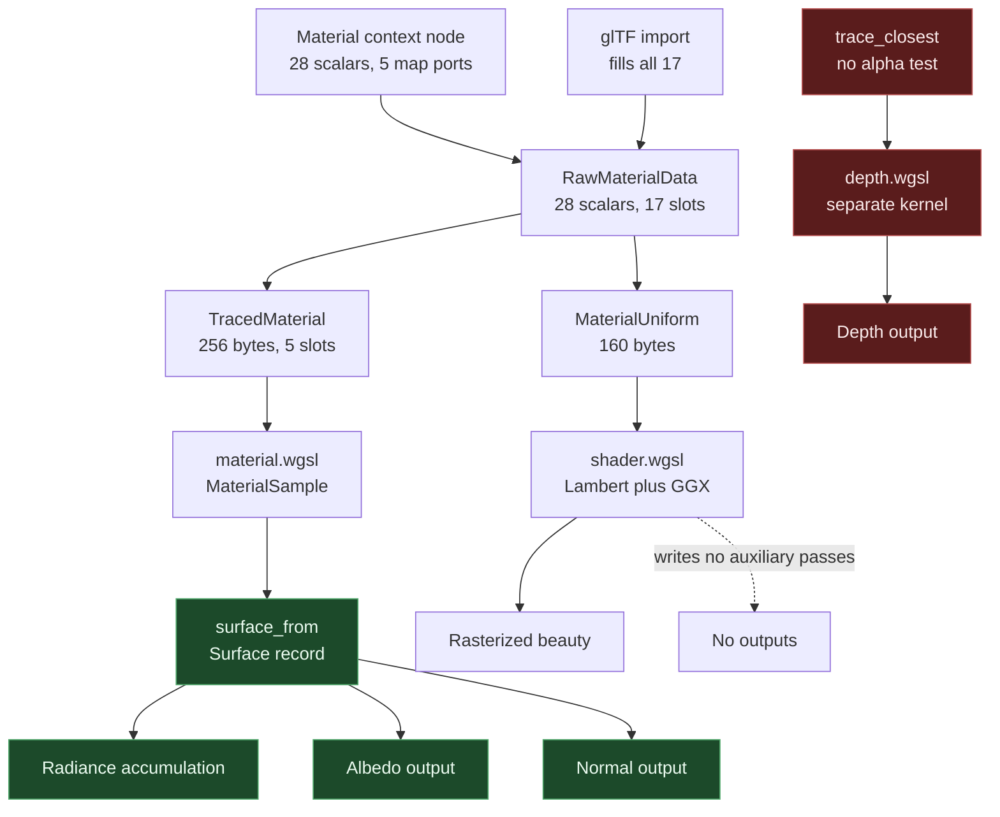

# Rendering and shading

This document treats the render pipeline as an architectural subject in its own right. It
covers the frame graph, the material model, the auxiliary output contract, the colour
pipeline end to end, the post-effect chain, shader organisation, GPU capability handling, and
the checks that make rendering correctness verifiable rather than a matter of taste.

Read it before touching a pass, a shader, a material parameter, an auxiliary output, or any
colour-space conversion. The README lists updating this document as an obligation for exactly
those changes.

Everything under a heading marked **Today** is descriptive and true at the time of writing,
with a citation. Everything under a heading marked **Target** is prescriptive and does not
exist. Where a defect is named it is named as a defect, not smoothed into intent.

## The authority question, settled

Solarxy shades one authored material through two independently written implementations: the
raster path in `crates/solarxy-renderer/src/shaders/shader.wgsl` and the path tracer's BSDF in
`crates/solarxy-renderer/src/shaders/pathtrace/bsdf.wgsl`. They share a parameter vector and
no code.

[ADR 0013](adr/0013-path-tracer-is-the-shading-ground-truth.md) settles which one is right.
The path tracer is the shading ground truth. The rasterizer is a real-time approximation of
it. A difference between the two is one of exactly two things and must be labelled as one of
them:

- a deliberate real-time approximation, listed in the divergence register below with the
  reason it is acceptable, or
- a defect filed against the rasterizer.

That decision is why this document carries a divergence register at all. Before it, each
divergence was arguable in both directions, so none of them got fixed.

## Frame graph

### There is no render graph. Today

No type in `solarxy-renderer` or `solarxy-host` declares a pass's reads or writes. There is no
pass registry, no dependency edge, no automatic barrier scheduling, and no aliasing analysis.
Pass ordering is Rust statement order and nothing else.

The sequencer is `encode_pane_passes` at `crates/solarxy-host/src/pane.rs:410`. It destructures
a `FrameCtx`, matches on the pane's content, and calls exactly one of three hardcoded chains:

| Chain | Function | Shape |
|---|---|---|
| Raster 3D | `render_3d_passes`, `crates/solarxy-host/src/pane.rs:259` | six statements |
| Overdraw inspection | `render_overdraw_pane`, `crates/solarxy-host/src/pane.rs:304` | two passes |
| UV layout | `render_uv_pane`, `crates/solarxy-host/src/pane.rs:605` | optional overlap count, then the UV map pass |

The composite is deliberately not in that function. It is a second free function,
`composite_and_submit` at `crates/solarxy-host/src/pane.rs:345`, invoked by the caller after
`RenderBackend::encode` has returned. So one pane's full order lives in two functions with a
trait call between them, and each shell writes that stitching itself:
`crates/solarxy-app/src/state/render.rs:258`, `crates/solarxy-web/src/app/render.rs:1275`, and
`crates/solarxy-host/src/still.rs:1210`.

One naming trap worth stating plainly. `crates/solarxy-host/src/passes.rs` contains no render
passes. It is the auxiliary-output display selector, `PassKind` at
`crates/solarxy-host/src/passes.rs:63`, plus the float-to-byte display mappings. The actual
pass chain is in `pane.rs`.

### The pass DAG

What to notice. The blue nodes work in linear scene-referred light at `Rgba16Float`, except
the traced accumulator which is `Rgba32Float`; the orange nodes work in display-referred
values written into the surface format. There is exactly one edge from the blue half into the
orange half, and it is the composite. That single crossing is the entire reason a traced image
inherits the raster path's finishing chain by construction rather than by discipline: the
traced resolve writes the same `hdr_resolve` view the raster main pass writes, so the composite
cannot tell them apart. Notice also that the outline rim enters the orange half after the
composite, not before, and that this is a correctness constraint rather than a preference: the
rim must never bloom and ambient occlusion must never darken it. Finally, notice that nothing
in this diagram is derived from a declaration. Every edge was reconstructed by reading bind
groups across three files, which is the strongest argument for the explicit graph proposed at
the end of this section.

### Every pass in order. Today

The raster 3D chain, one command encoder per pane, `crates/solarxy-host/src/pane.rs:259`.

**1. Shadow depth pass.** Shader `shaders/shadow.wgsl`. Encoded at
`crates/solarxy-renderer/src/frame.rs:1178`. Reads per-object vertex, index and instance
buffers, the shadow light view-projection bind group, and the material texture group, since
this pass alpha-tests cutout materials at `shaders/shadow.wgsl:58-61`. Writes the shadow depth
texture only, no colour attachment. **Correctness.** The main pass and the floor pass both
sample the shadow map. Skipped entirely when the pane's `shadow` flag is false.

**2. G-buffer pass.** Shader `shaders/gbuffer.wgsl`. Encoded at
`crates/solarxy-renderer/src/frame.rs:981`. Reads opaque triangle meshes and the camera bind
group. Writes the SSAO normal g-buffer, `Rgba8Snorm` at `crates/solarxy-renderer/src/ssao.rs:65`,
and a `Depth32Float` at `ssao.rs:305`. **Correctness relative to pass 5 only.** Gated on
`post.ssao_enabled`.

**3. Main pass.** Shader `shaders/shader.wgsl`, plus thirteen further shaders drawn inside the
same wgpu render pass. Encoded at `crates/solarxy-renderer/src/frame.rs:1221` onward, in this
statement order: background, either `background.wgsl` for a gradient or solid, or
`skybox.wgsl` for an HDRI sky; opaque meshes; the shadow-catching floor, `floor.wgsl`;
edge wireframe, `edge_wire.wgsl`; blended meshes; point and line topologies,
`points_lines.wgsl`; grid, `grid.wgsl`; normals, `normals.wgsl`; attribute vectors and
attribute labels, `gizmo.wgsl` and `label.wgsl`; axes, local axes and bounds, `gizmo.wgsl`;
the validation overlay and the selection tint, both `validation.wgsl`; light helpers, light
markers, camera helpers and the transform manipulator, all `gizmo.wgsl`. Writes the MSAA HDR
view resolving into `hdr_resolve_view`, and the depth texture.

Order inside this pass is correctness in two places. The depth-equal overlays, edge wire and
the validation lines, resolve against whatever landed first, which
`crates/solarxy-host/src/pane.rs:552-559` records as load-bearing. And the last four draws use
`depth_compare: Always`, so they must be last or they sit under the scene rather than over it
(`crates/solarxy-renderer/src/frame.rs:1387`).

**4. Selection outline, three sub-stages.** Encoded at
`crates/solarxy-renderer/src/frame.rs:1684`. First an outline mask pass through
`validation.wgsl`'s transform-only stages, writing an `R8Unorm` mask with no depth. Then a
jump-flood init through `outline.wgsl`, writing an `Rg32Float` half. Then exactly five
jump-flood step passes, each reading one half and writing the other. **Correctness.** The
ladder is a strict chain and the step count is fixed at five precisely so the parity of the
final slot is known statically. Gated on the pane having a selection and the selection style
being an outline.

**5. SSAO and two blurs.** Shaders `shaders/ssao.wgsl` and `shaders/ssao_blur.wgsl`. Encoded at
`crates/solarxy-renderer/src/frame.rs:1032`. Reads the g-buffer depth and normal views plus
the camera group. Writes the raw occlusion buffer, then the blur buffer, then the output
buffer, all `R8Unorm` (`crates/solarxy-renderer/src/ssao.rs:109` and `:329`). The three are
**correctness-ordered among themselves** and after pass 2. Their placement after the main pass
is **incidental**: the main pass neither writes their inputs nor reads their output, so they
could sit anywhere between the g-buffer and the composite. Nothing declares that, which is the
defect below.

**6. Bloom extract and two blurs.** Shader `shaders/bloom.wgsl`. Encoded from
`crates/solarxy-renderer/src/bloom.rs`. Reads `hdr_resolve_view`. Writes the bloom ping and
pong textures in a true ping-pong. **Correctness**, must follow pass 3. Gated on
`post.bloom_enabled`.

**7. Composite.** Shader `shaders/composite.wgsl`. Encoded from
`crates/solarxy-renderer/src/composite.rs`, called at `crates/solarxy-host/src/pane.rs:368`.
Reads `hdr_resolve`, the bloom ping, both colour-grading lookup slots, the composite parameter
uniform, and either the occlusion buffer or a neutral stand-in. Writes the surface view with a
per-pane viewport and scissor, clearing only for pane index zero. **Correctness**, last of the
tone chain.

**8. Outline blit.** Shader `shaders/outline.wgsl`. Encoded at
`crates/solarxy-renderer/src/frame.rs:1824`, driven from
`crates/solarxy-host/src/pane.rs:379-382`. Reads the final jump-flood half. Writes the surface
view, alpha-blended. **Correctness that it is after the composite**, and that is the entire
point of its position.

Not in these two crates but present in a desktop frame: the egui overlay pass, encoded at
`crates/solarxy-app/src/state/render.rs:342` after every pane has submitted.

### Substitute chains. Today

An empty pane slot with no camera gets an "Empty Pass" at
`crates/solarxy-renderer/src/frame.rs:950`, which clears the MSAA view and draws the gradient
unless the film back is transparent.

Overdraw inspection replaces passes 1 through 6 entirely
(`crates/solarxy-renderer/src/frame.rs:1105`): an additive count pass through
`shaders/overdraw_count.wgsl`, then a show pass through `shaders/overdraw_show.wgsl` loading
`hdr_resolve_view` with no blend and no depth. Correctness between the two.

A UV layout pane runs one or two overlap count passes through `shaders/uv_overlap.wgsl`,
arming an asynchronous readback, then the UV map pass through `shaders/uv_map.wgsl` or
`shaders/uv_debug.wgsl` (`crates/solarxy-host/src/pane.rs:605`).

### The traced chain. Today

`PathBackend::encode` at `crates/solarxy-renderer/src/pathtrace/backend.rs:579` dispatches the
path compute kernel, composed from `traverse`, `atlas`, `material`, `rand`, `camera`, `bsdf`,
`light`, `environment` and `aov` over `path.wgsl`. Optionally it then runs five a-trous
denoise compute passes (`crates/solarxy-renderer/src/pathtrace/denoise.rs`). Finally a resolve
render pass copies the running mean into the shared `hdr_resolve_view`
(`crates/solarxy-renderer/src/pathtrace/resolve.rs:84` and `:140`, both declaring
`Texture::HDR_FORMAT`). From there it rejoins the shared composite unchanged.

The accumulator ping-pongs and swaps **before** a dispatch, never after one, so every reader
reads the write slot. `crates/solarxy-host/tests/traced_backend.rs` is the only thing that
catches a swap on the wrong side.

### What the missing graph costs. Today

Three consequences follow directly from ordering being implicit, and all three have already
been paid.

**Post targets are single instances aliased across every pane.** `Renderer`
(`crates/solarxy-renderer/src/frame.rs:403`) holds exactly one of each SSAO buffer, one bloom
ping and pong, one outline mask and ping-pong pair, one overdraw counter, one UV overlap
counter, and one MSAA-plus-resolve HDR pair, allocated at
`crates/solarxy-renderer/src/frame.rs:516`. In a four-pane layout all four panes write and read
the same textures. What makes that safe is only that each pane's write and its read are
contiguous in recording order, and the shells happen to submit per pane at
`crates/solarxy-host/src/pane.rs:385`. No type expresses that invariant. The
`PaneComposite::writes_occlusion` field at `crates/solarxy-host/src/pane.rs:331-338` exists
because this aliasing already bit once: a traced pane compositing against the shared occlusion
buffer was darkened by its raster neighbour's answer. That fix addresses one symptom, not the
sharing.

**SSAO reads as ordered when it is not.** A reader has to trace five bind groups across three
files to learn that SSAO's position after the main pass is arbitrary. Someone who moves it
above the g-buffer for a plausible reason gets a stale occlusion buffer with no error, because
the bind group is valid and only the contents are last frame's.

**The trait's one output parameter is honoured by one of two implementations.**
`RenderBackend::encode` at `crates/solarxy-renderer/src/backend.rs:77` takes
`target: &wgpu::TextureView`, documented as the linear HDR view the shared post chain reads.
`PathBackend` resolves into it. `RasterBackend::encode` binds it as `_target` and drops it
(`crates/solarxy-host/src/raster.rs:140`), writing the renderer's own targets instead, for a
reason recorded honestly at `raster.rs:127-137`. All three call sites pass
`renderer.targets.hdr_resolve_view` specifically so the two backends happen to agree. The
raster path is therefore not retargetable, and a future caller handing it a different view,
such as a per-pane target that would remove the aliasing above, gets pixels in the wrong
texture with no error.

### An explicit frame graph. Target

Solarxy should declare passes rather than sequence them by hand. This does not exist and is a
proposal.

A pass declares a name, the resources it reads, the resources it writes, and whether each
ordering constraint is a correctness constraint or a scheduling hint. The chain becomes data
that the host walks rather than statements the host executes. Three properties follow that
cannot be had today:

1. **Aliasing becomes checkable.** A graph that knows a pass writes the occlusion buffer and
   another pass reads it can refuse a schedule where a second pane's write lands between them,
   which is exactly the class of bug `writes_occlusion` patches by hand.
2. **Per-pane resources stop being a comment.** The five host-fed vertex-buffer channels on
   `Renderer` (`crates/solarxy-renderer/src/frame.rs:423-439`) are per-pane data living in
   per-session storage, and `clear_viewport_furniture` at `frame.rs:1588` exists solely to
   paper over that. A declared resource scope makes it a type error instead. The path tracer
   already does this correctly, keying per-pane accumulators on `FrameCtx::index`.
3. **Reordering becomes reviewable.** Moving a pass either satisfies the declared edges or it
   does not, instead of either breaking nothing and teaching nothing, or breaking silently.

The migration is incremental: declare the existing chains without changing their order,
assert the declared order matches the encoded order, then start using the declarations. Nothing
about it requires a scheduler.

## Material model contract

### One authoring record. Today

`solarxy_core::geometry::RawMaterialData` at `crates/solarxy-core/src/geometry.rs:423-624` is
the single authored material. It carries a 28-scalar metallic-roughness set plus 17 texture
slots: five core slots (base colour, normal, metallic-roughness, occlusion, emissive) and
twelve principled slots (transmission, thickness, clearcoat, clearcoat roughness, clearcoat
normal, sheen colour, sheen roughness, iridescence, iridescence thickness, specular, specular
colour, anisotropy).

The convention is glTF 2.0 metallic-roughness plus the `KHR_materials_*` extension family:
`ior`, `transmission`, `volume`, `clearcoat`, `sheen`, `iridescence`, `specular`, `anisotropy`,
`emissive_strength`, `unlit`. The glTF importer and exporter round-trip all of it
(`crates/solarxy-formats/src/gltf.rs`, `crates/solarxy-formats/src/export.rs:473-478`).

That record fans out into two hand-maintained GPU records and then into two shaders that share
no code:

| Stage | Type | Size | Path |
|---|---|---|---|
| Authored | `RawMaterialData` | 28 scalars, 17 texture slots | `crates/solarxy-core/src/geometry.rs:423` |
| Raster GPU | `MaterialUniform` | 160 bytes | `crates/solarxy-renderer/src/material.rs:19` |
| Raster WGSL | `MaterialUniform` | 28 fields declared whole | `crates/solarxy-renderer/src/shaders/shader.wgsl:155` |
| Traced GPU | `TracedMaterial` | 256 bytes, five texture slots | `crates/solarxy-renderer/src/pathtrace/material.rs:91` |
| Traced WGSL | `Material` | mirrored | `crates/solarxy-renderer/src/shaders/pathtrace/material.wgsl` |

`MaterialUniform::from_material` at `crates/solarxy-renderer/src/material.rs:111` is the single
CPU-to-GPU conversion for the raster path, and both upload routes call it: the file importer
and the node-graph cook. They previously carried identical struct literals with nothing keeping
them in step.

The two GPU records are held together by `every_principled_scalar_survives_the_build` at
`crates/solarxy-renderer/src/pathtrace/material.rs:355`. **Nothing holds the two shaders
together.** That is the root cause of every divergence in the register below.

### Deliberate divergences from the convention. Today

Four, each with a stated reason.

1. `attenuation_distance == 0.0` means no attenuation, standing in for the specification's
   infinite default, because JSON cannot carry a non-finite value
   (`crates/solarxy-core/src/geometry.rs:506-513`).
2. `sheen_color` carries sheen reflectance directly with no separate sheen weight, so black is
   off (`crates/solarxy-renderer/src/shaders/pathtrace/bsdf.wgsl:578-582`).
3. An eighth shading-model axis that is not a glTF concept, covering matcap, toon, unlit, two
   clay variants, chrome and silhouette. Honoured by the rasterizer only; the tracer traces
   everything as physically based (`crates/solarxy-renderer/src/shaders/pathtrace/material.wgsl:78-82`).
4. Twelve principled texture slots are stored, imported and exported, and sampled by neither
   renderer. The rasterizer's reason is a real WebGPU limit, stated at
   `crates/solarxy-core/src/geometry.rs:569-574`: the fragment stage already spends 10 of the
   16 sampled textures core WebGPU guarantees. The tracer's cost of widening is stated at
   `crates/solarxy-renderer/src/pathtrace/material.rs:15-29` as two array lengths and twelve
   enum arms. This is a cut line rather than an oversight, but it is invisible from inside the
   product: an imported file with a clearcoat normal map or an anisotropy map opens, saves,
   re-exports faithfully, and renders with those effects flat, with no warning on either
   surface.

The node graph is a fourth notion again. It authors five texture ports (`MAP_PORTS`,
`crates/solarxy-graph/src/nodes/material_node.rs:48-105`) and every principled scalar, but none
of the twelve principled maps, no `occlusion_strength`, no alpha mode, and no alpha cutoff
(`build_inline_material` hardcodes a cutoff of 0.5 at
`crates/solarxy-graph/src/nodes/material_node.rs:747`). The rasterizer binds four textures;
occlusion arrives as the green-blue-red packed map's red channel.

### Tracing roughness end to end. Today

Six hops, and the parameter's meaning is reinterpreted at four of them.

1. **Declared.** `ParamSpec::new("roughness", ...)`, default 0.5, hard range 0 to 1,
   `driven_by_port("metallic_roughness_map")`, at
   `crates/solarxy-graph/src/nodes/material_node.rs:266-283`. Its own documentation asserts
   "The shader clamps the low end to 0.04, so a perfect mirror is not reachable".
2. **Cooked.** `build_inline_material` at
   `crates/solarxy-graph/src/nodes/material_node.rs:723-727` substitutes 1.0 for both metallic
   and roughness when a metallic-roughness map is connected. **Reinterpretation one:** at the
   node level the factor is a hand-off, not a multiply, so the same visual result is reachable
   from two different data states.
3. **Serialized.** `RawMaterialData.roughness_factor` at
   `crates/solarxy-core/src/geometry.rs:440`. Serialized by serde into the `.slxy` archive,
   carried across the import-worker boundary by `crates/solarxy-kernel/src/transfer.rs`, and
   hashed for material dedupe by `crates/solarxy-kernel/src/merge.rs`.
4. **Raster CPU.** `MaterialUniform.roughness_factor` at
   `crates/solarxy-renderer/src/material.rs:113`, a straight copy.
5. **Raster WGSL.** `crates/solarxy-renderer/src/shaders/shader.wgsl:778-782` computes
   `clamp(material.roughness_factor * orm_sample.g * camera.roughness_scale, 0.04, 1.0)`.
   **Reinterpretation two:** `camera.roughness_scale`, a viewport-only debug multiplier the
   tracer has no equivalent of. **Three:** a floor of 0.04. **Four:** the packed map's green
   channel. The result is then treated as perceptual roughness: the GGX distribution squares
   it, the Smith visibility term uses `(r + 1)^2 / 8` on it, the prefiltered environment mip
   is `roughness * 5.0`, and the split-sum lookup coordinate is the perceptual value. Four of
   the eight shading models and every viewport material override overwrite it outright with
   0.7, 1.0 or 0.03 (`shader.wgsl:758-765` and `:793-798`), so the parameter is discarded
   entirely for those.
6. **Traced.** `TracedMaterial.roughness` at
   `crates/solarxy-renderer/src/pathtrace/material.rs:196`, multiplied by the packed map's
   green channel at `shaders/pathtrace/material.wgsl:104` with no debug scale and no floor,
   then clamped at `shaders/pathtrace/bsdf.wgsl:649` to a minimum of 0.001 and squared exactly
   once into the GGX alpha. **Reinterpretation five:** the effective minimum roughness is
   0.001, not 0.04, so the node's own documentation is false for a rendered image.

A sixth reinterpretation follows for anisotropy. The rasterizer splits the alpha symmetrically,
`at = alpha * (1 + aniso)` and `ab = alpha * (1 - aniso)`
(`shader.wgsl:295-297`). The tracer stretches one axis,
`alpha = vec2f(mix(alpha_b, 1.0, strength * strength), alpha_b)`
(`bsdf.wgsl:654`). The same authored number produces different lobe widths on both axes.

### Tracing thickness end to end. Today

The hard one, and the reason ADR 0013 was written.

1. **Declared** at `crates/solarxy-graph/src/nodes/material_node.rs:606-622`, default 0.0, hard
   range 0 to 1000, shown only when transmission is non-zero. Its help reads: "How far light
   travels through the interior, in world units. 0 means the surface is thin-walled, a bubble
   or a pane with no volume behind it." That sentence states **both** readings, which is why
   the parameter looks documented and is not.
2. **Serialized** as `RawMaterialData.thickness`.
3. **Raster CPU** at `crates/solarxy-renderer/src/material.rs:126`, a straight copy into the
   uniform's first vec4-shaped block.
4. **Raster WGSL** at `crates/solarxy-renderer/src/shaders/shader.wgsl:911-916`:
   `let sigma = -log(tint) / material.attenuation_distance;`
   `through *= exp(-sigma * max(material.thickness, 0.0));`
   The parameter **is** the optical path length. It is used as a distance, in world units,
   with no geometry consulted. The whole transmission branch is gated on the material being
   physically based, so a stylized material's transmission is silently ignored.
5. **Traced CPU** at `crates/solarxy-renderer/src/pathtrace/material.rs`, copied.
6. **Traced WGSL** at `crates/solarxy-renderer/src/shaders/pathtrace/bsdf.wgsl:665`:
   `surf.thin_film = m.thickness == 0.0;` and, for the same boolean reading, at
   `shaders/pathtrace/light.wgsl:482`: `let solid = m.thickness != 0.0;`. The magnitude is
   never used arithmetically anywhere in the tracer. The absorption distance is the ray's own
   chord, `transmission_attenuation(hit.t, ...)` at `shaders/pathtrace/path.wgsl:178-180`.

One authored field, two incompatible physical meanings. Concretely: setting thickness on a
glass material changes the tint in the viewport and changes only whether the surface refracts
at all in a render. A ten-centimetre solid shows a viewport tint fixed at ten centimetres
regardless of the actual geometry, while the render tints by the real chord.

Under ADR 0013 the tracer's reading is the correct one and the rasterizer is the defect. The
fix is not merely to change the raster arithmetic: a rasterizer has no chord to measure, so
the honest correction is either an approximation of the chord from the material's own volume
hint, listed as an approximation, or a documented statement that raster transmission is
thickness-independent.

### Divergence register. Today

Under ADR 0013 every row here is either a defect against the rasterizer or a listed
approximation. Rows are marked accordingly. A row marked defect is a bug, not a curiosity.

| Parameter or behaviour | Rasterizer | Path tracer | Verdict |
|---|---|---|---|
| `thickness` | Beer-Lambert path length, `shader.wgsl:911-916` | thin-versus-solid flag; distance is the ray chord, `bsdf.wgsl:665`, `path.wgsl:178-180` | **Defect.** One parameter, two physical meanings |
| `emissive_strength` | uploaded at `material.rs:129`, declared at `shader.wgsl:179`, read by no raster shader | honoured, `pathtrace/material.wgsl:117` | **Defect.** A viewport-versus-render mismatch of up to 100x, silently |
| Texture filtering and mips | `Rgba8UnormSrgb` view, hardware decodes per texel before the blend, full mip chain (`texture.rs:99-103`, `mipmap.rs:26`) | `Rgba8Unorm` atlas, single mip level, decode applied to the blended result (`pathtrace/mod.rs:741,746`; `atlas.wgsl:103-110`) | **Defect against the tracer**, and the exception that proves ADR 0013 is about shading rather than sampling. Decode-then-blend and blend-then-decode differ at every texel boundary, and the absent mip chain aliases where the raster does not |
| `occlusion_strength` and the occlusion map | honoured, `shader.wgsl:777` applied at `:887` | computed at `pathtrace/material.wgsl:107-111` and read by no lobe | **Approximation, listed.** A tracer computes its own occlusion; the field's own comment says so. The cost is a spent atlas slot and a tap per hit |
| Base diffuse lobe | Lambert with `kD = (1-F)(1-metallic)`, `shader.wgsl:308-309` | Burley with the retroreflective term, `bsdf.wgsl:441-453` | **Approximation, listed.** Real-time cost. Note it makes *every* material differ, not only exotic ones, and no node help says so |
| Specular visibility | Schlick-Smith, `k = (r+1)^2/8`, `shader.wgsl:246-250` | height-correlated Smith, `bsdf.wgsl:193-199` | **Approximation, listed.** Unconditional, same caveat as above |
| Roughness floor | 0.04, `shader.wgsl:780` | 0.001, `bsdf.wgsl:649` | **Approximation, listed**, but the node documentation states the raster floor as fact and must be corrected |
| `clearcoat_roughness` | read three ways in one shader: unclamped as an environment mip at `shader.wgsl:941`, unclamped as a lookup coordinate at `:947`, clamped to 0.04 for the two direct lobes at `:1066` and `:1164` | clamped to 0.001, `bsdf.wgsl:656` | **Defect.** Four meanings for one number, three of them in one image at the default value of zero |
| Anisotropy parameterisation | symmetric split, `shader.wgsl:295-297` | single-axis stretch, `bsdf.wgsl:654` | **Defect.** Pick one |
| Anisotropy without UVs | uses the mesh tangent | falls back to an arbitrary normal-derived basis at `bsdf.wgsl:638` while still stretching alpha at `:654` | **Defect against the tracer.** For a mesh with no texture coordinates the highlight stretches along an axis with no relation to the surface. Note the tracer *does* apply normal maps: it derives a per-triangle tangent from the triangle's UVs at `traverse.wgsl:639-677`, consumed at `path.wgsl:229-235` |
| Vertex colours | multiplied into base colour and alpha, `shader.wgsl:776` | dropped; the traced arena carries no colour field, `pathtrace/arena.rs:85-94` | **Defect.** A coloured scan renders in colour in the viewport and flat in a render, with no warning |
| Stylized shading models and toon steps | honoured | traced as physically based, `pathtrace/material.wgsl:78-82` | **Approximation, listed.** A stylized model is a viewport affordance by design |
| Ambient and hemisphere lights | blended by the normal's up component, `shader.wgsl:881-885` | dropped at build time, `pathtrace/light.rs:131` | **Defect.** The reasoning for dropping them is sound; folding their contribution into the environment instead is the missing half |
| Camera aperture, focus, blades | ignored; `set_lens` defaults to a no-op at `backend.rs:126` and the rasterizer does not override it | honoured | **Approximation**, but an unstated one: the camera node's help says the *viewport* draws through a pinhole, which is true of the viewport and false of a rasterized render, and nothing warns |
| Light count | capped at eight, `shader.wgsl:219` | unbounded | **Approximation, listed.** Stated in `BackendCaps::max_lights` |
| Multiple-scattering compensation | absent, no notion of it | absent, explicitly and with a measured deficit, `bsdf.wgsl:498-513` | **Approximation, listed** on both sides |

Two structural observations about this register. First, every defect in it is invisible from
inside the product: nothing warns, and the only way to discover one is to compare a viewport
against a render by eye. `BackendCaps` is the shape that could carry such a warning and
currently carries six fields, only three of which anything consults. Second, the golden
capture designed to prove every principled lobe runs, `principled.png` at
`crates/solarxy-host/examples/golden.rs:275-292`, sets sixteen uniform fields and omits
exactly the two the raster shader does not read, `emissive_strength` and
`iridescence_thickness_min`. The gate structurally cannot catch the defect it was closest to.

### The contract, stated once. Target

A material parameter has one meaning. That meaning is stated once, in the parameter's
declaration in `crates/solarxy-graph/src/nodes/material_node.rs`, in physical terms that do
not name a renderer. Both implementations honour that meaning or are wrong.

Where an implementation cannot honour it in real time, the shortfall is written in this
document's divergence register with the reason, and the parameter's own help says the render
is authoritative. It is not acceptable for the difference to be discoverable only by rendering
twice.

## Auxiliary output contract

### The supported set. Today

Three auxiliary outputs, defined by `AovKind` at `crates/solarxy-host/src/passes.rs:29`, and
written by the path tracer only.

| Output | Space | Range | Encoding | Units | Where |
|---|---|---|---|---|---|
| Albedo | linear scene-referred colour | nominally 0 to 1 per channel, unclamped | `Rgba32Float` accumulator, resolved as float | dimensionless reflectance | `path.wgsl:244` |
| Normal | world space | components in -1 to 1 | float, not encoded into 0 to 1 | unit vector | `path.wgsl:245` |
| Depth | camera space, along the camera's forward axis | 0 to a miss sentinel | float, single channel | world units | `depth.wgsl:79-87` |

Two definitions in the table need their reasoning, because both are choices a downstream tool
will assume differently.

Depth is the **axial** component of the vector from the eye to the surface, not the ray's
length. The two differ by the cosine between the ray and the camera axis, which is one at
frame centre and falls away towards the corners. Reporting the length would give a downstream
defocus a focal surface curved like a sphere about the eye rather than a plane square to the
lens. It is written as `dot(surface - eye, forward)` rather than as hit distance times cosine,
because the camera ray unprojects the near plane rather than starting at the eye, which is
what makes it correct for an orthographic camera (`depth.wgsl:66-87`).

Albedo and normal are recorded at the first hit whose roughness clears a threshold, not at the
first hit outright (`path.wgsl:243`). A mirror shows what is behind the camera, so its albedo
says nothing about the pixel and its normal would steer a denoiser towards an edge that is not
there. Two honest caveats follow and are limitations rather than defects: the recorded albedo
is the base-colour factor times its texture tap, so it is not the albedo a conductor lobe or a
transmissive surface actually reflects; and a mirror pixel deliberately describes the first
rough surface behind it.

### The architectural rule

**An auxiliary output derives from the same evaluation as the beauty image.** It is not a
second render of the scene. It is a value recorded from the material sample and surface record
the beauty shading already produced, in the same kernel, accumulated in the same dispatch.

That rule is what makes an auxiliary output trustworthy. A denoiser steered by a normal buffer
produced by a second code path is steered by a description of a scene that may not be the
scene that was rendered.

### Where the rule holds, and where it does not. Today

**Albedo and normal hold it exactly.** Both are taken from the identical surface record the
beauty shades, produced by `surface_from` at `path.wgsl:235`, recorded at `:244-245` inside
the bounce loop, accumulated in the same kernel as the radiance, and merged across chunks
weighted by the count of samples that described a surface, carried in the colour target's
alpha lane. There is no parallel path.

**Depth does not.** `shaders/pathtrace/depth.wgsl` is a separate compute kernel with its own
bindings, driven by `encode_depth_aov` at `crates/solarxy-renderer/src/backend.rs:137`. It
shoots one ray through the pixel centre with no jitter and an aperture of zero
(`depth.wgsl:60`) and calls `trace_closest` (`depth.wgsl:61`).

The design reason for a separate kernel is sound and stated at `depth.wgsl:6-14`: a depth
value must not be averaged across samples the way radiance is, so it cannot ride the
accumulator. The consequence, however, is a real second-code-path defect.

`trace_closest` at `shaders/pathtrace/traverse.wgsl:416` performs **no alpha test**. It tests
instance visibility and triangle intersection and nothing else; there is no material fetch and
no texture read anywhere in the walk. The alpha-mask cutoff and the stochastic
alpha-blend pass-through live in the path kernel's own bounce loop, at
`shaders/pathtrace/path.wgsl:195` and `:214-220`, which the depth kernel does not run.

So for any masked cutout material, foliage, chain-link, a decal, or any blended surface, the
depth output reports the distance to a surface the beauty ray passed straight through. A
downstream defocus, fog pass or depth composite keys on geometry that is not in the picture.

This is exactly the failure the rule exists to prevent, and it is worth noting that the raster
path gets the same question right: its shadow pass alpha-tests cutouts at
`shaders/shadow.wgsl:58-61`, so cutout handling is consistent inside the raster path and
inconsistent only in the traced depth kernel.

**The rasterizer writes no auxiliary outputs at all.** `RasterBackend::CAPS` reports
`writes_aovs: false` (`crates/solarxy-host/src/raster.rs:76`), and `aov_sources` and
`encode_depth_aov` take the trait's `None` defaults. A rasterized still therefore silently
produces no auxiliary passes whatever was asked for, and `PassSelector::beauty_only` at
`crates/solarxy-host/src/passes.rs:128` is the surfaces' only way to learn that. Worth
recording: the raster path already computes a world normal and a view position per pixel for
SSAO (`shaders/gbuffer.wgsl`, targets at `crates/solarxy-renderer/src/ssao.rs:65` and `:282`).
The data exists and is not exposed.

### Target

The alpha test belongs in the shared traversal, not in one kernel's loop. Either
`trace_closest` gains an alpha-aware variant that both kernels call, or the depth kernel runs
the path kernel's coverage loop without shading. Whichever is chosen, the invariant to state
and then assert is: **the depth output describes the same surface the beauty ray stopped at.**

## Colour pipeline end to end

This section is written so that a reviewer can point at any texture read or write in the
codebase and say which space it is in.

### The chain

What to notice. There is exactly one working space and it is linear scene-referred at half
precision, `Texture::HDR_FORMAT = Rgba16Float` at
`crates/solarxy-renderer/src/texture.rs:54`. Everything above the tone map is scene light;
everything below it is a picture. The tone map is the only stage that changes which of those
two a value is, which is why the two lookup slots sit on opposite sides of it and why swapping
them feeds each table the wrong domain silently. Notice the three different ways a texture
reaches the working space, and that the third one, the traced atlas, decodes after filtering
rather than before, which is a defect rather than a design. Notice also the two dotted
branches: a float still leaves the chain after the grade with no encoding transfer function
applied, and a scene-linear still skips the chain entirely. Both are legitimate deliverables
and both are places where the file on disk and the preview shown beside it disagree by an
entire transfer curve.

### Stage by stage, with space and precision. Today

**Texture decode, raster path.** `Texture::from_raw_rgba` picks `Rgba8UnormSrgb` unless the
caller asks for linear (`crates/solarxy-renderer/src/texture.rs:99-103`). Decode is done by
sampler hardware, per texel, **before** filtering. Normal maps and packed
occlusion-roughness-metallic maps take the linear flag. Mip chains are built CPU-side and
filtered in linear space when the source is sRGB (`crates/solarxy-renderer/src/mipmap.rs:24-26`,
using the piecewise decode table at `mipmap.rs:88`). Precision: 8 bits per channel in, f32 in
the sampler.

**Texture decode, traced path.** The atlas is a single-mip `Rgba8Unorm` array texture
(`crates/solarxy-renderer/src/pathtrace/mod.rs:741` and `:746`). `sample_atlas` calls
`textureSampleLevel` at level zero and applies `tex_srgb_to_linear` to the **filtered result**
(`shaders/pathtrace/atlas.wgsl:103-110`). The transfer function is a per-texture descriptor bit
rather than a format, deliberately, so one page can hold a base-colour map beside a normal map.
The comment at `atlas.wgsl:71-73` claims the two paths "have to agree"; they do not, because
decoding a blend is not blending decodes, and the absent mip chain aliases where the raster
path does not. This is the defect recorded in the register above.

**Vertex colours.** Decoded to linear at load for PLY sources through
`solarxy_core::geometry::srgb_to_linear` (`crates/solarxy-core/src/geometry.rs:54`), taken as
already-linear for glTF colour attributes, and re-encoded to sRGB bytes for the point and line
path at `crates/solarxy-renderer/src/scene_objects.rs:1068`, then decoded again in
`shaders/points_lines.wgsl:95-96`.

**Image-based lighting.** Radiance and OpenEXR sources decode to f32 linear in
`solarxy-formats`, are sanitised and convolved CPU-side, and are uploaded as `Rgba16Float`
cubemaps (`crates/solarxy-renderer/src/ibl.rs:616`). The skybox keeps the source
equirectangular map as a `Rgba16Float` 2D texture (`crates/solarxy-renderer/src/skybox.rs:49`).

**Working space.** Linear scene-referred, `Rgba16Float`. The MSAA target and the resolve target
are both this format (`crates/solarxy-renderer/src/frame.rs:102-109`). Bloom ping and pong are
the same; the SSAO position g-buffer is `Rgba16Float`, the normal g-buffer is `Rgba8Snorm`, and
the occlusion buffers are `R8Unorm` (`crates/solarxy-renderer/src/ssao.rs:65`, `:282`, `:109`,
`:329`).

**Traced accumulator.** `Rgba32Float` storage textures, ping-ponged, resolved into the same
shared `Rgba16Float` view (`crates/solarxy-renderer/src/pathtrace/resolve.rs:84` and `:140`).
The colour target's alpha lane carries the count of samples that described a surface, which is
what makes the auxiliary mean exact across chunks; the resolve writes its own alpha so nothing
downstream sees the count.

**The finishing chain**, entirely in `shaders/composite.wgsl:126-206`, all f32 in the shader:

| Step | Line | Space in | Space out |
|---|---|---|---|
| Bloom add | `:144` | linear scene-referred | linear scene-referred |
| Occlusion multiply | `:148` | linear scene-referred | linear scene-referred |
| Matte unpremultiply, only when carrying alpha | `:164-169` | weighted linear | unassociated linear |
| Exposure | `:171` | linear scene-referred | linear scene-referred |
| Lookup slot A, on `to_log` of the colour | `:177-180`, shaper at `:93-97` | log-shaped 0 to 1 | whatever the table emits |
| Tone map switch | `:183-188` | linear scene-referred | display-referred |
| Lookup slot B | `:193-196` | display-referred | display-referred |
| Lift, gamma, gain | `:198-200`, `grade` at `:118-123` | display-referred | display-referred |

**Tone operators.** Four, selected by `ToneMode`: none, linear, Reinhard and ACES filmic, with
ACES filmic the default. `tone_none` at `composite.wgsl:69-71` and `tone_linear` at `:73-75`
are byte-identical clamps, so two of the four user-facing operators are indistinguishable. The
per-pane look is resolved by `resolve_look` at `crates/solarxy-renderer/src/composite.rs:294`,
which is the one place camera-over-pane precedence is written, though it is called
independently from each shell.

**Display transform.** Not in a shader. It is the colour target's format. The desktop picks the
first sRGB surface format and declares a linear view format
(`crates/solarxy-app/src/state/init.rs:70-83`) which nothing ever instantiates, since its
surface views use the default descriptor. The browser configures a non-sRGB surface and renders
through an sRGB view (`crates/solarxy-web/src/app/lifecycle.rs:68-96`). The headless render command
uses `Bgra8UnormSrgb` (`crates/solarxy-render/src/lib.rs:503`). Two shells, mirror-image
routes, no shared helper and no test pinning them together.

**Readbacks.** `StillReadback` at `crates/solarxy-host/src/still.rs:92-104` names three:
`Display8` reads the surface-format capture target, already sRGB-encoded bytes; `DisplayFloat`
reads `FLOAT_COMPOSITE_FORMAT = Rgba32Float`
(`crates/solarxy-renderer/src/pipelines.rs:1245`) after the whole chain but **without** the
encoding transfer function; `SceneLinear` skips the composite entirely and reads the
`Rgba16Float` resolve target, widened to f32 on the way out.

**File encode.** PNG from the sRGB bytes. EXR is linear-coded through
`crates/solarxy-formats/src/export.rs`, premultiplying alpha on the way out. Any float still
previewed on a surface goes through `float_to_rgba8` at
`crates/solarxy-host/src/still.rs:174`, which clamps to 0 to 1 and applies the sRGB encode.

### The stage that lives in TypeScript. Today

`web/src/engine/client.ts:678` defines `hexToLinearRgb`, which parses a CSS hex colour and
applies the exact piecewise sRGB decode in JavaScript:

    const toLinear = (c: number) => {
      const s = c / 255;
      return s <= 0.04045 ? s / 12.92 : ((s + 0.055) / 1.055) ** 2.4;
    };

It has two callers, both in the same file. `setLabelColors` at
`web/src/engine/client.ts:144-149` decodes three interface theme tokens before pushing them
across the WebAssembly boundary as linear components for the GPU label atlas.
`setSelectionHighlight` at `web/src/engine/client.ts:308-311` does the same for the selection
rim colour, and its own comment states the reasoning correctly: the rim draws into an sRGB
swapchain view, so the shader wants linear components and the hardware re-encodes on write.

The arithmetic is right and the reasoning is right. The architectural problem is where it
lives. This is a colour-pipeline stage in the frontend, which under the mirror-and-command
model is supposed to be a display mirror that never interprets engine data. It makes the
frontend a participant in the colour pipeline, and it makes the sRGB transfer function's
implementation count seven rather than six.

The transfer function is currently written independently in these places, and they agree today
on the constants 0.04045, 0.0031308, 12.92, 1.055 and 2.4 with nothing forcing them to keep
agreeing:

| Implementation | Direction | Path |
|---|---|---|
| The nominal canonical pair | both | `crates/solarxy-core/src/geometry.rs:54` and `:68` |
| Mip chain build | both | `crates/solarxy-renderer/src/mipmap.rs:88` and `:101` |
| Point colour packing | encode | `crates/solarxy-renderer/src/scene_objects.rs:1068` |
| Float still preview | encode | `crates/solarxy-host/src/still.rs:180-183` |
| Terminal contrast | decode | `crates/solarxy-cli/src/tui/contrast.rs:99-101` |
| Point and line shader | decode | `crates/solarxy-renderer/src/shaders/points_lines.wgsl:95-96` |
| Traced atlas shader | decode | `crates/solarxy-renderer/src/shaders/pathtrace/atlas.wgsl:75-76` |
| The frontend | decode | `web/src/engine/client.ts:681-684` |

A precomputed constant, `FALLBACK_ALBEDO` at
`crates/solarxy-renderer/src/pathtrace/material.rs:78`, is an eighth instance, and is the only
one with a test that recomputes it.

**Target.** The transfer function is defined once in `solarxy-core` and exported to every
consumer that can reach Rust. WGSL cannot, so the two shader copies are pinned by a
source-level drift test the way `tokens_drift.rs` already pins the theme palette against the
generated web stylesheet. The frontend copy is deleted: the shell hands the engine a hex string
and the engine decodes it, which is one fewer boundary type and removes the frontend from the
colour pipeline entirely.

### Where the space is ambiguous, doubled, or wrong. Today

Six places, each with the code that makes it so.

**Inspection modes are display-intent data pushed through a tone map.** The composite
short-circuits only overdraw and occlusion preview (`composite.wgsl:127-138`). Material ID,
texel density and depth produce visualisation colours in `shader.wgsl:667-709`, hashed
identifiers, a red-green-blue ramp and a grey depth ramp, written into the linear HDR target,
and then take the full finishing chain. Consequently the depth ramp's white is not white, the
material-ID hashes compress and shift with the pane's exposure, and loading a grading table
recolours the visualisation.

**The UV layout pane composites with the pane's full look.** `composite_and_submit` disables
bloom and occlusion for a UV pane (`crates/solarxy-host/src/pane.rs:352-354`) but still passes
`c.look` to `write_params` at `:355-366`. `shaders/uv_map.wgsl:54-61` samples the base-colour
texture, already linearised by its sRGB view, and writes it raw into the HDR target. So
inspecting a texture in the UV pane shows an exposure-scaled, tone-mapped and possibly graded
version of the texture rather than the texture.

**The validation overlay carries a second, untested palette.** `IssueCategory::color` at
`crates/solarxy-renderer/src/validation.rs:37-46` hardcodes six display-intent RGBA values,
alpha-blended into the linear HDR target by `shaders/validation.wgsl` and then tone mapped and
graded. `solarxy_core::theme::Palette` already owns the interface's severity colours and is
drift-tested against the generated web stylesheet; this is a second copy of that concept, and
it is the untested one that gets drawn into the 3D scene.

**Background colours are ambiguous by construction.** `ResolvedBackground.clear` is documented
as linear RGB at `crates/solarxy-core/src/preferences.rs:213` and the built-in white is
`[1.0, 1.0, 1.0]` at `preferences.rs:243-245`. Under the default ACES curve linear 1.0 maps to
roughly 0.80 and encodes to about 232 of 255, so the background named White is not white.
Custom backgrounds authored through the preferences dialog carry the same ambiguity.

**Lookup slot A applies a domain remap on top of an already-normalised input.**
`LutSampling::for_cube` at `crates/solarxy-renderer/src/lut.rs:49-62` folds the table's
declared domain and a half-texel correction into one scale and bias. Slot A samples `to_log` of
the colour, whose output is normalised to 0 to 1 by construction against the log window
(`composite.wgsl:93-97`), and then applies the domain remap on top of it at `:99-102`. For a
table declaring a unit domain this is correct. For any other declared domain the input range is
mapped twice and the table is sampled over the wrong window. Slot B, which samples the
display-referred value directly, is the case the domain map was written for. Nothing tests the
shaper. Separately, the lookup slots are renderer-global while the resolved look is per pane,
which the code works around by defaulting the slot strengths to zero rather than to the
camera's value (`crates/solarxy-renderer/src/composite.rs:37-48`).

**The float still and its preview disagree by an entire transfer curve.** `DisplayFloat` runs
the full chain into an `Rgba32Float` target that applies no encoding transfer function, so the
file holds tone-mapped values linearly coded, while the PNG of the same render holds the same
values sRGB-encoded. Meanwhile `float_to_rgba8` applies the sRGB encode to **both** float
readback modes identically, so a scene-linear preview's only tone mapping is a clamp. That is
stated in the function's own documentation as a deliberate choice, and it is defensible for a
preview; what is not recorded is that the preview and the file therefore differ.

One more that is worth recording as **correct**, so nobody "fixes" it. A screenshot copies the
surface texture (`crates/solarxy-app/src/state/capture.rs`) and swizzles the byte order. Since
the surface view format is sRGB the bytes are already encoded, which is right. Note though that
the same texture is written through two views with different transfer functions in one frame,
the composite through the sRGB view and egui through the linear one
(`crates/solarxy-app/src/gui/renderer.rs:83`), so a screenshot mixes hardware-encoded and
shader-encoded pixels by design.

And one whole authoring stage that is **not in the diagram because it has no space at all**.
The texture-context operators in `solarxy-imaging` operate on `RawImageData`
(`crates/solarxy-core/src/geometry.rs:86`), which is a byte vector, its dimensions and a
content hash, with no colour-space tag. A search for any mention of sRGB across
`crates/solarxy-imaging/src/` returns nothing. So a blur, a mix or a levels adjustment authored
in the texture context is performed on encoded bytes, and the result is then decoded again by
the sRGB texture view. This is the one place in the pipeline where the working space is not
merely ambiguous but absent.

## Post-effect chain

### Order, and what breaks if it moves. Today

The order is fixed inside `fs_composite` at `shaders/composite.wgsl:140-206`. Each step's
position is load-bearing for a different reason.

**Bloom add before exposure** (`:144` then `:171`). This is the one ordering that is arguably
wrong rather than merely constrained. The bloom threshold is applied to raw HDR luminance in
`shaders/bloom.wgsl:29-34`, and the result is added before the exposure multiply, so the
threshold is an absolute scene-referred number with no relationship to the exposure the shot is
graded at. Raising exposure does not widen what blooms. The `emissive_strength` parameter's own
help describes an exposure-and-tone-map interaction that this ordering does not produce.

**Occlusion multiply in the linear domain** (`:148`). It is an occlusion factor on scene light.
Applying it after the tone map would darken a picture rather than remove light.

**The matte unpremultiply after the screen-space folds and before the nonlinear chain**
(`:164-169`). Deliberate, and documented at `:150-162`. Folding bloom and occlusion in the
weighted domain is what keeps bloom that spilled onto an uncovered pixel clipped by the matte
instead of becoming a halo. The nonlinear chain below is written for unassociated colour.
Moving it in either direction breaks one of those two.

**Exposure before the tone map** (`:171` then `:183`). This is what makes the tone curve's
shoulder mean anything.

**Lookup slot A before the tone map, slot B after it.** Slot A must precede it because for a
table authored as a tone curve, the table **is** the tone map, and it needs the log shaper
(`:176-180`). Slot B must follow because a table exported from a grading suite expects
display-referred input with no shaper (`:190-196`). Swapping them feeds each table the wrong
domain, silently, with a plausible-looking image as the result.

**The grade is flag-gated rather than relying on neutral values to cancel**
(`crates/solarxy-renderer/src/composite.rs:77-94`, `composite.wgsl:118-123`). The comment
explains why: `pow(x, 1.0)` is not bit-identical to `x`, it compiles to an exponential of a
logarithm and comes back a unit or two of last place away. An always-on grade would move every
golden capture. Removing the gate breaks the tolerance-zero gate rather than the picture.

**The selection rim after the composite** (`crates/solarxy-host/src/pane.rs:379-382`) and
`clear_viewport_furniture` before a delivered image
(`crates/solarxy-renderer/src/frame.rs:1588`) are the two places where "what counts as a
picture" is enforced outside the shader.

### Resources and reuse. Today

Bloom is a true ping-pong: two full-resolution textures with bind groups pre-built against
each, reallocated in pairs on resize (`crates/solarxy-renderer/src/bloom.rs`). It is
**single-scale**, one nine-tap horizontal and one nine-tap vertical Gaussian at full resolution
(`shaders/bloom.wgsl:45-66`), not a mip pyramid, so the spread is a fixed handful of pixels at
any resolution and the effect changes character with output size.

SSAO owns a position g-buffer, a normal g-buffer, a depth texture and two occlusion buffers.
The path tracer ping-pongs its own `Rgba32Float` accumulator pair and its auxiliary pair.

All shared render targets are allocated in exactly two places, `Renderer::new` and
`Renderer::resize_targets` (`crates/solarxy-renderer/src/frame.rs:516`), and the resize early
returns when dimensions are unchanged, so the steady state costs nothing. Targets are sized to
the **largest pane** in the layout, not per pane
(`crates/solarxy-renderer/src/panes.rs`), so in an asymmetric layout the small panes render
into an oversized target and the composite scales the result into a smaller rectangle.

Two per-frame allocations remain on the traced path and are worth knowing about because
nothing measures them: the resolve builds its bind group per call
(`crates/solarxy-renderer/src/pathtrace/resolve.rs:180` and `:209`, the choice argued at
`:168-171`), and the denoiser builds one per a-trous level, five per traced pane per frame.
With filtering on that is six bind-group descriptors per traced pane per frame, and twelve in a
layout with two traced panes.

## Shader organisation and variants

### Two regimes, one mechanism. Today

WGSL has no include mechanism. The workspace answers that question twice, differently, and
nothing names the split.

**The path tracer composes.** The nineteen files under
`crates/solarxy-renderer/src/shaders/pathtrace/` are fragments. Nine of them declare no entry
point at all: `traverse`, `atlas`, `material`, `rand`, `bsdf`, `environment`, `light`, `camera`
and `aov`. A kernel is built by prepending fragments to an entry-point fragment with Rust's
`concat!` in `crates/solarxy-renderer/src/pathtrace/mod.rs` and
`crates/solarxy-renderer/src/pathtrace/probe.rs`. That is what lets the traversal be one text
shared by every kernel that walks the scene, and by the test that pins it against its CPU twin
in `solarxy-bvh`.

**The compositions are enumerated.** `RECIPES` at
`crates/solarxy-renderer/tests/pathtrace_shader_source.rs:136-201` lists exactly ten: the
debug kernel, the traversal probe, the atlas probe, the rand probe, the material probe, the
BSDF probe, the light probe, the denoiser, the depth pass, and the path kernel.

**A fragment no recipe names fails the build.**
`every_fragment_the_host_composes_appears_in_a_recipe` at `:207` walks every WGSL file in the
directory and fails if no recipe names it, with the instruction to add it to a recipe or delete
it. Its sibling `every_composition_the_host_builds_parses` at `:222` runs the shader front end
over each concatenation. A third test,
`no_pathtrace_shader_depends_on_a_derivative_or_a_barrier` at `:88`, enforces the uniformity
discipline the browser requires, by grep rather than by comment, because the browser rejects
the alternative at pipeline creation with a message that reads like a type error.

**The raster shaders do not compose.** The twenty-five files in
`crates/solarxy-renderer/src/shaders/` share nothing. The camera uniform's struct is declared
by hand in eighteen of them, several as legal prefixes. The yaw rotation used for HDRI
orientation is written twice, in `shader.wgsl:643-647` and `skybox.wgsl:48-52`, with a comment
in each saying it matches the other. The material uniform is written twice, whole in
`shader.wgsl:155` and as a legal 32-byte prefix in `shadow.wgsl`. The sRGB decode is written
twice in WGSL. None of this is grepped, parsed in composition, or drift-tested. The prefix rule
that makes a partial declaration legal is stated in comments and enforced by nothing.

That last one has a named gap. `crates/solarxy-renderer/tests/uniform_layout.rs` computes the
shader front end's span of a named WGSL struct and compares it to `size_of` on the Rust side,
which is the comparison nothing else in the build makes. Its case table covers the label
parameters, the lights uniform, the material uniform, the composite parameters, and the path
tracer's storage records. It does **not** cover `CameraUniform`, which is the largest and most
duplicated of them. Adding a field to the camera uniform in the middle rather than at the end
misreads every shader in the raster set, and the stated failure mode, a passing Rust size
assert, a compiling shader and a black viewport, applies to the one uniform nothing measures.

### The permutation ceiling. Today

Effectively ten fixed compositions on the traced side, plus a real permutation system.

The tracer uses pipeline-overridable constants through wgpu's compilation options: a debug
channel constant produces three pipelines from one module
(`crates/solarxy-renderer/src/pathtrace/mod.rs:341`), and a path estimator constant plus a
transmission bias produce three from another (`mod.rs:1555`). The transmission bias is
test-only and ships no way to set it.

The raster side has **no permutation system at all**. Variation is done three ways:

1. **Uniform branching.** The main shader switches on a material override and an inspection
   mode; the composite switches on the tone operator and short-circuits on two inspection
   modes; the UV map shader picks its background from a uniform.
2. **Hand-written pipeline pairs from one module with one differing state.** Coloured and
   uncoloured mesh variants, occluded and unoccluded label variants, ghosted and plain edge
   wire, the three outline mask topologies.
3. **Runtime pipeline selection in the draw loop**, lazily switched to batch runs of the same
   flavour.

47 render pipelines are built eagerly in `Pipelines::new`
(`crates/solarxy-renderer/src/pipelines.rs:233`), plus one lazy float composite built the first
time a float still asks for it. Eight compute pipelines exist outside that, all in the tracer.

Two design choices are worth quoting because they are the right ones and easy to undo. The
composite has **zero permutations by design**: an empty lookup slot binds an identity 3D
texture rather than taking a second pipeline (`composite.wgsl:18-24`). Its one exception,
`FLOAT_COMPOSITE_FORMAT`, is a second pipeline built only because a colour target's format is
fixed at pipeline creation. And the environment sampling strategy is a uniform branch rather
than an override constant, explicitly because it is one branch inside one function.

### Target

The raster shaders should get the composition mechanism the tracer already has, starting with
the camera uniform. The mechanism exists, is tested, and refuses an unconsumed fragment; there
is no argument for a second regime beyond history. Until that happens, `CameraUniform` belongs
in the uniform layout table, which is a smaller piece of work and closes the sharper failure.

## Capability tiers

### There is no optional-feature problem. Today

Every device request in the workspace passes `wgpu::Features::empty()` and disables
experimental features. No optional GPU feature is required anywhere, on either shell or in the
headless command. The entire capability surface is limits.

### Limits raise exactly two fields, deliberately. Today

`solarxy_renderer::limits::required_limits` at `crates/solarxy-renderer/src/limits.rs:50` takes
`wgpu::Limits::default()` as the floor and raises exactly two fields to whatever the adapter
reports: `max_buffer_size` and `max_storage_buffer_binding_size`. No field is ever lowered, so
a device request stays valid on any conformant adapter. Both GPU shells and the headless
command use this helper.

The interesting part is what it refuses to do. wgpu offers `Limits::or_better_values_from`,
a one-liner that walks every field and takes the better of the two. The helper does not use it,
and the reason is stated at `limits.rs:11-21`: that call raises the **count** limits along with
the sizes, and the path tracer's scene bind group already spends core WebGPU's per-stage
storage-buffer budget exactly. Raising a count limit would let a later change quietly exceed
what the target platform guarantees and fail only on the machines that guarantee least.

The budget itself is stated as a number a device can be asked about, at
`crates/solarxy-renderer/src/pathtrace/mod.rs:59-64`: seven storage buffers in the scene group
plus the transparency coverage count in the target group, against core WebGPU's grant of eight.
It is the whole budget rather than a comfortable margin. This is also why the tracer's four
bind-group layouts are declared as their own `PathtraceLayouts`
(`crates/solarxy-renderer/src/bind_groups.rs:311`), built only when a tracer exists: folding
them into the general registry would impose the tracer's limit floor on every consumer of it.

One documentation drift to fix rather than propagate. `limits.rs:15-18` says the scene bind
group binds **six** compute-stage storage buffers; `pathtrace/mod.rs:59-64` says seven plus
coverage, spending all eight. Two adjacent files disagree about the exact budget that the
refusal to raise count limits turns on. The second is the one that matches the layout.

### The capability guard is vacuous. Today

`device_supports_tracing` at `crates/solarxy-renderer/src/pathtrace/mod.rs:83` asks whether a
set of limits offers at least eight storage buffers and four storage textures per shader stage.
Its documentation says it exists so a menu can decide whether to offer the traced mode without
constructing a tracer to find out.

It cannot return false for any device this application creates. `required_limits` floors every
request at `wgpu::Limits::default()`, and those defaults are exactly eight and four. A device
below them fails `request_device` outright, so any device that exists satisfies the predicate
unconditionally. Its own test suite proves this without noticing: one case asserts the
predicate is true for the default limits, and the negative cases use downlevel defaults and
hand-built structures no shell ever requests.

It has exactly one caller, a capability object serialized to the browser at
`crates/solarxy-web/src/app/view_state.rs:206`, which is presentational. The four sites that actually
construct a path-tracing backend do not call it: `crates/solarxy-web/src/app/render.rs:141`,
`crates/solarxy-web/src/app/still.rs:36`, `crates/solarxy-app/src/state/still/mod.rs:295` and
`crates/solarxy-render/src/lib.rs:1222`.

So on a device that genuinely cannot host the tracer, the guard reports capable and
construction fails at pipeline creation, which is the exact failure the function's own comment
says it exists to prevent.

**Target.** Ask the question of the **adapter's** limits rather than of the created device's,
which makes it non-vacuous, and consult it at every construction site.

### The multisample count is never validated. Today

`msaa_sample_count` is a user preference accepting 1, 2 or 4
(`crates/solarxy-core/src/preferences.rs:933`), offered in the preferences dialog, which
iterates exactly those three values. It flows unchecked from
`crates/solarxy-app/src/state/init.rs:86` into `Renderer::new`, into the depth and MSAA HDR
texture creation, and into every multisample-aware pipeline
(`crates/solarxy-renderer/src/pipeline_builder.rs:177`).

Nothing in the workspace calls `adapter.get_texture_format_features` or tests any multisample
capability flag. A search for those names across the crates returns nothing. Core WebGPU
mandates sample counts 1 and 4 only.

The failure is a validation error rather than a wrong picture: on an adapter without 2x
multisample support, selecting 2 makes every multisample texture and every multisample pipeline
fail validation at renderer construction. The uncaptured-error hook installed by both shells
(`crates/solarxy-renderer/src/faults.rs`) logs it, but the renderer will not have been built.

### Web versus native. Today

`solarxy-renderer` and `solarxy-host` contain **zero** conditional compilation. A search for
architecture predicates across both crates returns nothing. They compile unchanged to
WebAssembly and native, with every platform divergence pushed into the shells above them.

The divergences that exist are these:

| Difference | Native | Web | Recorded? |
|---|---|---|---|
| Backend mask | primary backends | browser WebGPU | in code |
| Surface usage | render attachment plus copy source, for screenshots | render attachment only | in code |
| sRGB plumbing | sRGB surface format with a declared linear view nothing instantiates, `state/init.rs:70-83` | base format with a declared sRGB view used for every surface view, `crates/solarxy-web/src/app/lifecycle.rs:68-96` | not recorded; mirror-image routes, no shared helper, no test |
| Multisample count | user preference of 1, 2 or 4 | pinned at 4, `crates/solarxy-web/src/app/mod.rs:74` | **not recorded anywhere** |
| Traced viewport panes | none; the desktop calls the raster backend unconditionally at `crates/solarxy-app/src/state/render.rs:258` and hardcodes the raster occlusion capability at `:308` | per-pane, `crates/solarxy-web/src/app/render.rs:1275-1280` | not recorded as a decision |
| Float still ceiling | none | 16 megapixels, because WebAssembly is a 32-bit address space | in code, with the reason for keeping it out of the shared crate |
| Screenshot budget | none | 4 megapixels with a downscale, to avoid losing the device | in code, though the constant is declared twice in two functions |

**There is no stated policy on acceptable visual difference between the two.** That is the gap
worth closing first, because the multisample divergence alone means a maintainer comparing a
desktop capture against a browser capture to validate a renderer change is comparing two
different anti-aliasing configurations, and will attribute the edge differences to the change
under test.

**Target policy.** State it as three tiers.

1. **Must be bit-identical:** every value produced by the finishing chain given the same input,
   every material evaluation, every colour-space conversion. These are arithmetic, and a
   difference is a defect.
2. **May differ within a stated tolerance:** anti-aliased edges, floating-point-order
   differences in accumulation, and driver-level filtering. These need a number, and the number
   belongs here.
3. **May differ in kind, and must be declared:** capabilities one shell has and the other does
   not, such as traced viewport panes. A capability difference is stated in `BackendCaps` or in
   this document, and a surface that cannot offer something says so rather than silently
   drawing something else.

The multisample count moves out of the preferences dialog or gains a validated capability
query, and either way both shells read the same value from the same place.

## Rendering quality bar

Correctness is verifiable only where a check exists. This section states each check, marks it
**Exists today** or **Proposed**, and says what it covers.

### Golden-image comparison. Exists today

`crates/solarxy-host/examples/golden.rs` captures at 1024 by 768 with four-sample multisampling
and a 2048 shadow map, driven through the shared pane path so the gate covers the real
orchestration rather than a parallel harness. Eight captures per model: shaded, wireframe,
material identifier, depth, validation and clay, plus a capture forcing every principled lobe
on at once, a capture exercising both lookup slots and the grade, and a node-driven-lights
capture. Two models are required, an untextured mesh and a textured one, because the untextured
one alone was blind to the material and texture pipeline through an entire rewrite.

`crates/solarxy-host/src/compare.rs:50` is the one definition of how close two images are, read
by the golden example and by the still-render tests. The gate runs at **tolerance zero**: a
pixel counts as differing if any channel differs by more than zero.

The captures are not committed. The gate captures at HEAD and re-captures the pull request's
base commit on the same runner, then compares (`.github/workflows/ci.yml`, the goldens job).
Putting `[golden-accept]` in the pull request title or the commit message downgrades a diff to
a report rather than a failure, which is how an intentional render change is adjudicated by an
author rather than waved through by a tolerance.

Two limits of this gate, stated plainly. Every capture uses the raster engine, so **no traced
pixel is gated at all**. And the principled capture synthesizes its material by writing the GPU
uniform directly, bypassing the authored record and the node graph, so a break in the CPU-side
material conversion or in the cook would not show.

### Energy conservation and white furnace. Exists today, tracer only

`crates/solarxy-renderer/tests/pathtrace_bsdf.rs` runs the real kernel bindings through the GPU
probe, which is the only way a shader gets unit tested here:

| Test | Line | What it asserts |
|---|---|---|
| `the_white_furnace_never_creates_energy` | `:463` | a directional-albedo ceiling over a metalness by roughness grid, printing the single-scattering deficit |
| `the_transmission_lobe_transmits_and_keeps_its_energy` | `:576` | the transmission lobe's energy |
| `smooth_glass_transmits_rather_than_swallowing` | `:909` | an energy **floor**; the suite previously had only a ceiling |
| `total_internal_reflection_keeps_its_energy` | `:1112` | energy under total internal reflection |
| `the_lobe_split_does_not_move_what_the_estimator_integrates_to` | `:1199` | the lobe split is estimator-neutral |

Sampler-versus-density agreement is checked per lobe by histogram comparison at `:378`, `:406`,
`:435`, `:997` and `:1057`.

`crates/solarxy-renderer/tests/pathtrace_light.rs` adds analytic checks on the light sampling:
a rectangle's density integrates to the solid angle it subtends (`:249`), the sampler and the
intersection agree on that density (`:299`), one-sided and two-sided emission behave (`:333`,
`:357`), a spot falls off across its cone and stops at the edge (`:434`), a directional light
is parallel and does not fall off (`:467`), forty lights all reach the kernel (`:489`), an
ambient light never becomes a record the kernel could pick (`:520`), and the three estimators
agree on the same scene through several configurations (`:566`, `:742`, `:1475`, `:1726`).

**There is no raster energy or furnace test of any kind.** The rasterizer's shading correctness
is protected only by a pixel-identity diff against the previous commit's build.

### Rasterizer versus tracer agreement. Proposed

Does not exist. `crates/solarxy-renderer/tests/pathtrace_scene_parity.rs` compares **geometry
ingestion** only, by its own module documentation, and nothing anywhere compares the two
shading models.

ADR 0013 makes this test necessary rather than optional, because "the rasterizer approximates
the tracer" is not a checkable statement without it. The proposal: one scene exercising each
material parameter in turn, rendered through both backends at converged sample counts, compared
per parameter with a per-parameter tolerance recorded in this document's divergence register.
A parameter whose divergence exceeds its recorded tolerance fails. A parameter with no recorded
tolerance fails on any divergence. That is the mechanism that turns the register from prose
into a gate, and it is the single highest-value check missing.

### Auxiliary output versus beauty consistency. Proposed

Does not exist. `crates/solarxy-host/tests/still_render.rs:407` asserts a traced tile carries
the passes that were asked for, `:468` asserts a still that asked for none gets none, and the
depth case at `:441-462` asserts the depth plane discriminates hits from misses. All three are
presence and shape checks. **Nothing compares an auxiliary output against the beauty it is
supposed to describe.**

The proposal follows directly from the alpha-masked depth defect: render a scene containing a
masked cutout, and assert that every pixel where the beauty ray reached the background also
reads the background distance in the depth plane. That single assertion would have caught the
defect. Generalised: for each auxiliary output, one property relating it to the beauty, checked
on a scene chosen to make the property falsifiable.

### Colour pipeline round-trip. Proposed

Does not exist. The only sRGB-related tests are loader-level, mip-filtering-level, point-colour
packing, and one atlas descriptor bit. Nothing asserts that a known linear value survives the
composite, the surface encode and the PNG write; nothing asserts that the traced atlas decode
agrees numerically with the raster format decode; nothing pins the eight transfer-function
implementations to each other.

Three assertions would cover the pipeline: a known linear value round-trips to the expected
byte through the real composite and surface format; the tracer's shader decode and the
rasterizer's hardware decode agree on the same texel to within a stated tolerance; and every
transfer-function implementation in the workspace produces the same value for the same input,
by a drift test of the same shape as the existing theme-palette one.

### Per-pass GPU timing against a budget. Proposed

Does not exist, at all. Every render-pass descriptor in both crates sets no timestamp writes,
and timestamp queries, query sets and query types appear nowhere in the workspace. No timestamp
GPU feature is requested, so it could not work if attempted.

What exists instead: a whole-frame CPU wall-clock number shown in the desktop status bar, and
one deliberately ignored ray-throughput measurement in
`crates/solarxy-renderer/tests/pathtrace_perf.rs`, run by hand, whose header records the
reference-machine figures. It is a measurement rather than a regression gate and is not in
continuous integration because runner GPUs are software rasterizers.

Budgets stated as numbers exist, and none of them is a frame budget: a cook budget of 6
milliseconds in the browser and 8 on the desktop, a four-megapixel tile budget, a
256-by-256-pixel preview tile budget, a four-megapixel screenshot budget, and a sixteen-megapixel
float-still ceiling on the browser.

**The rasterizer has no performance measurement at all.** The proposal is timestamp queries
around each pass in the chain, a per-pass budget stated in this document, and a report rather
than a gate to begin with, since runner hardware cannot be trusted for absolute numbers.

## Material and auxiliary output flow

What to notice. The green subgraph is the shared evaluation the auxiliary output contract
depends on: one `Surface` record produced by `surface_from` feeds the radiance accumulation and
both the albedo and normal outputs, so those two cannot describe a different scene than the
beauty. The red subgraph is where that guarantee is broken: the depth output comes from its own
kernel, reaching the geometry through a traversal function that performs no alpha test, so it
describes a surface the beauty ray passed through. Notice also the top of the diagram: one
authored record fans into two GPU records held together by a test, and then into two shaders
held together by nothing, which is the structural reason the divergence register exists.
Finally, notice that the raster branch produces no auxiliary outputs at all despite already
computing a world normal and a view position for its own occlusion pass.

## What this document obliges

Under the README's update rules, these changes are incomplete without a change here:

- Adding a render pass, or changing pass order. Update the frame graph section, including
  whether the new position is correctness or performance.
- Changing any colour-space conversion, in Rust, in WGSL, or in TypeScript. Update the colour
  pipeline section's stage table.
- Adding or changing a material parameter. Update the material contract, and if the two
  implementations disagree, add a row to the divergence register with a verdict.
- Adding an auxiliary output, or changing how one is computed. Update the auxiliary output
  contract, including whether it derives from the shared evaluation.
- Changing a device limit, a feature request, or a capability predicate. Update the capability
  tiers section.
- Adding a rendering correctness check. Move it from proposed to exists today, in the quality
  bar.

## Open questions

Recorded here rather than answered, because the code does not settle them.

- Which of `thickness`'s two meanings is intended? ADR 0013 makes the tracer's reading
  authoritative, but a rasterizer has no chord to measure, so the correction needs a design
  decision rather than a bug fix.
- Should the material identifier, texel density and depth inspection modes, plus the UV layout
  pane and the validation overlay, bypass the composite the way overdraw and occlusion preview
  already do? They are display-intent data currently passing through exposure, both lookup
  slots, the tone map and the grade.
- Are the built-in background colours meant as linear scene values or as display values? If
  display, they need decoding before reaching the HDR target. If linear, the one named White
  needs a value above 1.0 to actually read as white through the default tone curve.
- Is `ToneMode::Linear` supposed to differ from `ToneMode::None`? They are byte-identical
  clamps today, and both are user-reachable and separately persisted.
- What is the plan for the twelve unused principled texture slots: widen the tracer's record,
  restructure the raster bind groups, or warn on import that they will not render? All three
  are defensible; silently rendering them flat is not.
- Should `RasterBackend` warn when a scene it is asked to render carries an aperture, an ambient
  or hemisphere light, vertex colours, more than eight lights, or a stylized shading model the
  other engine would drop? `BackendCaps` exists for exactly this and carries six fields of which
  three are consulted.
- Was the desktop viewport's inability to show a traced pane a deliberate scope cut or an
  unfinished adoption of the backend trait? The browser does it per pane; the desktop calls the
  raster backend unconditionally, and nothing records which it is.
- Was the absence of GPU timestamp queries a decision, on browser support or added complexity,
  or simply never reached?
- Is multisampling at two samples supported on the adapters Solarxy ships to? The preference
  offers it, nothing validates it, and no evidence was found that anyone has selected it.
- The desktop still render lights a traced scene with the resolved gradient sky when a document
  has no environment image (`crates/solarxy-app/src/state/still/mod.rs:619-643`), while the browser
  still and the headless command both install black deliberately and by name
  (`crates/solarxy-web/src/app/render.rs:243-244`, `crates/solarxy-render/src/lib.rs:1258`). Two
  surfaces agree and one does not. Which is the intended answer for what "no environment image"
  means?
