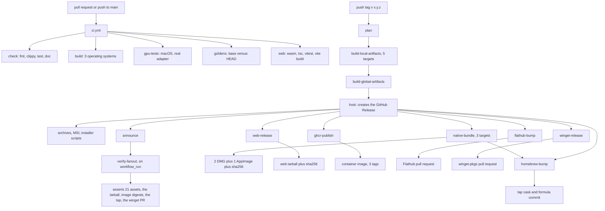

# Build, release, and platforms

This document describes how Solarxy is built, what it ships, and how a version reaches a
user. Everything here is descriptive: it is true of the repository as it stands, and every
claim cites a path. Where a build-level property is a problem rather than a design, it is
called a gap and stated as one.

Two things are covered elsewhere on purpose. What a crate is allowed to own and depend on is
[04-target-architecture.md](04-target-architecture.md). The order in which the shells should
converge is [09-evolution-and-roadmap.md](09-evolution-and-roadmap.md). This document states
only the build-level differences between them.

## Target matrix

Three surfaces ship, and each has its own target list.

**The desktop viewer, `solarxy`.** cargo-dist builds five targets, declared once in
`dist-workspace.toml`:

| Target | Runner | Artefact |
|---|---|---|
| `aarch64-apple-darwin` | cargo-dist, plus `macos-14` for the bundle | `.tar.xz` archive, `.dmg` |
| `x86_64-apple-darwin` | cargo-dist, plus `macos-15-intel` for the bundle | `.tar.xz` archive, `.dmg` |
| `x86_64-unknown-linux-gnu` | cargo-dist, plus `ubuntu-22.04` for the bundle | `.tar.xz` archive, `.AppImage` |
| `aarch64-unknown-linux-gnu` | cargo-dist only | `.tar.xz` archive |
| `x86_64-pc-windows-msvc` | cargo-dist only | `.zip` archive, `.msi` |

The native bundle matrix at `.github/workflows/native-bundle.yml:37-49` is three legs, not
five. There is no aarch64 Linux AppImage, and the comment at that site records the reason:
upstream `appimagetool` has no stable aarch64 binary, and the AppImage step in the composite
action is gated to x86_64. There is no aarch64 Windows target at all.

**The command line, `solarxy-cli`.** The same five cargo-dist targets, minus the MSI. The
asset list that `verify-fanout.yml:103-125` asserts on every stable release names four
`solarxy-cli-*.tar.xz` archives, one `solarxy-cli-x86_64-pc-windows-msvc.zip`, and the two
installer scripts. No `solarxy-cli-*.msi` appears in that list, and none is built.

**The web app.** One target, `wasm32-unknown-unknown`, plus a static JavaScript and CSS
bundle. It is not a platform matrix; it is one artefact whose platform is whatever browser
supports WebGPU.

### The x86_64 instruction-set floor

`.cargo/config.toml:1-8` sets `-C target-feature=+avx2,+fma` on all three x86_64 targets,
unconditionally, for every profile. `.cargo/config.toml:10-11` sets
`-C target-cpu=apple-m1` on `aarch64-apple-darwin`.

Every shipped x86_64 artefact therefore requires AVX2 and FMA, which means Haswell or newer
on Intel and Excavator or newer on AMD. Below that floor the binary does not degrade, it
raises an illegal instruction. No workflow, no test, and no file in this repository states
that requirement, and no CI job builds without those flags, so nothing would notice if the
floor moved.

## Toolchains

| Toolchain | Version | Declared at |
|---|---|---|
| Rust MSRV | 1.92 | `Cargo.toml:24` as `rust-version`, `clippy.toml` as `msrv` |
| Rust edition | 2024 | `Cargo.toml:23` |
| Rust in CI | pinned 1.92 | `dtolnay/rust-toolchain@1.92` at `ci.yml:17`, `:48`, `:62`, `:104`, `:171` |
| Rust for shipped native binaries | unpinned `stable` | `native-bundle.yml:63` |
| wasm-bindgen | exactly 0.2.126 | `crates/solarxy-web/Cargo.toml:67`, installed by version at `ci.yml:184` and `web-release.yml:90` |
| binaryen, for `wasm-opt` | 123 | `ci.yml:192`, `web-release.yml:98` |
| Node | 22 | `ci.yml:178`, `web-release.yml:80` |
| TypeScript | `^5.6.3` | `web/package.json:46` |
| Vite | `^6.0.7`; Vitest `^4.1.10` | `web/package.json:47-48` |

There is no `rust-toolchain.toml` in the repository, so the pin exists only inside the CI
workflows and is not applied to a local build or to a release build.

The wasm-bindgen pin is enforced twice rather than trusted. `crates/solarxy-web/Cargo.toml:67`
takes it as an exact requirement, `=0.2.126`, and
`crates/solarxy-web/build-wasm.sh:68-77` greps that pin back out of the manifest and refuses
to run if the CLI on `PATH` reports a different version. The comment at `build-wasm.sh:66-67`
gives the reason: the generated glue and the wasm disagree at run time otherwise, and the
symptom is an unreadable boot failure rather than a build error.

`wasm-opt -Oz -all` runs on every profile except `debug` (`build-wasm.sh:110-114`). A missing
binaryen is a hard error under `--dist` and a loud warning otherwise (`build-wasm.sh:88-97`),
because the shipping profile must never be discovered to have skipped the optimiser after the
fact.

One measured fact about the wasm profiles is worth carrying, because it contradicts the
obvious assumption. `build-wasm.sh:16-24` records that `--dist`, which is fat LTO, produces a
wasm 265 bytes **larger** than `release` after `wasm-opt -Oz`: 955,247 against 954,982 bytes
brotli. `wasm-opt` already performs whole-module optimisation and subsumes what LTO would
contribute. The release build uses `--dist` anyway (`web-release.yml:108`), on the argument
that codegen quality may differ, but it is not a size lever.

## Artefact per surface

### Desktop viewer

| Artefact | Produced by | Notes |
|---|---|---|
| `.tar.xz` and `.zip` archives | cargo-dist | Five targets; carry `THIRD-PARTY-NOTICES.md` alongside the licence and README, forced by `dist-workspace.toml`'s `include` key |
| Shell and PowerShell installers | cargo-dist | `dist-workspace.toml` `installers`; install path `~/.local/bin`, `install-updater = false` |
| `.msi` | cargo-dist plus WiX | Windows x86_64 only. `wix/main.wxs` is regenerated by cargo-dist on every run, so the hand-set product icon is preserved by `allow-dirty = ["msi"]` |
| `.dmg`, two architectures | `native-bundle.yml` plus `.github/actions/native-bundle/action.yml` | Hand-built `.app` with an authored `Info.plist`, an ad-hoc `codesign --sign -`, then `create-dmg`. Embeds the CLI binary next to the GUI |
| `.AppImage`, x86_64 | the same composite action | `appimagetool` pinned to its continuous build, since it has no tagged releases |
| Homebrew cask | `homebrew-bump.yml` | Edits `Casks/solarxy.rb` in the tap repository, filling each architecture's `sha256` from the `.dmg.sha256` companion the bundle job publishes |
| winget manifest | `winget-release.yml` | Submits `packaging/winget/manifests/k/Koljam/Solarxy/<version>/` to `microsoft/winget-pkgs` |
| Flatpak | packaged, not submitted | `packaging/flatpak/` holds the manifest, desktop entry, AppStream metainfo and vendored cargo sources. The one-time Flathub submission has not been made |

The Homebrew files under `packaging/homebrew/` are a reviewed copy, not what ships.
`packaging/homebrew/README.md:9-20` states this plainly: the bump job checks out the tap
repository and edits the files there, never reading this directory, so the hashes committed
here are placeholders and a change to the *shape* of a cask or formula must be carried across
by hand.

Flathub is declared absent rather than failing. `verify-fanout.yml:44` carries
`DECLARED_ABSENT: "flathub"` as the single place that says so, with the comment at `:41-44`
explaining that a permanently red run and a silently missing channel are both worse than one
explicit declaration. `flatpak-check.yml` exists to verify the manifest actually builds, but
it is `workflow_dispatch` only and wired to no tag.

### Command line

| Artefact | Produced by |
|---|---|
| Shell and PowerShell installers | cargo-dist, per `crates/solarxy-cli/Cargo.toml:79` |
| Portable `.tar.xz` and `.zip` archives | cargo-dist |
| Homebrew formula | `homebrew-bump.yml`, pointing at the cargo-dist archives |
| Container image | `ghcr-publish.yml`, tags `<x.y.z>`, `<x.y>` and `latest`, skipped on prereleases |

**There is deliberately no CLI MSI.** `dist-workspace.toml` lists `msi` among the workspace
installers, and `crates/solarxy-cli/Cargo.toml:78-79` overrides that for this package with
`installers = ["shell", "powershell"]`. The reason is convention rather than capability:
Rust command-line tools are not distributed as MSIs on Windows, and the absence of
`[package.metadata.wix]` on the CLI manifest is what makes the omission structural rather than
a setting someone could flip by accident. The root `Cargo.toml:93-98` carries that block for
the GUI.

The CLI's shipped feature set is not its default feature set.
`crates/solarxy-cli/Cargo.toml:78-83` declares `features = ["watch"]` under
`[package.metadata.dist]`, so cargo-dist builds the archives with the live render window
enabled even though `watch` is off in `default`. Every channel fed by those archives carries
it: the two installer scripts, the portable archives, the Homebrew formula, and the container
image, whose `Dockerfile.cli` fetches a cargo-dist release archive rather than compiling.
The one shipped CLI without the window is the copy embedded in the macOS `.app`, because
`native-bundle.yml:70` runs a plain `cargo build --release --workspace`. That build reaches
the `#[cfg(all(feature = "render", not(feature = "watch")))]` arm at
`crates/solarxy-cli/src/bin/solarxy-cli.rs:595-599`, which answers `--watch` with a message.

### Web

One artefact: `solarxy-web-<tag>.tar.gz` plus a `.sha256`, attached to the GitHub Release by
`web-release.yml:198-216`. It is a static bundle. The server that hosts it downloads that
tarball and builds nothing, and holds no credentials for this repository
(`web-release.yml:4-5`).

The bundle is a five-entry Vite build (`web/vite.config.ts:64-73`): the landing page, the
editor at `app.html`, the scene player at `player.html`, and the public roadmap and references
pages. Heavy vendor code is split into named chunks at `vite.config.ts:82-87`, and `elkjs` is
deliberately **not** named there so it stays dynamically imported. The comment at
`vite.config.ts:78-81` records that this was the largest single saving available, roughly
1.6 MB.

Assets are pre-compressed with `gzip -9 -k` at `web-release.yml:120-132`, because the edge
serves `<file>.gz` when it exists. The originals are kept for clients that do not accept gzip.

Unlike the four package-channel jobs, the web bundle job does **not** skip prereleases
(`web-release.yml:7-10`). That is load-bearing: a release-candidate tag is how the whole
deploy is rehearsed end to end without touching an irreversible channel.

## CI and CD topology

Ten workflows. Two are entry points, six are reusable workflows the release calls in-graph,
one verifies the result after the fact, and one is manual.

Two things in that graph are deliberate and easy to undo. The six channel jobs depend on
`plan` and `host` only, never on `announce`. The comment at `.github/workflows/release.yml:299-307`
records why: `announce` builds and publishes nothing, and during the 0.8.2 release a transient
Actions outage killed it before a single step ran, behind which all six channels silently
skipped while the release looked complete. The second is the one hand-added edge in the graph:
`custom-homebrew-bump` also depends on `custom-native-bundle` (`release.yml:360-366`), because
the cask verifies the DMG against a real checksum and that checksum is a companion file the
bundle job publishes. Without the edge the two jobs race, and a cask must never be bumped to a
version it cannot verify.

`release.yml` is cargo-dist generated and both of those edits survive regeneration only because
`dist-workspace.toml` declares `allow-dirty = ["msi", "ci"]`. The `post-announce-jobs` list in
`dist-workspace.toml` is therefore documentation: the jobs themselves are wired by hand in
`release.yml`.

### What each entry point gates

`ci.yml` fires on every pull request and on pushes to `main`, with no path filters and no
concurrency group.

- **check** (`ubuntu-latest`): `cargo fmt --all --check`; `cargo clippy --workspace --all-features -- -D warnings`;
  three narrower clippy runs over `solarxy-core` at no-default-features, serde only and fs;
  `cargo test --workspace --all-features`; two `cargo doc --no-deps` runs under
  `RUSTDOCFLAGS=-D warnings` (`ci.yml:21-37`). Note that the workspace clippy invocation has
  **no** `--all-targets`, so tests, integration files and examples are never linted in CI even
  though `CLAUDE.md` documents the local command with that flag.
- **build**: `cargo build --release --all-features` across `ubuntu-latest`, `macos-latest` and
  `windows-latest` (`ci.yml:39-50`). Compilation only, no tests.
- **gpu-tests** (`macos-latest`): `solarxy-renderer`, `solarxy-host` and `solarxy-render`
  under `SOLARXY_REQUIRE_GPU=1`, then the same three again with `--release`
  (`ci.yml:57-82`). The comment at `:52-56` states that the check job's ubuntu runner has no
  adapter, so every GPU test silently skips there, which is how the renderer suite went unrun
  for the life of the project. The second, optimised run exists because a tiled traced still
  passed in debug and failed in release for a whole release cycle.
- **goldens** (`macos-latest`): captures the same two models twice on the same runner, once at
  `pull_request.base.sha` through `git worktree add` and once at `HEAD`, then compares at
  `--tolerance 0` (`ci.yml:97-150`). It deliberately refuses a committed baseline, because
  golden pixels depend on the adapter and driver. An intentional render change is adjudicated
  by putting `[golden-accept]` in the commit message or the pull request title, which downgrades
  failure to a report. The pull request title is passed through the environment rather than
  interpolated into the shell (`ci.yml:130-134`), because it is attacker-controlled on a public
  repository.
- **web** (`ubuntu-latest`): installs the pinned wasm-bindgen and binaryen, runs clippy on
  `wasm32`, builds the wasm, then `npm ci`, `npm run typecheck`, `npm test`, `npx vite build`
  (`ci.yml:166-220`). The ordering is mandatory rather than stylistic: `web/src/wasm/pkg/` is
  gitignored (`web/.gitignore:3`) and is a value import reached by the test graph, so neither
  `tsc` nor Vitest can resolve their imports before the wasm exists.

`release.yml` fires on a tag matching `**[0-9]+.[0-9]+.[0-9]+*`. `verify-fanout.yml` fires on
that workflow completing, or on manual dispatch, and re-derives success from artefacts:
21 named release assets, the web tarball, the three container tags resolved and compared by
digest, the version grepped out of the tap's cask and formula, and a search for the submission
pull request on `microsoft/winget-pkgs` (`verify-fanout.yml:88-232`).

Every reusable workflow detects its invocation mode by input presence rather than by
`github.event_name`, and each says so in a comment (for instance `native-bundle.yml:51-56`).
The reason is a real trap: inside a called workflow, `github.event_name` reflects the caller's
event, which is `push`, not `workflow_call`.

## Versioning and version bumps

The Rust version is single-sourced. `Cargo.toml:22` sets `version = "0.9.0"` under
`[workspace.package]`, and every member inherits it with `version.workspace = true`. Bumping a
release is a one-line edit.

Nothing else inherits it. Four other surfaces carry the version and each learns about a bump
differently:

| Surface | Where the version lives | How it is updated |
|---|---|---|
| Rust workspace | `Cargo.toml:22` | Hand edit, one line, inherited by all 15 members |
| Web frontend | `web/package.json:4` | Hand edit. Stamped into the bundle as `__APP_VERSION__` by `web/vite.config.ts:46` and written into the `generator` field of every scene file the app saves |
| winget | `packaging/winget/manifests/k/Koljam/Solarxy/<version>/` | A new directory of three YAML files, committed by hand before the tag |
| Flatpak | `packaging/flatpak/dev.koljam.solarxy.metainfo.xml` | A new `<release>` element with a version and a date, committed by hand |
| Homebrew tap | the tap repository | Written by `homebrew-bump.yml` from the tag and the published checksums; never from `packaging/homebrew/` |

Nothing pins `web/package.json`'s version to the workspace version. A grep of the test tree
finds no test that reads `package.json`, and the two are kept in step only by the release
procedure. The comment at `vite.config.ts:42-45` records that the previous arrangement, a
version string hardcoded in the session module, silently went stale across a release, which is
the same failure mode one level up.

The winget directory is the one bump that must precede the tag. `winget-release.yml` reads the
committed manifest for the version being released and fills its single `{{INSTALLER_SHA256}}`
placeholder from the real MSI. If the directory does not exist the job has nothing to submit.
`ProductCode` is deliberately omitted from the manifest, since the WiX ProductCode rotates on
every build and winget reads it from the MSI itself.

**The prerelease format is constrained by WiX.** A prerelease must be dot-separated semver, so
`0.5.0-rc.1` and never `0.5.0-rc1`. WiX requires an `A.B.C.D` integer version, and cargo-dist
can map only the dotted form onto that trailing integer. This constraint applies to the tag,
the workspace version, and every manifest that mirrors them.

Prereleases are also the gate that separates rehearsal from publication. The four package
channels each test both `announcement_is_prerelease` from the cargo-dist plan and the tag text
for `-rc.`, `-alpha.` or `-beta.` (for instance `homebrew-bump.yml:58-72`), and skip. The web
bundle job does not, on purpose. So a release-candidate tag exercises the whole build, upload
and deploy path while touching no irreversible channel.

## The release flow

1. Work happens on a branch and lands on `main` through a pull request, which is what makes
   `ci.yml` the gate. The golden job compares against `pull_request.base.sha`, so a release
   that intentionally re-baselines the renderer needs `[golden-accept]` in the pull request
   title or the commit message, and the reason belongs in the pull request body.
2. Before the tag, the winget manifest directory for the new version and the Flatpak metainfo
   release entry must already be committed, because both are read from the repository at tag
   time.
3. The tag is lightweight, named `v<version>`, on the merge commit.
4. `release.yml` plans, builds the five targets, builds the global installers, creates the
   GitHub Release, and then runs the six channel jobs in parallel off `host`.
5. **The fan-out is verified by artefact, never by job colour.** Three of the channel jobs
   fail soft on a missing credential: `homebrew-bump.yml:58-66`, `flathub-bump.yml:46-56` and
   `winget-release.yml:53-63` each emit a `::warning::`, set `proceed=false`, and let the job
   finish green having published nothing. A green run is therefore not evidence that a tap
   commit exists. `verify-fanout.yml` is that check automated, and it is the step to run
   rather than the release summary to read.
6. The edge configuration and the deploy of the web tarball live in a separate repository and
   are outside the scope of this document.

## Where the desktop and web builds diverge

The dependency graph is one workspace, and the shared crates below `solarxy-app` and
`solarxy-web` are the same code. What differs is what each shell can link and what each target
provides. The direction the two should converge is [04](04-target-architecture.md) and
[09](09-evolution-and-roadmap.md), and the reason a shared application layer has to be a new
crate is [ADR 0012](adr/0012-shared-application-layer-is-a-new-crate.md). The build-level
differences are these.

**The desktop build includes, and the web build cannot:**

- The `winit` and `egui` shell, `solarxy-app`, and every native dialog it opens.
- `solarxy-cli`, its terminal substrate, and the headless render command `solarxy-render`.
- The live render window behind the CLI's `watch` feature, which links a second `winit` event
  loop and a second `wgpu` device.
- Filesystem paths. `solarxy-formats` and `solarxy-renderer` both default to a `std-fs`
  feature (`crates/solarxy-formats/Cargo.toml:14`,
  `crates/solarxy-renderer/Cargo.toml:16-17`) that the web build turns off, leaving the
  byte-first loading API as the only entry point.
- A wall clock. `std::time::Instant` does not exist on `wasm32`, which is why the tiled still
  job takes its clock as a caller-supplied field rather than reading one.
- AVX2 and FMA codegen on x86_64, and an Apple M1 target CPU on Apple Silicon
  (`.cargo/config.toml`).
- A 64-bit address space, which is why the browser host carries its own float-still pixel
  ceiling and the desktop does not.

**The web build includes, and the desktop build does not:**

- One `cdylib` in which the engine and the renderer compile into a single WebAssembly
  instance, so cooked geometry is an in-process handoff and never crosses into JavaScript.
- A second instance of the same artefact running GPU-free in an import worker, which is what
  forces the parsing and hierarchy-building code to be free of any device handle.
- The `getrandom_backend="wasm_js"` rustflag (`.cargo/config.toml:16-17`), inert on every
  native target and required on `wasm32` because `getrandom` 0.3 arrives transitively.
- A `zip` dependency taken without default features so it compiles to `wasm32`
  (`crates/solarxy-scenefile/Cargo.toml:21-24`), which is what constrains the scene archive to
  stored entries.
- Two extra optional features that exist to be measured rather than shipped: `pt-probe` and
  `diagnostics` (`crates/solarxy-web/Cargo.toml:17-28`). `build-wasm.sh` takes a
  `--features` pass-through specifically so the payload cost of an optional feature is the same
  script run twice on one toolchain (`build-wasm.sh:11-14`).
- The whole JavaScript toolchain: Node, TypeScript, Vite, Vitest, and the payload budgets
  below.

Parity between the two shells is not a build problem. Both shells already compile the same
core; what neither shares is anything above the engine, and that is the subject of
[ADR 0012](adr/0012-shared-application-layer-is-a-new-crate.md).

## The two real gaps

### Shipped binaries are built by a toolchain no CI job exercises

Every job in `ci.yml` pins `dtolnay/rust-toolchain@1.92`, at lines 17, 48, 62, 104 and 171.
That matches `rust-version = "1.92"` in `Cargo.toml:24` and `msrv = "1.92"` in `clippy.toml`.

`native-bundle.yml:63` runs `rustup default stable && rustup target add <target>` and then
builds the binaries that go into every DMG and the AppImage. cargo-dist's own build path is
equally unpinned: on ordinary runners it uses whatever Rust the runner image ships, and the
`rustup` install at `release.yml:124-130` is guarded by `if: ${{ matrix.container }}` so it
fires only on container legs. There is no `rust-toolchain.toml`, and `dist-workspace.toml`
declares no toolchain key.

So the artefacts a user installs are compiled by whatever `stable` happened to be on the
runner that day, by a compiler that no job in `ci.yml` ever ran. A codegen or standard-library
change between 1.92 and current stable reaches users before it reaches CI, and the gap is not
narrow: it widens by one Rust release every six weeks with no signal.

The web bundle is not in this set. `web-release.yml:72` pins `dtolnay/rust-toolchain@1.92`
like CI does. The unpinned surface is exactly the native bundles and the cargo-dist archives
and MSI.

### The payload budgets gate nothing on a pull request

Three real numbers protect the web bundle, and they are enforced with an exit code rather than
a log line:

| Budget | Bytes | Declared at |
|---|---|---|
| wasm, gzipped | 2,621,440 | `web-release.yml:39` |
| player JavaScript, gzipped | 51,200 | `web-release.yml:46` |
| editor boot JavaScript, gzipped | 471,040 | `web-release.yml:57` |

They run in the step at `web-release.yml:134-196`, in the job that fires from a tag. The `web`
job in `ci.yml` builds the same bundle at `ci.yml:220` and asserts nothing about its size; a
grep of `ci.yml` for a size or budget check returns nothing. So a pull request that adds a
heavy eager dependency goes green, and the byte measurement happens only once the tag exists
and the GitHub Release is already public.

The budgets do not run after the release is announced, which is a distinction worth keeping
straight: the channel jobs depend on `plan` and `host` only, so the web job runs in parallel
with `announce`, gated on the release having been created. That does not help. The tag is the
irreversible step, and it is already pushed.

Two further details limit how much these budgets would catch even where they do run, and both
are visible in the script.

The "editor boot JS" figure at `web-release.yml:153-154` sums **every** `*.js.gz` under
`web/dist` except files matching `elk*` and `CodeEditor*`. That directory holds the chunks of
all five build entries, so the figure is a whole-site sum, not the editor's boot path its own
comment at `:47-49` describes. It would still catch a heavy dependency landing eagerly, which
is the property it was written for, but the number does not mean what its name says.

The player loop at `web-release.yml:183-186` accumulates with
`[ -f "$F.gz" ] && PLAYER_JS=$((PLAYER_JS + ...))`. A referenced file whose `.gz` the
pre-compress step missed contributes zero rather than failing, so a gap in the compression
step reads as a smaller player.

The specific regression these budgets were written for is separately gated on every pull
request, and by a source-level rule rather than a byte count: the 0.8.1 player that shipped
431 KB of React and dockview through one value import is caught by
`the_player_does_not_import_the_editors_ui_graph` in
`crates/solarxy-core/tests/tokens_drift.rs:635`, which the budget's own error message points
at (`web-release.yml:193`). That test bans seven imports and reads the player directory
without recursion, so a subdirectory would escape it. What is release-only is the byte
measurement, and the byte measurement is what would catch a regression nobody predicted.

Moving the three checks into the `web` job costs one step. The bundle is already built there;
what is missing is the pre-compress step and the comparison.

## Open questions

- Was the unpinned `rustup default stable` in `native-bundle.yml` a deliberate choice, to pick
  up newer codegen for shipped binaries, or inherited from an earlier iteration? If deliberate,
  nothing records why no CI job builds with it.
- The AVX2 and FMA floor on x86_64 is not stated anywhere in this repository. The user-facing
  installation page lives in a wiki outside this repository and was not read, so whether the
  requirement is disclosed to users could not be determined here.
- `verify-fanout.yml` asserts the presence of 21 named release assets by exact filename. It is
  not clear what keeps that list in step with `dist-workspace.toml`'s target list: adding a
  target would add assets the list does not name, and the check asserts only that the named
  ones exist.
- Whether the manual quality gates were run for a given release cannot be answered from this
  repository. `docs/qa/desktop-checklist.md` and `docs/qa/render-checklist.md` both instruct
  the runner to record the result in a document that lives outside it.
